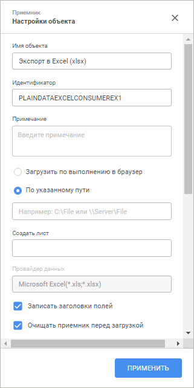
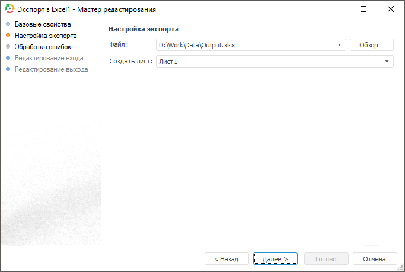

# Страница «Настройка экспорта»: Задача ETL, веб-приложение

Страница «Настройка экспорта»: Задача ETL, веб-приложение
-

# Настройка экспорта

На странице «Настройка экспорта»
 приёмника данных «[Excel](UiEtl_Outputs_Excel.htm)»
 указывается файл для экспорта данных.

[Экспорт
 в файл XLS](javascript:TextPopup(this))

	Для экспорта данных в файл XLS:

		- Укажите файл формата *.xls, в который будут экспортироваться
		 данные.

		- Для корректного экспорта данных в файл создайте новый лист.
		 Его наименование не должно совпадать с существующими наименованиями
		 листов.

	В наименовании листа допускается использовать:

			- буквы русского и латинского алфавитов;

			- цифры;

			- квадратные скобки «[», «]»; знак доллара «$»;
			 знак подчеркивания «_»;

		- Укажите драйвер для соответствующей версии Microsoft Excel.

[Экспорт
 в файл XLSX](javascript:TextPopup(this))

	

	Для экспорта данных в файл XLSX:

		- Укажите файл формата *.xlsx, в который будут экспортироваться
		 данные.

		- Создайте лист. В наименовании листа допускается использовать:

			- буквы русского и латинского алфавитов;

			- цифры;

			- квадратные скобки «[», «]»; знак доллара «$»;
			 знак подчеркивания «_».

См. также:

[Приёмник
 данных «Excel»](UiEtl_Outputs_Excel.htm)

		Справочная
		 система на версию 10.9
		 от 18/08/2025,
		 © ООО «ФОРСАЙТ»,
