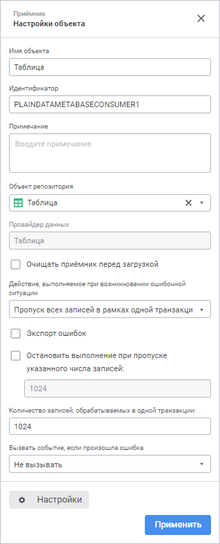
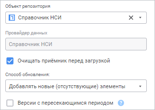
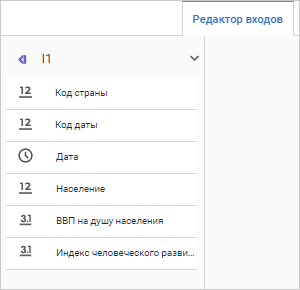

# Коннектор к приёмнику данных «Объект репозитория»: Задача ETL, веб-приложение

Коннектор к приёмнику данных «Объект репозитория»: Задача ETL, веб-приложение
-

# Объект репозитория

	Коннектор «Объект репозитория»
	 - объект, предназначенный для загрузки данных в объекты репозитория.

	После добавления коннектора на рабочее пространство задачи ETL выберите
	 [приёмник данных](#receiver), задайте [настройки
	 экспорта](#export) и отредактируйте [вход](#input) и [выход](#output)
	 коннектора.

## Выбор приёмника данных

	При создании нового коннектора предварительно будет отображено модальное
	 окно с деревом репозитория. Выделите в дереве необходимый приёмник
	 и нажмите кнопку «Выбрать».
	 В качестве приёмника можно выбрать следующие объекты:

		- справочник НСИ;

		- таблица;

		- документ.

	Если в настройках приёмника указывается база данных, то для базы
	 данных должно быть настроено автоподключение. Если в качестве приёмника
	 выбирается ярлык на объект из другого репозитория, то в связи с репозиторием
	 должно быть настроено автоподключение.

## Настройка экспорта

	На панели свойств можно изменить приёмник и задать параметры экспорта
	 данных.

[Для отображения
 панели свойств](javascript:TextPopup(this))

		- добавьте новый коннектор на рабочую область. Панель свойств
		 отобразится автоматически;

		- выделите готовый коннектор на рабочей области.

	Список доступных настроек зависит от типа выбранного приёмника данных.
	 Для документа список настроек зависит от типа сохранённого в нём файла.
	 Настройки аналогичны настройкам экспорта для приёмника данных такого
	 же формата - [Excel](../Excel/UiEtl_Outputs_Excel.htm#export),
	 [Текст](../Text/UiEtl_Outputs_Text.htm#export).

	Для таблиц/справочников НСИ список настроек представлен ниже.

	

	Для настройки доступны следующие параметры:

	- Имя объекта. При необходимости
	 измените наименование коннектора;

	- Идентификатор. При необходимости
	 измените идентификатор объекта. Идентификатор должен быть уникальным в рамках задачи ETL. Допускается использование
	 букв латинского алфавита, цифр и знаков «_». Идентификатор должен
	 начинаться с буквы;

	- Примечание. При необходимости
	 введите аннотацию к объекту. Примечание может содержать любую информацию по
	 усмотрению пользователя;

		- Объект репозитория.
		 В поле указан объект репозитория, выбранный в качестве приёмника
		 данных. Для удаления объекта нажмите кнопку .
		 После удаления объекта станет доступен выбор нового объекта в
		 раскрывающемся списке поля «Объект
		 репозитория»;

	- Очищать приёмник перед загрузкой.
	 По умолчанию флажок снят, осуществляется добавление новых и обновление
	 существующих данных при загрузке. Для удаления всех данных из объекта-приёмника
	 перед выполнением загрузки установите флажок.

Если приёмником является справочник НСИ,
 то будет доступен параметр «Способ обновления»
 для выбора способа обновления элементов:

Доступны следующие варианты:

		- Замещать
		 все элементы. Элементы, которых нет в источнике - будут
		 удалены;

		- Добавлять
		 новые (отсутствующие) элементы. Добавляются только новые
		 элементы, существующие не обновляются;

		- Обновлять
		 существующие элементы. Обновляются только существующие
		 элементы, новые не добавляются;

		- Добавлять
		 новые элементы и обновлять существующие. Добавляются новые,
		 обновляются существующие элементы. Элементы, которых нет в источнике,
		 не обновляются.

При выборе способа обновления «Добавлять
 новые (отсутствующие) элементы» или «Добавлять
 новые элементы и обновлять существующие» для [версионного
 справочника НСИ](UiNavObj.chm::/reference_book/FAQ/UiRds_Work_RDS_Elements_work_2.htm) доступен параметр:

		- Версии
		 с пересекающимся периодом. Установите флажок для добавления
		 новой версии элемента, которая пересекается с периодами существующих
		 версий. Учитывайте следующие особенности добавления новой версии:

			- если дата начала импортируемой версии элемента совпадает
			 с датой начала существующей версии, то существующая версия
			 будет удалена;

			- если дата окончания импортируемой версии элемента совпадает
			 с датой окончания существующей версии, то существующая версия
			 будет удалена;

			- если даты начала и окончания импортируемой версии элемента
			 совпадают с датами начала и окончания существующей версии,
			 то существующая версия будет удалена;

			- если даты начала и окончания импортируемой версии элемента
			 отличаются от дат начала и окончания существующей версии и
			 период существующей версии входит в импортируемую, то существующая
			 версия будет удалена;

			- если даты начала и окончания импортируемой версии элемента
			 отличаются от дат начала и окончания существующей версии и
			 период импортируемой версии входит в существующую, то существующая
			 версия будет разделена на два периода. В первом периоде дата
			 окончания существующей версии изменится на дату начала импортируемой
			 версии. Во втором периоде дата начала существующей версии
			 изменится на дату окончания импортируемой версии. Между периодами
			 добавляется импортируемая версия элемента.

По умолчанию флажок снят, новая версия элемента
 добавляется, если её период не пересекается с существующими версиями.

Если в настройках задачи ETL задан [обработчик
 событий](../../../06_CreateETL/Event_Handling.htm), то при возникновении ошибок будет генерироваться событие
 OnError. Также можно определить дальнейшее поведение объекта экспорта
 при возникновении ошибочных ситуаций:

	- Действие, выполняемое при возникновении
	 ошибочной ситуации. Выберите действие, выполняемое при возникновении
	 ошибок во время выгрузки данных:

		- Остановка
		 расчёта задачи. При возникновении ошибки экспорта будет
		 полностью остановлено выполнение задачи ETL;

		- Пропуск
		 только некорректных записей. Исключаются некорректные записи.
		 Данный пункт нужно выбирать в случае, когда наличие всех записей
		 некритично;

		- Пропуск
		 всех записей в рамках одной транзакции. Исключаются все
		 записи той транзакции, в которой возникнет ошибочная ситуация.
		 Данный пункт нужно выбирать в случае, когда необходимо разделить
		 весь объем записей на транзакции, в рамках которых необходимо
		 получение всех данных без исключения.

При выборе действий «Остановка
 расчёта задачи» или «Пропуск только
 некорректных записей» будет происходить разделение задачи на транзакции,
 а указанное количество записей будет влиять на скорость выполнения задачи;

	- Экспорт ошибок. По умолчанию
	 флажок снят, ошибки, возникшие при выполнении задачи ETL, не экспортируются.
	 При установке флажка выберите, куда будет отправляться информация
	 об ошибках:

		- Загрузить по выполнению
		 в браузер. После экспорта в браузере будет открыта страница
		 со списком ошибок;

		- По указанному пути.
		 Задайте путь и наименование файла, в который будет экспортироваться
		 список ошибок;

	- Остановить выполнение при пропуске
	 указанного числа записей.
	 По умолчанию флажок снят.
	 Для остановки выполнения задачи ETL установите флажок и укажите
	 пороговое количество ошибочных записей, при превышении которого экспорт
	 будет остановлен;

	- Количество записей, обрабатываемых
	 в одной транзакции. Укажите количество записей, обрабатываемых
	 в рамках одной транзакции в соответствующем поле. По умолчанию обрабатывается
	 1024 записи;

	- Вызвать событие, если произошла
	 ошибка. Позволяет выбрать пользовательское событие, которое
	 будет генерироваться при возникновении ошибки. В списке отображаются
	 события, созданные в [пользовательских
	 метаданных](UiDevEnv.chm::/04_NavigatorSetting/Classes_Object/Classes_Events.htm) репозитория. Отслеживание события осуществляется
	 в [планировщике
	 задач](UiAppSrv.chm::/UiAppSrv_purpose.htm),
	 задачи должны быть настроены на выполнение [по
	 наступлению настраиваемого события](UiAppSrv.chm::/3_Work_Tasks/UiAppSrv_Work_Tasks_CreateTask_TimeTable.htm#customevent).

		- Настройки. Кнопка
		 позволяет перейти к редактированию [входа](#input)
		 и [выхода](#output) коннектора.

## Редактирование входа

Для задания списка полей и связи для входа перейдите на вкладку «Редактор входов».

[Для отображения
 вкладки редактирования входов](javascript:TextPopup(this))

		- Откройте панель свойств объекта.

		- Нажмите кнопку  «Настройки».

		- На панели дополнительных настроек объекта перейдите на вкладку
		 «Редактор входов».

На странице доступны следующие настройки:

[Идентификатор](javascript:TextPopup(this))

	Для изменения идентификатора входа дважды щёлкните в его области
	 и задайте новое значение. Возможно использование символов латинского
	 алфавита, цифр и специального символа «_». По умолчанию идентификаторы
	 входов объектов генерируются автоматически в формате: I<номер
	 входа>.

[Связь с объектом](javascript:TextPopup(this))

	Установите связь с объектом. Для этого нажмите кнопку  «Создать
	 связь» и выберите выход какого-либо
	 объекта. Если список полей источника и приёмника полностью совпадает,
	 то все поля будут связаны автоматически. Также связь полей может быть
	 настроена в группе настроек «[Настройка
	 связей](../../05_Links/uietl_links_create.htm)».

[Поля](javascript:TextPopup(this))

	Добавьте необходимые поля объекта задачи ETL в список. В указанные
	 поля будут выгружаться данные. Для добавления в список всех полей
	 из связанного с входом объекта, являющегося приёмником, нажмите кнопку
	 
	 «Действия» и выполните команду
	 «Заполнить из приёмника».

## Редактирование выхода

[Для отображения
 вкладки редактирования выходов](javascript:TextPopup(this))

		- Откройте панель свойств объекта.

		- Нажмите кнопку  «Настройки».

		- На панели дополнительных настроек объекта перейдите на вкладку
		 «Редактор выходов».

На странице доступны следующие настройки:

[Идентификатор](javascript:TextPopup(this))

	Для изменения идентификатора выхода дважды щёлкните в его области
	 и задайте новое значение. Возможно использование символов латинского
	 алфавита, цифр и специального символа «_». По умолчанию идентификаторы
	 выходов объектов генерируются автоматически в формате: O<номер
	 выхода>.

[Связь с объектом](javascript:TextPopup(this))

	Установите связь с объектом. Для этого нажмите кнопку  «Создать
	 связь» и выберите вход какого-либо
	 объекта. Если список полей источника и приёмника полностью совпадает,
	 то все поля будут связаны автоматически. Также связь полей может быть
	 настроена в группе настроек «[Настройка
	 связей](../../05_Links/uietl_links_create.htm)».

[Поля](javascript:TextPopup(this))

	Добавьте необходимые поля объекта задачи ETL в список. Из указанных
	 полей будут выгружаться данные.

	Для добавления в список всех полей из файла-источника, нажмите кнопку
	 
	 «Действия» и выполните команду
	 «Заполнить из источника».

	Для добавления нового поля нажмите кнопку 
	 «Добавить». Будет открыто
	 окно «Свойства поля»:

	

	Примечание.
	 Вид окна «Свойства поля» зависит
	 от выбранного источника данных.

	Задайте в нем значения атрибутов поля:

		- Наименование. Наименование
		 поля;

		- Идентификатор. Уникальный
		 идентификатор поля;

		- Тип. Из раскрывающегося
		 списка выберите тип данных поля;

		- Вычисляемое поле.
		 Для задания формулы, по которой будет вычисляться значение поля,
		 установите данный флажок. После установки флажка введите выражение
		 с помощью клавиатуры.

		Для увеличения значения каждой новой записи на фиксированную величину
		 используйте специальное выражение INCREMENT.

	Примечание.
	 Специальное выражение INCREMENT
	 доступно только для вычисляемого поля целого типа.

	Синтаксис данного выражения: INCREMENT[Value1,
	 Value2], где Value1 - начальное значение, Value2 - шаг, на который
	 значение Value1 должно увеличиваться при каждом вызове выражения.
	 При каждой загрузке данных заполнение будет начинаться с начального
	 значения.

	Для редактирования поля выполните для него команду контекстного
	 меню «Редактировать».

См. также:

[Создание коннекторов к приёмнику данных](../UiEtl_Outputs.htm)

		Справочная
		 система на версию 10.9
		 от 18/08/2025,
		 © ООО «ФОРСАЙТ»,
