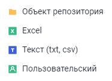

# Создание коннекторов к приёмнику данных: Задача ETL, веб-приложение

Создание коннекторов к приёмнику данных: Задача ETL, веб-приложение
-

# Создание коннекторов к приёмнику
 данных

Все доступные коннекторы располагаются в группе контекстного меню «Приёмник». Коннекторы предназначены
 для подключения к внешним приёмникам или объектам репозитория и экспорта
 в них данных. Каждый коннектор хранит в себе настройки подключения к определённому
 приёмнику и связи с другими объектами задачи ETL.

Доступные коннекторы к приёмникам данных:

[Создание
 коннектора](javascript:TextPopup(this))

	Для создания коннектора к приёмнику данных вызовите контекстное
	 меню на рабочей области задачи ETL и в группе «Приёмник»
	 выберите требуемый тип приёмника.

[Редактирование
 коннектора](javascript:TextPopup(this))

	Для редактирования коннектора выделите его на рабочей области. В
	 зависимости от типа коннектора будет отображена панель свойств с соответствующим
	 набором настроек.

См. также:

[Построение
 задачи ETL](../Construction_ETL.htm)

		Справочная
		 система на версию 10.9
		 от 18/08/2025,
		 © ООО «ФОРСАЙТ»,
