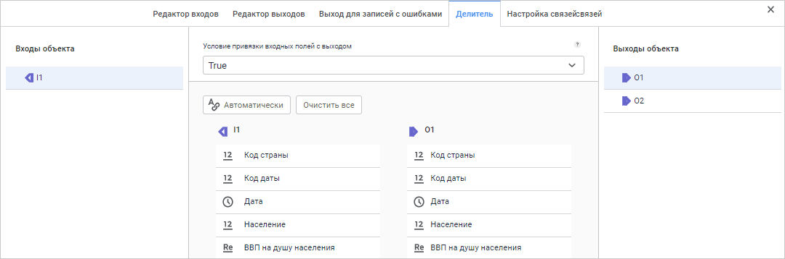
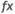
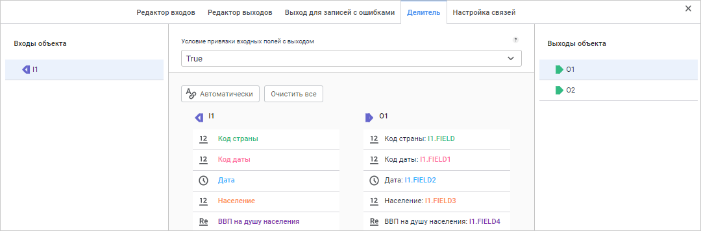

# Преобразователь «Разделение»: Задача ETL, веб-приложение

Преобразователь «Разделение»: Задача ETL, веб-приложение
-

# Разделение

Преобразователь «Разделение»
 - объект, выполняющий разделение данных. Объект «Разделение»
 имеет один вход и произвольное число выходов. Разделение данных между
 выходами выполняется при помощи условий, задающих привязку входных полей
 с выходными.

Упорядоченность и уникальность данных по каким-либо индексам для операции
 разделения являются несущественными.

При использовании преобразователя «Разделение»
 из таблицы:

		 Key
		 Date
		 Value

		 1
		 Summer
		 1111

		 1
		 Winter
		 2222

		 2
		 Summer
		 3333

		 2
		 Winter
		 4444

		 3
		 Summer
		 5555

		 3
		 Winter
		 6666

можно получить две таблицы:

		 Key
		 Date
		 Value

		 1
		 Summer
		 1111

		 2
		 Summer
		 3333

		 3
		 Summer
		 5555

и:

		 Key
		 Date
		 Value

		 1
		 Winter
		 2222

		 2
		 Winter
		 4444

		 3
		 Winter
		 6666

После [добавления](../UiEtl_Trfs.htm#add) преобразователя
 на рабочую область настройте [базовые
 свойства](../UiEtl_Trfs.htm#settings_panel), [вход](../UiEtl_Trfs.htm#input_tab) и [выходы](../UiEtl_Trfs.htm#output_tab)
 преобразователя, а также [выход
 для записей с ошибками](../UiEtl_Trfs.htm#error_output_tab).

После этого настройте [условия разделения данных](#split).

## Делитель

Для настройки условия разделения данных:

	- Откройте [панель настроек](../UiEtl_Trfs.htm#settings_panel)
	 преобразователя.

	- Нажмите кнопку  «Настройки».

	- На панели дополнительных настроек преобразователя перейдите
	 на вкладку «Делитель».

После выполнения действий будет отображена вкладка «Делитель».
 Вид вкладки до настройки разделения данных:

### Условия привязки входных полей с выходом

Вход и выходы преобразователя перечислены в группах «Входы
 объекта» и «Выходы объекта»
 в левой и правой частях вкладки соответственно.

Условие привязки отображается в поле «Условие
 привязки входных полей с выходом». Для выбранного условия на вкладке
 отображаются входные и выходные поля. Если объект-разделитель содержит
 несколько условий, то они рассматриваются как части составного условия,
 соединенные оператором ИЛИ.

Условие по умолчанию имеет следующий вид: «True».
 Условие означает, что при наличии настроенных связей данные из входных
 полей будут экспортированы в выходные поля. Если скорректировать данное
 условие на «False», то при наличии
 настроенных связей данные из входных полей не будут экспортированы в выходные
 поля.

Возможные операции с условиями:

[Добавление
 условия](javascript:TextPopup(this))

	Для добавления условия нажмите кнопку  в поле
	 «Условие привязки входных полей с
	 выходом». В раскрывшемся списке выполните команду «Добавить».
	 Будет открыто окно [редактора выражений](uinav.chm::/gui/expressioneditor.htm).
	 Сформируйте необходимое условие.

[Редактирование
 условия](javascript:TextPopup(this))

	Для добавления условия нажмите кнопку  в поле
	 «Условие привязки входных полей с
	 выходом». В раскрывшемся списке выполните команду «Редактировать»
	 в контекстно меню условия. Будет открыто окно [редактора выражений](uinav.chm::/gui/expressioneditor.htm).

[Удаление
 условия](javascript:TextPopup(this))

	Для удаления условия нажмите кнопку  в поле «Условие привязки входных полей с выходом».
	 В раскрывшемся списке выполните команду «Удалить»
	 в контекстном меню условия. Условие будет удалено без запроса подтверждения
	 выполняемого действия.

### Связи полей входа с полями выходов

Для каждого условия должна быть установлена связь входных полей с выходными
 полями, иначе поля на выходе будут пустыми.

Доступные действия со связями полей:

	- Автоматически. Позволяет
	 автоматически создать связи между всеми входными и выходными полями,
	 имеющими одинаковые идентификаторы. Для автоматического создания связей
	 нажмите кнопку «Автоматически»;

	- Создание связи полей.
	 Для создания связи перетащите необходимое поле из левого списка на
	 поле в правом списке, используя механизм Drag&Drop. Будет создана
	 связь между соответствующим входным и выходным полями, даже если они
	 имеют различные идентификаторы;

	- Редактирование выходного значения.
	 Редактирование формулы преобразования выходного значения возможно
	 с помощью [редактора выражений](uinav.chm::/gui/expressioneditor.htm).
	 Для редактирования выходного значения наведите указатель на соответствующее
	 выходное поле в правом списке и нажмите кнопку  «Редактирование выражения». Будет
	 открыто окно редактора выражений;

	- Очистить все.
	 Позволяет удалить все связи, настроенные между полями выбранного
	 входа и выхода;

	- Удаление связей. Для
	 удаления связи между входным и выходным полями наведите указатель
	 на соответствующее выходное поле и нажмите кнопку  «Очистка выражения». Будет запрошено
	 подтверждение удаляемого действия.

Вид вкладки после настройки разделения данных:

См. также:

[Создание преобразователей данных](../UiEtl_Trfs.htm)

		Справочная
		 система на версию 10.9
		 от 18/08/2025,
		 © ООО «ФОРСАЙТ»,
