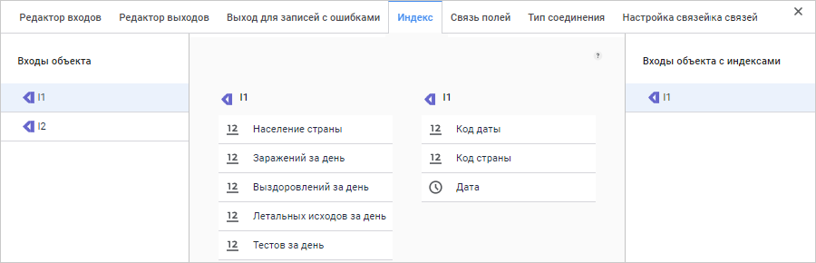
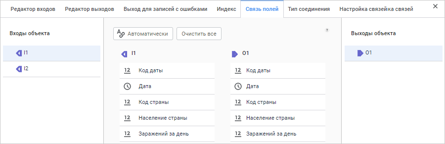
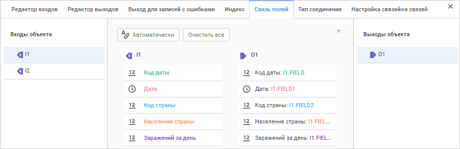

# Преобразователь «Соединение»: Задача ETL, веб-приложение

Преобразователь «Соединение»: Задача ETL, веб-приложение
-

# Соединение

	Преобразователь «Соединение»
	 - объект, предназначенный для слияния данных, при этом перед слиянием
	 данных выполняется проверка заданных условий. С помощью этого преобразователя
	 можно получить в результирующем наборе только те записи, для которых
	 значения в одном из полей связи совпадают, либо все записи одного
	 источника, дополненные значениями из других, если значения этих записей совпадают
	 по ключевым полям.

	Каждый объект имеет несколько входов и один выход. У всех источников
	 должны быть определены уникальные индексы, количество и типы полей.
	 Указанные атрибуты должны быть идентичны для всех источников. Дублирование
	 записей не допускается (в этом случае необходимо провести предварительно
	 операцию [удаления дубликатов](../08_Delete/uietl_trfs_delete.htm)).

	Для эффективной работы данного алгоритма должны быть выполнены условия:

		- отсутствие дубликатов по уникальному индексу во всех источниках
		 данных;

		- все источники должны быть упорядочены по уникальному индексу.
		 Порядок полей в уникальном индексе должен совпадать для всех источников.

	При использовании преобразователя «Соединение»
	 с типом «Внешнее соединение»
	 из таблиц:

			 Key
			 Date
			 Value

			 1
			 Summer
			 2222

			 2
			 Winter
			 4444

			 3
			 Spring
			 5555

	и:

			 Key
			 Date
			 Value2

			 1
			 Summer
			 1111

			 2
			 Winter
			 3333

	можно получить таблицу:

			 Key
			 Date
			 Value
			 Value2

			 1
			 Summer
			 2222
			 1111

			 2
			 Winter
			 4444
			 3333

			 3
			 Spring
			 5555

	После [добавления](../UiEtl_Trfs.htm#add) преобразователя
	 на рабочую область настройте [базовые
	 свойства](../UiEtl_Trfs.htm#settings_panel), [входы](../UiEtl_Trfs.htm#input_tab) и [выход](../UiEtl_Trfs.htm#output_tab) преобразователя, а также
	 [выход для записей с ошибками](../UiEtl_Trfs.htm#error_output_tab).

	После этого задайте [индекс](#index), [связь
	 полей](#connection) и [тип соединения](#joint_type).

## Индекс

	Для настройки связей между полями входов и полями выхода преобразователя:

		- Откройте [панель
		 настроек](../UiEtl_Trfs.htm#settings_panel) преобразователя.

		- Нажмите кнопку  «Настройки».

		- На панели дополнительных настроек преобразователя перейдите
		 на вкладку «Индекс».

	После выполнения действий будет отображена вкладка «Индекс»:

	

	На вкладке «Индекс» определите
	 индексируемые поля каждого входа. По значениям индексируемых полей
	 происходит сопоставление данных в источниках.

	В группе «Входы объекта»
	 выберите вход, для которого необходимо определить индексируемые поля.
	 Из левого списка, соответствующего структуре входа, перетащите выбранные
	 поля в правый список. Поля, оказавшиеся в правом списке, будут индексируемыми.

	Для всех входов список и тип индексируемых полей должны совпадать.

## Связь полей

	Для настройки соответствия между полями входов и выхода:

		- Откройте [панель
		 настроек](../UiEtl_Trfs.htm#settings_panel) преобразователя.

		- Нажмите кнопку  «Настройки».

		- На панели дополнительных настроек преобразователя перейдите
		 на вкладку «Связь полей».

	После выполнения действий будет отображена вкладка «Связь
	 полей». Вид вкладки до настройки связей:

	

	Входы и выход преобразователя перечислены в группах «Входы
	 объекта» и «Выходы объекта»
	 в левой и правой частях вкладки соответственно.

	В левом списке перечислены поля входа, выбранного в группе «Входы объектов», в правом - поля
	 выхода.

Доступные действия со связями полей:

	- Автоматически. Позволяет
	 автоматически создать связи между всеми входными и выходными полями,
	 имеющими одинаковые идентификаторы. Для автоматического создания связей
	 нажмите кнопку «Автоматически»;

	- Создание связи полей.
	 Для создания связи перетащите необходимое поле из левого списка на
	 поле в правом списке, используя механизм Drag&Drop. Будет создана
	 связь между соответствующим входным и выходным полями, даже если они
	 имеют различные идентификаторы;

	- Редактирование выходного значения.
	 Редактирование формулы преобразования выходного значения возможно
	 с помощью [редактора выражений](uinav.chm::/gui/expressioneditor.htm).
	 Для редактирования выходного значения наведите указатель на соответствующее
	 выходное поле в правом списке и нажмите кнопку  «Редактирование выражения». Будет
	 открыто окно редактора выражений;

	- Очистить все.
	 Позволяет удалить все связи, настроенные между полями выбранного
	 входа и выхода;

	- Удаление связей. Для
	 удаления связи между входным и выходным полями наведите указатель
	 на соответствующее выходное поле и нажмите кнопку  «Очистка выражения». Будет запрошено
	 подтверждение удаляемого действия.

	Вид панели после настройки связей между полями:

	

## Тип соединения

	Для настройки типа соединения:

		- Откройте [панель
		 настроек](../UiEtl_Trfs.htm#settings_panel) преобразователя.

		- Нажмите кнопку  «Настройки».

		- На панели дополнительных настроек преобразователя перейдите
		 на вкладку «Тип соединения».

	После выполнения действий будет отображена вкладка «Тип
	 соединения»:

	

	Доступен выбор следующих типов соединения:

		- Внутреннее соединение.
		 Используется по умолчанию. В объект-приёмник попадают только те
		 записи из объектов-источников, у которых совпадают значения индексируемых
		 полей;

		- Внешнее соединение.
		 В объект-приёмник заносятся все записи из источника, указанного
		 в поле «Основной вход»,
		 а данные из остальных источников будут их дополнять. Связь объектов
		 источников осуществляется по заданному индексу. Для использования
		 данного типа соединения выберите в качестве основного источник
		 в раскрывающемся списке поля «Основной
		 вход».

См. также:

[Создание преобразователей данных](../UiEtl_Trfs.htm)

		Справочная
		 система на версию 10.9
		 от 18/08/2025,
		 © ООО «ФОРСАЙТ»,
