# Преобразователь «Группировка»: Задача ETL, веб-приложение

Преобразователь «Группировка»: Задача ETL, веб-приложение
-

# Группировка

	Преобразователь «Группировка»
	 - объект, выполняющий группировку данных. На входе объекта один источник,
	 на выходе - один приёмник. Данная операция производит удаление дублирующихся
	 значений по указанному индексу. В отличие от [удаления
	 дубликатов](../08_Delete/uietl_trfs_delete.htm), все значения полей записей, у которых дублируются
	 значения по заданному индексу, агрегируются при помощи функций «Сумма», «Минимум»,
	 «Максимум» и так далее. Поля,
	 которые не могут быть обработаны одной из таких функций, не входят
	 в результат группировки.

	Для эффективной работы группировки данные источника должны быть
	 упорядочены по индексу. После выполнения операции данные остаются
	 упорядоченными.

	При использовании преобразователя «Группировка»
	 из таблицы:

			 Key
			 Date
			 Value

			 4
			 Summer
			 1111

			 1
			 Winter
			 1111

			 5
			 Summer
			 3333

			 2
			 Winter
			 4444

			 6
			 Summer
			 1111

			 3
			 Winter
			 6666

	можно получить таблицу без дублирования:

			 Key
			 Date
			 Value

			 5
			 Summer
			 3333

			 2
			 Winter
			 4444

			 3
			 Winter
			 6666

	и таблицу из агрегированных с помощью суммы дубликатов:

			 Key
			 Date
			 Value

			 4
			 Summer
			 2222

			 1
			 Winter
			 1111

## Базовые свойства

Для редактирования преобразователя:

	- двойным щелчком выделите его на рабочей области;

	- выполните команду «Редактировать»
	 в контекстном меню преобразователя.

В результате выполнения одного из действий будет отображена панель настроек
 преобразователя:

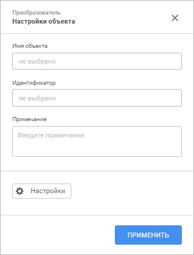

На панели настроек задайте базовые свойства, общие для всех преобразователей:

	- Имя объекта. В соответствующем
	 поле введите новое имя объекта. Изменение имени приведет к изменению
	 текста, отображаемого на элементе в рабочей области;

	- Идентификатор. В соответствующем
	 поле введите новый идентификатор объекта. Идентификатор преобразователя
	 должен быть уникальным в рамках задачи и начинаться с буквы. Допускается
	 использование букв латинского алфавита, цифр и знака «_»;

	- Примечание. В текстовом
	 поле введите описание объекта. Поле не обязательно для заполнения.

## Редактирование входов преобразователей

Для определения и настройки списка входов преобразователя и списка полей:

	- Откройте панель настроек преобразователя.

	- Нажмите кнопку  «Настройки».

	- На панели дополнительных настроек преобразователя перейдите
	 на вкладку «Редактор входов».

После выполнения действий будет отображена вкладка «Редактор
 входов»:

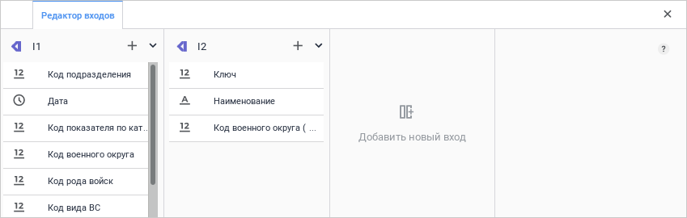

Примечание.
 Вкладка «Редактор входов» показана
 на примере преобразователя «Объединение».
 Вид панели и количество доступных входов зависит от типа преобразователя.

### Входы и связи

Возможные операции над входами преобразователя:

[Добавление
 входа](javascript:TextPopup(this))

	Добавление входа можно реализовать двумя способами:

		- Настройка входа уже созданного
		 преобразователя. Для настройки входа созданного преобразователя
		 выполните следующие действия:

			- Убедитесь, что на рабочей области расположен как минимум
			 один объект, информация с которого должна поступать на вход
			 преобразователя.

			- Нажмите кнопку  «Добавить новый вход» на
			 вкладке «Редактор входов».
			 На вкладке появится список доступных источников:

	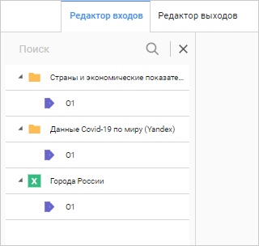

	Примечание.
	 В списке отображаются только те объекты, для которых еще не настроена
	 связь с преобразователем.

			- Щелчком мыши выберите нужный источник из списка. На
			 вкладке «Редактор входов»
			 появится выбранный источник и его поля. Идентификатор входа
			 по умолчанию - «IN»,
			 где N - номер входа выбранного преобразователя.

	В результате выполненных действий будут
	 созданы вход и его связь с объектом:

	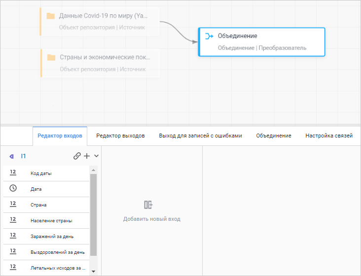

	Примечание.
	 Результат настройки входа показан на примере преобразователя «Объединение».

	Если для преобразователя доступен выбор
	 нескольких входов, повторно нажмите на кнопку  «Добавить новый вход» и повторите
	 процедуру выбора источника для входа;

		- Настройка входа одновременно
		 с процедурой добавления преобразователя в задачу ETL. Для
		 настройки входа при создании преобразователя:

			- Убедитесь, что на рабочей области расположен как минимум
			 один объект, информация с которого должна поступать на вход
			 преобразователя.

			- Наведите курсор на выбранный объект. Курсор примет вид
			 указателя, у каждой из четырёх граней объекта появятся коннекторы:

	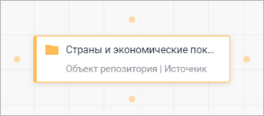

			- Щелчком мыши выделите один из коннекторов. В группе
			 «Преобразователь»
			 выберите необходимый преобразователь.

	После выполнения действий на рабочую
	 область будет добавлен преобразователь, связь между объектом и преобразователем
	 будет настроена автоматически.

[Редактирование
 входа](javascript:TextPopup(this))

	Для редактирования идентификатора входа дважды щелкните по идентификатору
	 входа - поле идентификатора перейдет в режим редактирования. Введите
	 новый идентификатор. Идентификатор входа должен быть уникальным и
	 начинаться с буквы. Допускается использование букв латинского алфавита,
	 цифр и знака «_».

[Дублирование
 входа](javascript:TextPopup(this))

	Дублирование позволяет создать вход с полями ранее созданного входа.

	Примечание.
	 Дублирование входа доступно только для преобразователей, для которых
	 допустимо добавление нескольких входов.

	Для дублирования входа:

		- Нажмите кнопку 
		 «Действия», расположенную
		 в строке с идентификатором соответствующего входа на вкладке «Редактор входов».

		- В раскрывшемся меню выполните команду «Дублировать».

	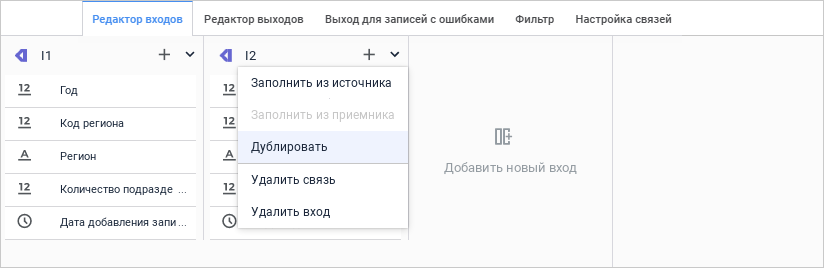

	В результате выполненных действий будет добавлен новый вход с полями
	 ранее созданного входа:

	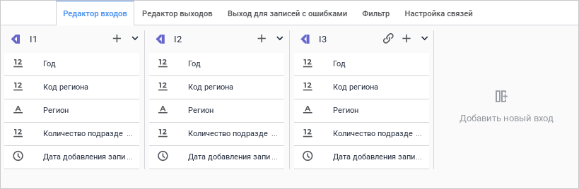

[Удаление
 входа](javascript:TextPopup(this))

	Для удаления входа:

		- Нажмите на кнопку 
		 «Действия», расположенную
		 в строке с идентификатором соответствующего входа на панели «Редактор входов».

		- В раскрывшемся меню выполните команду «Удалить
		 вход».

	После выполнения действий вход будет удален без подтверждения выполняемого
	 действия.

## Редактирование выходов преобразователей

Для определения выхода преобразователя и списка полей:

	- Откройте панель настроек преобразователя.

	- Нажмите кнопку  «Настройки».

	- На панели дополнительных настроек преобразователя перейдите
	 на вкладку «Редактор выходов».

После выполнения действий будет отображена вкладка «Редактор
 выходов»:

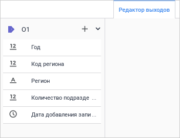

### Выходы и связи

Возможные операции для выходов преобразователя:

[Добавление
 выхода](javascript:TextPopup(this))

	Настроить выход преобразователя можно двумя способами:

		- Настройка связи выхода
		 с уже созданным приёмником. Для настройки выхода преобразователя
		 выполните следующие действия:

			- Убедитесь, что на рабочей области расположен как минимум
			 один объект, выполняющий роль приёмника данных.

			- Нажмите кнопку 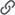 «Создать связь», расположенную
			 рядом с идентификатором выхода на вкладке «Редактор
			 выходов». Идентификатор выхода по умолчанию - «ON», где N - номер выхода
			 преобразователя.

	На вкладке появится список доступных
	 приёмников:

	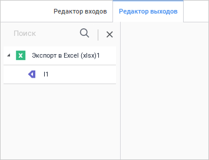

	Примечание.
	 В списке отображаются только те объекты, для которых еще не настроена
	 связь с преобразователем.

			- Щелчком мыши выберите вход нужного объекта из списка.
			 Связь будет настроена с выбранным объектом.

	В результате выполненных действий будут
	 созданы выход преобразователя и его связь с объектом;

		- Настройка связи одновременно
		 с процедурой добавления приёмника в задачу ETL. Для настройки
		 связи между выходом преобразователя и объектом при создании объекта:

			- Убедитесь, что на рабочей области расположен преобразователь,
			 для которого нужно настроить выход.

			- Наведите курсор на преобразователь. Курсор примет вид
			 указателя, у каждой из четырёх граней преобразователя появятся
			 коннекторы.

			- Щелчком мыши выделите один из коннекторов. В раскрывшемся
			 списке выберите тип объекта, который будет выполнять роль
			 приёмника данных.

	Примечание.
	 Команда доступна, если связь между выходом преобразователя и приёмником
	 еще не создана и не превышено максимальное количество выходов преобразователя.

	После выполнения действий на рабочую
	 область будет добавлен объект, связь между выходом преобразователя
	 и объектом будет настроена автоматически.

[Редактирование
 выхода](javascript:TextPopup(this))

	Для редактирования идентификатора выхода дважды щелкните по идентификатору
	 выхода - поле идентификатора перейдет в режим редактирования. Введите
	 новый идентификатор. Идентификатор входа должен быть уникальным и
	 начинаться с буквы. Допускается использование букв латинского алфавита,
	 цифр и знака «_».

[Удаление
 выхода](javascript:TextPopup(this))

	Для удаления входа:

		- Нажмите кнопку 
		 «Действия», расположенную
		 в строке с идентификатором соответствующего выхода на вкладке
		 «Редактор выходов».

		- В раскрывшемся меню выполните команду «Удалить
		 выход».

	После выполнения действий выход будет удален без подтверждения выполняемого
	 действия.

## Редактирование полей входов и выходов

Для настройки полей входов перейдите на вкладку «Редактор
 входов». Для настройки полей выходов перейдите на вкладку «Редактор выходов». Возможные операции
 для полей входов и выходов аналогичны:

[Добавление
 поля](javascript:TextPopup(this))

	Для создания поля:

		- Нажмите кнопку  «Добавить
		 поле», расположенную рядом с идентификатором входа/выхода.

	Будет открыто окно:

	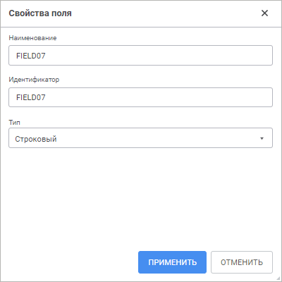

		- Отредактируйте идентификатор и наименование. По умолчанию
		 они совпадают.

		- Выберите из раскрывающегося списка необходимый тип поля
		 в зависимости от типа данных источника/приёмника.

	В результате выполненных действий будет создано поле с указанными
	 параметрами.

[Редактирование
 поля](javascript:TextPopup(this))

	Для быстрого редактирования наименования поля щёлкните по наименованию
	 поля, которое нужно изменить. Поле наименования будет переведено в
	 режим редактирования. Введите новое наименование.

	Для быстрого редактирования типа поля щёлкните по типу поля, которое
	 нужно редактировать. Выберите в раскрывающемся списке новый тип поля.

	Для редактирования всех параметров поля выполните команду «Редактировать» в контекстном меню
	 поля. Откроется окно редактирования параметров поля:

	

	При необходимости, измените идентификатор, наименование и тип поля.
	 Для сохранения внесённых изменений нажмите кнопку «Применить».

[Удаление
 поля](javascript:TextPopup(this))

	Для удаления поля выполните команду «Удалить»
	 в контекстном меню поля.

	Поле будет удалено без подтверждения выполняемого действия.

[Автоматическое
 заполнение полей](javascript:TextPopup(this))

	Для автоматического заполнения полей входа/выхода:

		- Нажмите кнопку 
		 «Действия», расположенную
		 в строке с идентификатором соответствующего входа/выхода на вкладке
		 «Редактор входов»/«Редактор выходов».

		- Выполните одну из команд раскрывшегося меню:

			- Заполнить из источника.
			 В список будут добавлены поля из источника данных;

			- Заполнить из приёмника.
			 В список будут добавлены поля из приёмника данных.

	После выполнения действий поля входа/выхода будут заполнены автоматически
	 из источника/приёмника.

## Редактирование выходов с ошибочными записями

Для настройки связей выходов с ошибочными записями:

	- Откройте панель настроек преобразователя.

	- Нажмите кнопку  «Настройки».

	- На панели дополнительных настроек преобразователя перейдите
	 на вкладку «Выход для записей с ошибками».

После выполнения действий будет отображена вкладка «Выход
 для записей с ошибками»:

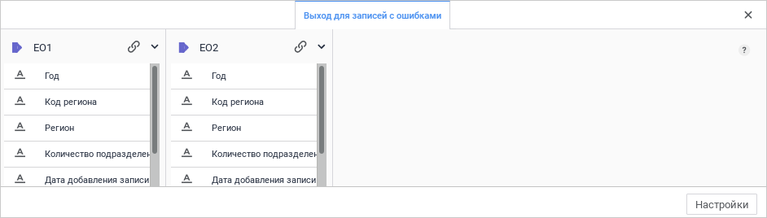

Примечание.
 Вкладка «Выход для записей с ошибками»
 показана на примере преобразователя «Объединение».
 Вид панели и количество доступных выходов зависит от типа преобразователя.

Для задания дополнительных настроек, которые будут применяться при возникновении
 ошибочных записей, нажмите кнопку «Настройки».
 Будет открыто окно:

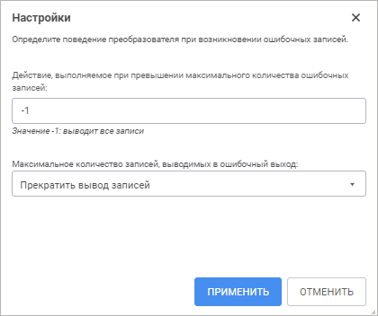

Укажите максимальное количество ошибочных записей, информация о которых
 будет экспортирована. По умолчанию установлено значение «-1», при этом
 экспортируется информация обо всех ошибочных записях.

Примечание.
 При наличии большого количества ошибочных записей, экспорт информации
 о них может замедлить выполнение задачи ETL.

Если задано максимальное количество выводимых записей, то также выберите
 действие, выполняемое при превышении этого количества. Доступны следующие
 действия:

	- Прекратить вывод записей.
	 Значение установлено по умолчанию. Вывод записей при превышении максимального
	 количества прекращается;

	- Остановка расчёта задачи.
	 При превышении максимального количества ошибочных записей расчёт задачи
	 прекращается.

Для сохранения введённых параметров нажмите кнопку «Применить».

## Поля группировки

	На вкладке «Поля группировки»
	 укажите группируемые поля, по значениям которых выполняется агрегация
	 данных из объектов-источников.

	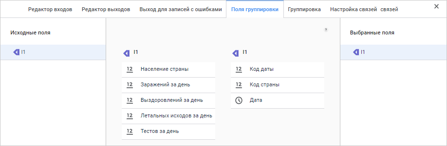

	Для создания списка группируемых полей перетащите выбранное поле
	 из списка «Исходные поля»
	 в список «Выбранные поля».
	 Для удаления выбранного поля из списка группируемых перетащите поле
	 обратно в список исходных полей.

	Если ни одно поле группировки не задано, то при переходе на следующую
	 страницу будет запрошено подтверждение выполняемого действия.

## Настройка группировки

	На вкладке «Группировка»
	 определяется функция для агрегации значений негруппируемых полей.

	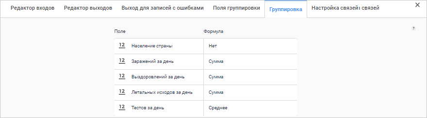

	На против каждого негруппируемого поля укажите функцию, выбрав её
	 из комбинированного списка. Доступны методы агрегации:

		- Нет.
		 Значения полей останутся без изменения;

		- Сумма.
		 Значения негруппируемого поля суммируются;

		- Среднее.
		 Вычисляется среднее значение негруппируемого поля;

		- Максимальное.
		 Вычисляется максимальное значение негруппируемого поля;

		- Минимальное. Вычисляется
		 максимальное значение негруппируемого поля.

См. также:

[Преобразователи данных](../UiEtl_Trfs.htm)

		Справочная
		 система на версию 10.9
		 от 18/08/2025,
		 © ООО «ФОРСАЙТ»,
