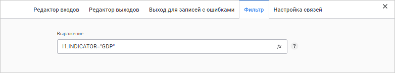

# Преобразователь «Фильтрация»: Задача ETL, веб-приложение

Преобразователь «Фильтрация»: Задача ETL, веб-приложение
-

# Фильтрация

Преобразователь «Фильтрация»
 - объект, выполняющий фильтрацию данных по заданным параметрам. На входе
 объекта один источник, на выходе - один приёмник. Поля источника проверяются
 на выполнение заданных [условий](#condition). Если условие
 для поля выполнено, запись попадает в результат. Данная функция является
 более простой формой [разделения](../01_Split/uietl_split.htm).

Упорядоченность и уникальность данных по каким-либо индексам являются
 несущественными.

При использовании преобразователя «Фильтрация»
 из таблицы:

		 Key
		 Date
		 Value

		 4
		 Summer
		 1111

		 1
		 Winter
		 2222

		 5
		 Summer
		 3333

		 2
		 Winter
		 4444

		 6
		 Summer
		 5555

		 3
		 Winter
		 6666

можно получить таблицу:

		 Key
		 Date
		 Value

		 4
		 Summer
		 1111

		 5
		 Summer
		 3333

		 6
		 Summer
		 5555

Таким образом, были отфильтрованы записи, не удовлетворяющие условию
 Date="Summer".

После [добавления](../UiEtl_Trfs.htm#add) преобразователя
 на рабочую область настройте [базовые
 свойства](../UiEtl_Trfs.htm#settings_panel), [входы](../UiEtl_Trfs.htm#input_tab) и [выход](../UiEtl_Trfs.htm#output_tab)
 преобразователя, а также [выход
 для записей с ошибками](../UiEtl_Trfs.htm#error_output_tab).

## Условие фильтрации

Для настройки условия фильтрации преобразователя:

	- Откройте [панель настроек](../UiEtl_Trfs.htm#settings_panel)
	 преобразователя.

	- Нажмите кнопку  «Настройки».

	- На панели дополнительных настроек преобразователя перейдите
	 на вкладку «Фильтр».

После выполнения действий будет отображена вкладка «Фильтр».
 В поле «Выражение» определяется
 условие, по которому происходит отбор записей из источника данных:

Условие должно возвращать логическое значение. В результирующий набор
 попадут те записи, для которых заданное условие является истинным.

Условие формируется в окне «[Редактор выражений](uinav.chm::/gui/expressioneditor.htm)»,
 для вызова которого нажмите кнопку 
 «Редактировать выражение».

См. также:

[Создание преобразователей данных](../UiEtl_Trfs.htm)

		Справочная
		 система на версию 10.9
		 от 18/08/2025,
		 © ООО «ФОРСАЙТ»,
