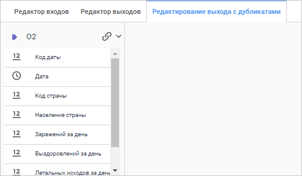
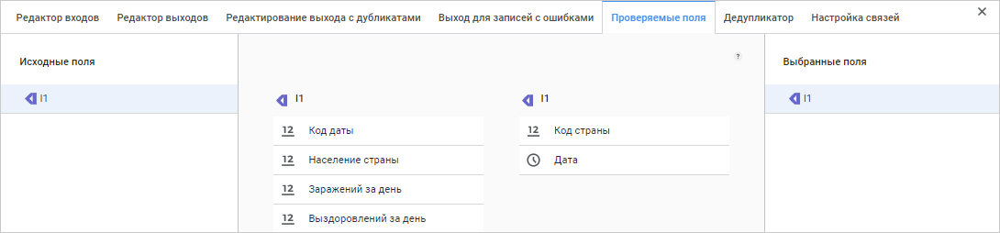

# Преобразователь «Удаление дубликатов»: Задача ETL, веб-приложение

Преобразователь «Удаление дубликатов»: Задача ETL, веб-приложение
-

# Удаление дубликатов

	Преобразователь «Удаление дубликатов»
	 - объект, выполняющий удаление дубликатов в данных. На входе объекта
	 один источник, на выходе - один приёмник для записей без дубликатов
	 и один приёмник для удалённых дубликатов. Данная операция производит
	 удаление дублирующих значений на основе заданного индекса. Для определения
	 удаляемых строк формируется условие, на основании которого происходит
	 отбор записей.

	Для эффективного удаления дубликатов данные источника должны быть
	 упорядочены по индексу. После выполнения операции данные остаются
	 упорядоченными.

	При использовании преобразователя «Удаление
	 дубликатов» из таблицы:

			 Key
			 Date
			 Value

			 4
			 Summer
			 1111

			 1
			 Winter
			 2222

			 5
			 Summer
			 3333

			 2
			 Winter
			 4444

			 4
			 Summer
			 1111

			 6
			 Summer
			 5555

			 5
			 Summer
			 3333

			 3
			 Winter
			 6666

	можно получить таблицу без дублирования:

			 Key
			 Date
			 Value

			 4
			 Summer
			 1111

			 1
			 Winter
			 2222

			 5
			 Summer
			 3333

			 2
			 Winter
			 4444

			 6
			 Summer
			 5555

			 3
			 Winter
			 6666

	и таблицу из удаленных дубликатов:

			 Key
			 Date
			 Value

			 4
			 Summer
			 1111

			 5
			 Summer
			 3333

	Таким образом, удаление дубликатов производилось, если одновременно
	 совпадали значения всех полей.

	После [добавления](../UiEtl_Trfs.htm#add) преобразователя
	 на рабочую область настройте [базовые
	 свойства](../UiEtl_Trfs.htm#settings_panel), [вход](../UiEtl_Trfs.htm#input_tab) и [выход](../UiEtl_Trfs.htm#output_tab) для записей без дублирования,
	 а также [выход для записей
	 с ошибками](../UiEtl_Trfs.htm#error_output_tab).

	После этого настройте [выход с дубликатами](#duplicates_exit),
	 [проверяемые поля](#fields) и [дедупликатор](#deduplicator).

## Редактирование выхода с дубликатами

	Настройка выхода для записей без дубликатов и выхода с дубликатами
	 выполняется на разных вкладках панели дополнительных настроек - «[Редактор
	 выходов](../UiEtl_Trfs.htm#output_tab)» и «Редактирование выхода
	 с дубликатами» соответственно.

	Для определения и настройки выхода преобразователя с дубликатами:

		- Откройте [панель
		 настроек](../UiEtl_Trfs.htm#settings_panel) преобразователя.

		- Нажмите кнопку  «Настройки».

		- На панели дополнительных настроек преобразователя перейдите
		 на вкладку «Редактирование выхода
		 с дубликатами».

	После выполнения действий будет отображена вкладка «Редактирование
	 выхода с дубликатами»:

	

	Для преобразователя может быть выбран только один выход с дубликатами.

	Возможные операции над выходом аналогичны операциям над выходом
	 на вкладке «[Редактор
	 выходов](../UiEtl_Trfs.htm#output_tab)».

## Проверяемые поля

	Для определения входных полей, значения которых будут проверяться
	 на дублирование:

		- Откройте [панель
		 настроек](../UiEtl_Trfs.htm#settings_panel) преобразователя.

		- Нажмите кнопку  «Настройки».

		- На панели дополнительных настроек преобразователя перейдите
		 на вкладку «Проверяемые поля».

	После выполнения действий будет отображена вкладка «Проверяемые
	 поля»:

	

	Для создания списка проверяемых полей из левого списка, соответствующего
	 структуре входа, перетащите выбранные поля в правый список, используя
	 механизм Drag&Drop. Для удаления поля из списка проверяемых перетащите
	 его обратно из правого списка в левый.

## Дедупликатор

	Для определения условия, на основании которого происходит отбор
	 записей для удаления:

		- Откройте [панель
		 настроек](../UiEtl_Trfs.htm#settings_panel) преобразователя.

		- Нажмите кнопку  «Настройки».

		- На панели дополнительных настроек преобразователя перейдите
		 на вкладку «Дедупликатор».

	После выполнения действий будет отображена вкладка «Дедупликатор»:

	

	Для формирования условия нажмите кнопку  «Редактирование выражения» в строке
	 поля «Выражение, вычисляемое на дублях».
	 Будет открыто окно [редактора выражений](uinav.chm::/gui/expressioneditor.htm).

	Правило отбора дубликатов определяется переключателем в группе «Правила отбора»:

		- Запись удовлетворяет условию.
		 Из записей-дублей в приёмник будет передана первая запись, удовлетворяющая
		 заданному условию;

		- Запись не удовлетворяет
		 условию. Используется по умолчанию. Из записей-дублей в
		 приёмник будет передана первая запись, неудовлетворяющая заданному
		 условию.

См. также:

[Создание преобразователей данных](../UiEtl_Trfs.htm)

		Справочная
		 система на версию 10.9
		 от 18/08/2025,
		 © ООО «ФОРСАЙТ»,
