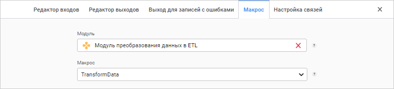

# Преобразователь «Пользовательский»: Задача ETL, веб-приложение

Преобразователь «Пользовательский»: Задача ETL, веб-приложение
-

# Пользовательский

Преобразователь «Пользовательский»
 - объект, предназначенный для преобразования данных с помощью заданного
 пользователем алгоритма. Данный преобразователь имеет несколько входов
 и выходов.

После [добавления](../UiEtl_Trfs.htm#add) преобразователя
 на рабочую область настройте [базовые
 свойства](../UiEtl_Trfs.htm#settings_panel), [входы](../UiEtl_Trfs.htm#input_tab) и [выход](../UiEtl_Trfs.htm#output_tab)
 преобразователя, а также [выход
 для записей с ошибками](../UiEtl_Trfs.htm#error_output_tab).

## Настройка макроса

Для настройки макроса преобразователя:

	- Откройте [панель настроек](../UiEtl_Trfs.htm#settings_panel)
	 преобразователя.

	- Нажмите кнопку  «Настройки».

	- На панели дополнительных настроек преобразователя перейдите
	 на вкладку «Макрос».

После выполнения действий будет отображена вкладка «Макрос»:

В полях «Модуль» и «Макрос»
 укажите соответственно модуль и содержащийся в нём макрос, который реализует
 пользовательский алгоритм преобразования данных из источника.

Макрос - это процедура, содержащая два параметра.
 Первый параметр содержит входные наборы записей, полученные из источников
 данных. Второй параметр формирует выходной набор записей, которые будут
 выгружены в приёмники данных.

См. также:

[Создание преобразователей данных](../UiEtl_Trfs.htm)

		Справочная
		 система на версию 10.9
		 от 18/08/2025,
		 © ООО «ФОРСАЙТ»,
