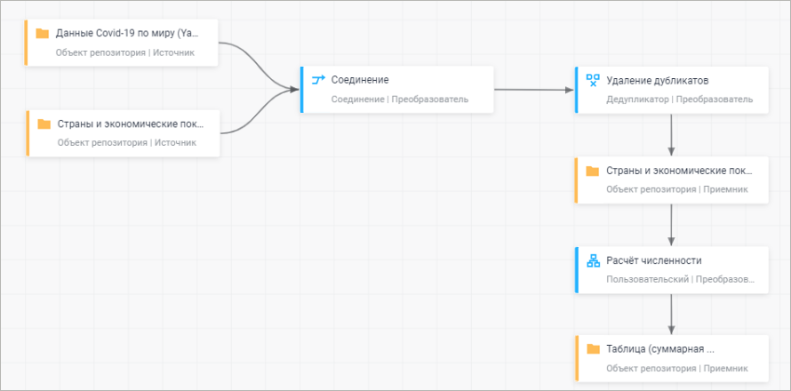
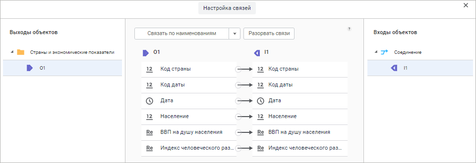
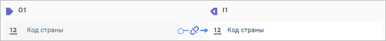

# Связи между объектами: Задача ETL, веб-приложение

Связи между объектами: Задача ETL, веб-приложение
-

# Связи между объектами

Связь - объект задачи ETL, определяющий соответствие между выходными
 полями одного объекта и входными полями другого объекта. Связи устанавливаются
 в процессе редактирования входов и выходов следующих объектов:

	- [коннекторов к исходным
	 данным](../02_Inputs/UiEtl_Inputs.htm);

	- [преобразователей
	 данных](../04_Transformers/UiEtl_Trfs.htm);

	- [коннекторов к приёмникам
	 данных](../03_Outputs/UiEtl_Outputs.htm);

	- [объектов из группы
	 «Другие» с коннекторами или преобразователями](../Other/Other_objects_group.htm).

Связи отображаются в виде стрелок:

## Редактирование связи

Для редактирования связи используйте вкладку «Настройка
 связей».

[Для открытия
 вкладки «Настройка связей»](javascript:TextPopup(this))

		- выделите связь на рабочей области;

		- перейдите на вкладку «Настройка
		 связей» на панели дополнительных настроек объекта, из которого
		 выходит связь:

			- Откройте [панель
			 настроек](../04_Transformers/UiEtl_Trfs.htm#settings_panel) объекта:

					- двойным щелчком выделите его на рабочей области;

					- выполните команду «Редактировать»
					 в контекстном меню объекта на рабочей области.

			- Нажмите кнопку  «Настройки».

			- На панели дополнительных настроек объекта перейдите
			 на вкладку «Настройка связей».

	В результате будет отображена вкладка «Настройка
	 связей».

На вкладке устанавливаются связи между полями выхода и входа. Действия
 со связями полей:

	- Автоматическое создание связей.
	 Для создания связей между полями выберите в раскрывающемся списке
	 один из вариантов:

		- Связать по наименованиям.
		 Связи будут настроены автоматически между полями с одинаковыми
		 наименованиями;

		- Связать по идентификаторам.
		 Связи будут настроены автоматически между полями с одинаковыми
		 идентификаторами;

		- Связать по порядку.
		 Связи будут настроены автоматически между полями в порядке их
		 следования;

	- Ручное создание связей.
	 Перетащите поле-выход на поле-вход;

	- Редактирование входных полей,
	 не связанных с выходом. Если для входного поля отсутствует
	 связь с выходным полем, то значение входного поля можно формировать
	 автоматически, используя автозаполнение. Для настройки параметров
	 автоматического заполнения поля наведите курсор мыши на соответствующее
	 входное поле и нажмите кнопку  «Параметры автозаполнения». Откроется
	 окно «Параметры автозаполнения поля»:

Параметры, доступные для редактирования,
 зависят от выбранного варианта автозаполнения:

		- Нет. Автозаполнение
		 не используется;

		- Константа. Поле
		 заполнятся указанной константой. Тип данных константы соответствует
		 типу данных поля;

		- Из сиквенса БД.
		 Применяется только для полей целого типа. Сиквенс - это упорядоченный
		 список значений. В соответствующих полях укажите базу данных,
		 содержащую сиквенс, и идентификатор сиквенса. Входное поле будет
		 заполнено допустимыми значениями сиквенса;

		- Автоинкремент. Применяется
		 только для полей целого типа. Укажите начальное значение и приращение,
		 которое будет использоваться для вычисления нового значения для
		 каждой новой записи. При каждой загрузке данных заполнение будет
		 начинаться с начального значения;

		- Текущая дата. Применяется
		 только для полей типа «Дата».
		 Входное поле заполняется текущей датой;

	- Разорвать связь. Наведите
	 курсор мыши на связь между полями, при этом вид связи изменится. Щёлкните
	 по связи для её удаления:

	- Разорвать связи. Для удаления
	 всех связей нажмите кнопку «Разорвать
	 связи». Все связи будут удалены без подтверждения выполняемого
	 действия.

См. также:

[Построение
 задачи ETL](../Construction_ETL.htm)

		Справочная
		 система на версию 10.9
		 от 18/08/2025,
		 © ООО «ФОРСАЙТ»,
