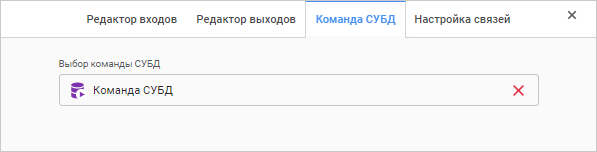

# Команда СУБД: Задача ETL, веб-приложение

Команда СУБД: Задача ETL, веб-приложение
-

# Команда СУБД

«Команда СУБД» - объект, предназначенный
 для преобразования данных при помощи одного из следующих объектов репозитория:
 «[Команда СУБД](UiNavObj.chm::/CUBD/UiDb_relationa_CUBD.htm)» или «[Процедура](UiNavObj.chm::/procedure/UiDb_relationa_procedure.htm)».

Для определения выполняемой процедуры:

	- Откройте [панель
	 настроек](Other_objects_group.htm#settings_panel) преобразователя.

	- Нажмите кнопку  «Настройки».

	- На панели дополнительных настроек преобразователя перейдите
	 на вкладку «Команда СУБД».

После выполнения действий будет отображена вкладка «Команда
 СУБД»:

В раскрывающемся списке выберите доступную в репозитории команду СУБД
 или Процедуру.

Если команда СУБД не содержит параметров, то список входов и выходов
 формируется на основании выходов источника, к которому подключается текущий
 объект. При этом фактические данные в выполняемую команду СУБД передаваться
 не будут. Они один к одному будут переданы со входа на выход. Задание
 входов/выходов используется для включения объекта «Команда
 СУБД» в какую-либо цепочку выполнения.

Если команда СУБД содержит параметры, то данные параметры будут являться
 входами и выходами текущего объекта. Данные из источника через значения
 параметров будут передаваться и использоваться при выполнении команды
 СУБД/процедуры, а затем передаваться через выход далее по цепочке выполнения.

См. также:

[Группа
 объектов «Другое»](Other_objects_group.htm)

		Справочная
		 система на версию 10.9
		 от 18/08/2025,
		 © ООО «ФОРСАЙТ»,
