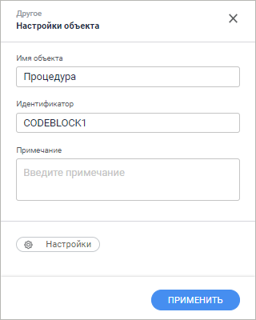

# Создание объектов из группы «Другое»: Задача ETL, веб-приложение

Создание объектов из группы «Другое»: Задача ETL, веб-приложение
-

# Создание объектов из группы «Другое»

Группа объектов «Другое» содержит
 дополнительные объекты, реализация которых не позволяет их однозначно
 отнести к [источникам](../02_Inputs/UiEtl_Inputs.htm), [приёмникам](../03_Outputs/UiEtl_Outputs.htm)
 или [преобразователям](../04_Transformers/UiEtl_Trfs.htm).
 Данные объекты предназначены для решения различных специфических задач,
 при этом они могут использоваться как сами по себе, так и в цепочках наряду
 с другим объектами.

Если в задаче используются процедуры, то будет игнорироваться [пакетная
 обработка данных](../../04_Work/04_Jurnal/UiEtl_Jurnal.htm).

Доступные объекты группы «Другое»:

[

## ](Procedure.htm)Создание объекта

Для создания дополнительного объекта для обработки данных вызовите контекстное
 меню на рабочей области задачи ETL и в группе «Другое»
 выберите требуемый тип объекта.

## Редактирование базовых свойств

Для редактирования объекта:

	- дважды щёлкните его на рабочей области;

	- выполните команду «Настроить»
	 в контекстном меню объекта.

В результате выполнения одного из действий будет отображена панель настроек:

Примечание.
 Пример панели настроек приведен для объекта «Процедура».

На панели настроек задайте базовые свойства, общие для всех объектов:

	- Имя объекта. В соответствующем
	 поле введите новое имя объекта. Изменение имени приведет к изменению
	 текста, отображаемого на элементе в рабочей области;

	- Идентификатор. В соответствующем
	 поле введите новый идентификатор объекта. Идентификатор объекта должен
	 быть уникальным в рамках задачи и начинаться с буквы. Допускается
	 использование букв латинского алфавита, цифр и знака «_»;

	- Примечание. В текстовом
	 поле введите описание объекта. Поле не обязательно для заполнения.

Для определения параметров работы, а также создания связей с другими
 объектами, нажмите кнопку «Настройки».
 Для сохранения настроек нажмите кнопку «Применить».

### Удаление объекта

Для удаления объекта выполните команду «Удалить»
 в контекстном меню. После выполнения действия будет запрошено подтверждение
 выполняемого действия.

## Редактирование входов

Для задания списка полей и связи для входа перейдите на вкладку «Редактор входов».

[Для отображения
 вкладки редактирования входов](javascript:TextPopup(this))

		- Откройте панель свойств объекта.

		- Нажмите кнопку  «Настройки».

		- На панели дополнительных настроек объекта перейдите на вкладку
		 «Редактор входов».

На странице доступны следующие настройки:

[Идентификатор](javascript:TextPopup(this))

	Для изменения идентификатора входа дважды щёлкните в его области
	 и задайте новое значение. Возможно использование символов латинского
	 алфавита, цифр и специального символа «_». По умолчанию идентификаторы
	 входов объектов генерируются автоматически в формате: I<номер
	 входа>.

[Связь с объектом](javascript:TextPopup(this))

	Установите связь с объектом. Для этого нажмите кнопку  «Создать
	 связь» и выберите выход какого-либо
	 объекта. Если список полей источника и приёмника полностью совпадает,
	 то все поля будут связаны автоматически. Также связь полей может быть
	 настроена в группе настроек «[Настройка
	 связей](../05_Links/uietl_links_create.htm)».

[Поля](javascript:TextPopup(this))

	Добавьте необходимые поля объекта задачи ETL в список. В указанные
	 поля будут выгружаться данные. Для добавления в список всех полей
	 из связанного с входом объекта, являющегося приёмником, нажмите кнопку
	 
	 «Действия» и выполните команду
	 «Заполнить из приёмника».

## Редактирование выходов

[Для отображения
 вкладки редактирования выходов](javascript:TextPopup(this))

		- Откройте панель свойств объекта.

		- Нажмите кнопку  «Настройки».

		- На панели дополнительных настроек объекта перейдите на вкладку
		 «Редактор выходов».

На странице доступны следующие настройки:

[Идентификатор](javascript:TextPopup(this))

	Для изменения идентификатора выхода дважды щёлкните в его области
	 и задайте новое значение. Возможно использование символов латинского
	 алфавита, цифр и специального символа «_». По умолчанию идентификаторы
	 выходов объектов генерируются автоматически в формате: O<номер
	 выхода>.

[Связь с объектом](javascript:TextPopup(this))

	Установите связь с объектом. Для этого нажмите кнопку  «Создать
	 связь» и выберите вход какого-либо
	 объекта. Если список полей источника и приёмника полностью совпадает,
	 то все поля будут связаны автоматически. Также связь полей может быть
	 настроена в группе настроек «[Настройка
	 связей](../05_Links/uietl_links_create.htm)».

[Поля](javascript:TextPopup(this))

	Добавьте необходимые поля объекта задачи ETL в список. Из указанных
	 полей будут выгружаться данные.

	Для добавления в список всех полей из файла-источника, нажмите кнопку
	 
	 «Действия» и выполните команду
	 «Заполнить из источника».

	Для добавления нового поля нажмите кнопку 
	 «Добавить». Будет открыто
	 окно «Свойства поля»:

	

	Примечание.
	 Вид окна «Свойства поля» зависит
	 от выбранного источника данных.

	Задайте в нем значения атрибутов поля:

		- Наименование. Наименование
		 поля;

		- Идентификатор. Уникальный
		 идентификатор поля;

		- Тип. Из раскрывающегося
		 списка выберите тип данных поля;

		- Вычисляемое поле.
		 Для задания формулы, по которой будет вычисляться значение поля,
		 установите данный флажок. После установки флажка введите выражение
		 с помощью клавиатуры.

		Для увеличения значения каждой новой записи на фиксированную величину
		 используйте специальное выражение INCREMENT.

	Примечание.
	 Специальное выражение INCREMENT
	 доступно только для вычисляемого поля целого типа.

	Синтаксис данного выражения: INCREMENT[Value1,
	 Value2], где Value1 - начальное значение, Value2 - шаг, на который
	 значение Value1 должно увеличиваться при каждом вызове выражения.
	 При каждой загрузке данных заполнение будет начинаться с начального
	 значения.

	Для редактирования поля выполните для него команду контекстного
	 меню «Редактировать».

См. также:

[Построение
 задачи ETL](../Construction_ETL.htm)

		Справочная
		 система на версию 10.9
		 от 18/08/2025,
		 © ООО «ФОРСАЙТ»,
