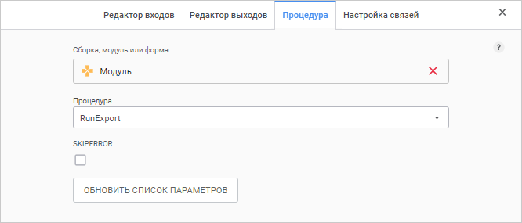

# Процедура: Задача ETL, веб-приложение

Процедура: Задача ETL, веб-приложение
-

# Процедура

«Процедура» - объект, предназначенный
 для выполнения процедур/функций, реализованных в модулях/формах/сборках
 репозитория.

После [добавления](Other_objects_group.htm#add) объекта на
 рабочую область настройте [базовые
 свойства](Other_objects_group.htm#settings_panel), [вход](Other_objects_group.htm#input_tab) и [выход](Other_objects_group.htm#output_tab) объекта.

Список входов и выходов может формироваться только на основании выходов
 источника, к которому подключается текущий объект. При этом фактические
 данные в выполняемую процедуру/функцию передаваться не будут. Они один
 к одному будут переданы со входа на выход. Задание входов/выходов используется
 для включения объекта «Процедура»
 в какую-либо цепочку выполнения.

После этого задайте выполняемую процедуру.

## Выбор процедуры

Для определения выполняемой процедуры:

	- Откройте [панель
	 настроек](Other_objects_group.htm#settings_panel) преобразователя.

	- Нажмите кнопку  «Настройки».

	- На панели дополнительных настроек преобразователя перейдите
	 на вкладку «Процедура».

После выполнения действий будет отображена вкладка «Процедура»:

В верхнем раскрывающемся списке выберите модуль или сборку репозитория,
 а в нижнем - выполняемую процедуру или функцию.

В список доступных входят все процедуры и функции без параметров или
 с параметрами простых типов. Кнопка «Обновить
 список параметров» позволяет обновить список доступных параметров
 в соответствии с сигнатурой выбранной процедуры/функции. Для каждого параметра,
 в соответствии с его типом, будет доступен редактор, позволяющий задать
 значение. Значения параметров будут переданы в процедуру/функцию при выполнении.

См. также:

[Группа
 объектов «Другое»](Other_objects_group.htm)

		Справочная
		 система на версию 10.9
		 от 18/08/2025,
		 © ООО «ФОРСАЙТ»,
