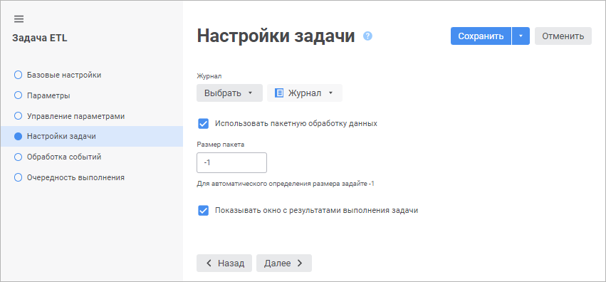

# Настройки задачи: Задача ETL, веб-приложение

Настройки задачи: Задача ETL, веб-приложение
-

# Настройки задачи

На странице «Настройки задачи»
 в [мастере редактирования
 задачи ETL](../../06_CreateETL/Relational_ETL_master.htm) указывается журнал, в котором будут храниться системные
 сообщения о ходе процессов импорта/экспорта данных в задаче ETL, а также
 ряд дополнительных параметров.

Журнал - объект репозитория,
 предназначенный для протоколирования операций, производимых при [выполнении
 задачи ETL](../../05_PropertyETL/UIEtl_WorkVisualisation.htm). Журнал представляет собой таблицу, изначально содержащую
 набор полей, необходимых для протоколирования. Добавление дополнительных
 полей возможно при создании и редактировании
 в [навигаторе
 объектов](getstarted.chm::/Interface/Interface_Navigator.htm).

Задайте следующие параметры:

	- Журнал. Для протоколирования
	 операций в свойствах задачи ETL укажите журнал. В раскрывающемся
	 списке объектов репозитория выберите журнал, в который будут
	 записываться системные сообщения о ходе процессов импорта/экспорта
	 данных в задаче ETL. Кнопка «Создать»
	 позволяет создать новый журнал;

	- Использовать пакетную обработку
	 данных. Пакетная обработка данных производит обработку записей
	 импорта/экспорта частями (пакетами). Количество записей обрабатываемых
	 в одном пакете указывается в поле «Размер
	 пакета»;

	- Показывать окно с результатами
	 выполнения задачи. Включает отображение окна с результатами
	 после [выполнения
	 задачи ETL](../../05_PropertyETL/UIEtl_WorkVisualisation.htm).

Протоколируемые операции задачи ETL:

	- начало выполнения;

	- ошибка выполнения;

	- пропуск записей;

	- добавление записей;

	- окончание выполнения.

См. также:

[Настройки
 задачи ETL](../../06_CreateETL/Relational_ETL_master.htm)

		Справочная
		 система на версию 10.9
		 от 18/08/2025,
		 © ООО «ФОРСАЙТ»,
