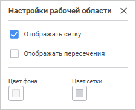
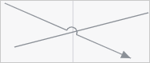
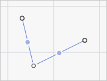
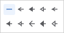
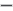
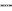
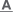
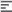

# Настройка оформления задачи ETL: Веб-приложение

Настройка оформления задачи ETL: Веб-приложение
-

# Настройка оформления задачи ETL

	При настройке оформления задачи ETL:

		- [Настройте оформление
		 рабочей области](ETL_Decor.htm#settings_param).

		- [Добавьте](ETL_Decor.htm#insert_object) и [настройте](ETL_Decor.htm#objects_settings) объекты оформления
		 задачи ETL.

## Настройка оформления рабочей области

	Для настройки оформления рабочей области:

		- Выполните команду «Параметры
		 рабочей области» контекстного меню рабочей области. Откроется
		 панель «Настройки рабочей области»:

	

		- Задайте параметры:

			- Отображать сетку.
			 Снимите флажок для скрытия сетки на рабочей области. По умолчанию
			 флажок установлен, сетка отображается;

			- Отображать пересечения.
			 Установите флажок для отображения перегиба линий при пересечении
			 прямых/угловых линий и стрелок на рабочей области:

	

	По умолчанию флажок снят, пересечения
	 прямых/угловых линий и стрелок отображаются без перегиба линий. Состояние
	 флажка не сохраняется, при открытии задачи ETL флажок всегда будет
	 снят;

			- Цвет фона/Цвет сетки. Выберите цвет
			 фона/сетки в раскрывающейся палитре цветов.

Для выбора доступны стандартные и пользовательские цвета. По умолчанию
 палитра содержит только стандартные цвета.

Для создания пользовательского цвета:

	- Нажмите кнопку  «Добавить
	 цвет». Откроется расширенная палитра цветов.

	- Выберите цвет в расширенной палитре цветов, на странице браузера
	 с помощью пипетки или задайте код цвета в формате RGB/HEX.

После выполнения действий пользовательский цвет будет создан и добавлен
 в палитру.

Примечание.
 Максимально возможное количество пользовательских цветов в палитре равно
 23.

Для удаления пользовательского цвета из палитры выполните команду «Удалить» контекстного меню выбранного
 цвета.

Для изменения непрозрачности цвета используйте бегунок или введите значение
 в процентах при необходимости.

Для сброса настроек цвета нажмите кнопку  «Цвет
 по умолчанию».

	Для скрытия/отображения сетки на рабочей
	 области используйте клавишу G.

## Добавление объектов оформления задачи
	 ETL

	Для оформления задачи ETL используйте [дополнительные
	 объекты](Objects_settings.htm#additional_objects): линии, фигуры, изображения.

	[Добавление
	 линии](javascript:TextPopup(this))

			- Выберите требуемый тип линии в  раскрывающемся
			 меню кнопки, содержащей набор линий, на [панели
			 инструментов](../01_General_Info/UiETL_StartingToWork.htm#elements_etl). Кнопка выбора линии имеет вид последней
			 выбранной линии.

			- Переместите курсор к предполагаемому месту начала линии
			 и, удерживая кнопку мыши, переместите курсор к месту предполагаемого
			 окончания линии. Отпустите кнопку мыши.

		У прямой линии/пунктирной линии/стрелки в её центре отображается
		 дополнительная точка, позволяющая создать ломаную линию. Для этого
		 перетащите дополнительную точку, расположенную в центре линии,
		 в другое место рабочей области при необходимости создания ломаной
		 линии. Дополнительные точки отображаются на каждом новом линейном
		 участке:

		

		Для удаления дополнительной точки дважды щёлкните по ней.

		Примечание.
		 Линии могут быть построены в любом месте рабочего пространства
		 без привязки к соединительным точкам.

	[Добавление
	 фигуры](javascript:TextPopup(this))

			- Выберите требуемый тип фигуры в раскрывающемся меню
			 кнопки, содержащей набор фигур, на [панели
			 инструментов](../01_General_Info/UiETL_StartingToWork.htm#elements_etl). Кнопка выбора фигуры имеет вид последней
			 выбранной фигуры.

			- Укажите курсором место расположения фигуры, щёлкнув
			 мышью на рабочей области.

	[Добавление
	 изображения](javascript:TextPopup(this))

			- Нажмите кнопку  «Изображение»
			 на [панели
			 инструментов](../01_General_Info/UiETL_StartingToWork.htm#elements_etl). Откроется окно выбора файла.

			- Выберите файл изображения и нажмите кнопку «Открыть».

			- Укажите курсором место расположения изображения, щёлкнув
			 мышью на рабочей области.

## Настройка объектов оформления задачи
	 ETL

	По умолчанию все [дополнительные
	 объекты](Objects_settings.htm#additional_objects) рабочей области имеют одинаковое оформление. Для настройки
	 оформления объектов задайте их параметры оформления. Для этого используйте
	 всплывающую панель с настройками оформления выделенного объекта:

		- для линии:

	

		- для фигуры:

	

	Задайте:

	[Параметры
	 линии](javascript:TextPopup(this))

			- Тип начальной/конечной
			 стрелки. Выберите требуемый тип начальной/конечной
			 стрелки в раскрывающемся меню кнопки 
			 «Начало»/  «Конец»:

		

		Кнопка выбора типа начальной/конечной
		 стрелки имеет вид последнего выбранного типа начальной/конечной
		 стрелки.

		При необходимости изменения выбранных
		 типов начальной и конечной стрелки между собой нажмите кнопку
		 
		 «Поменять местами»;

			- Цвет линии.
			 Выберите цвет линии в раскрывающейся палитре цветов кнопки
			  «Цвет
			 линии».

Для выбора доступны стандартные и пользовательские цвета. По умолчанию
 палитра содержит только стандартные цвета.

Для создания пользовательского цвета:

	- Нажмите кнопку  «Добавить
	 цвет». Откроется расширенная палитра цветов.

	- Выберите цвет в расширенной палитре цветов, на странице браузера
	 с помощью пипетки или задайте код цвета в формате RGB/HEX.

После выполнения действий пользовательский цвет будет создан и добавлен
 в палитру.

Примечание.
 Максимально возможное количество пользовательских цветов в палитре равно
 23.

Для удаления пользовательского цвета из палитры выполните команду «Удалить» контекстного меню выбранного
 цвета.

Для изменения непрозрачности цвета используйте бегунок или введите значение
 в процентах при необходимости.

Для сброса настроек цвета нажмите кнопку  «Без
 цвета».

			- Тип линии. Выберите
			 тип линии в раскрывающемся меню кнопки  «Настройка линии»:

	- . Сплошная линия;

	- . Квадратные точки;

	- . Штрих;

	- . Штрих-точка-точка-штрих;

	- . Штрих-точка-штрих.

Толщина границы задаётся в пунктах.

			- Текст линии.
			 Добавьте/настройте текст линии. Для получения подробной информации
			 по добавлению и настройке текста линии обратитесь к разделу
			 «[Ввод и редактирование
			 текста](ETL_Decor.htm#settings_text)».

	[Параметры
	 фигуры](javascript:TextPopup(this))

			- Цвет границы.
			 Выберите цвет линии в раскрывающейся палитре цветов кнопки
			 
			 «Цвет границы».

Для выбора доступны стандартные и пользовательские цвета. По умолчанию
 палитра содержит только стандартные цвета.

Для создания пользовательского цвета:

	- Нажмите кнопку  «Добавить
	 цвет». Откроется расширенная палитра цветов.

	- Выберите цвет в расширенной палитре цветов, на странице браузера
	 с помощью пипетки или задайте код цвета в формате RGB/HEX.

После выполнения действий пользовательский цвет будет создан и добавлен
 в палитру.

Примечание.
 Максимально возможное количество пользовательских цветов в палитре равно
 23.

Для удаления пользовательского цвета из палитры выполните команду «Удалить» контекстного меню выбранного
 цвета.

Для изменения непрозрачности цвета используйте бегунок или введите значение
 в процентах при необходимости.

Для сброса настроек цвета нажмите кнопку  «Без
 цвета».

			- Тип границы.
			 Выберите тип границы в раскрывающемся меню кнопки  «Настройка
			 границ»:

	- . Сплошная линия;

	- . Квадратные точки;

	- . Штрих;

	- . Штрих-точка-точка-штрих;

	- . Штрих-точка-штрих.

Толщина границы задаётся в пунктах.

			- Цвет заливки.
			 Выберите цвет заливки в раскрывающейся палитре цветов кнопки
			 
			 «Цвет заливки».

Для выбора доступны стандартные и пользовательские цвета. По умолчанию
 палитра содержит только стандартные цвета.

Для создания пользовательского цвета:

	- Нажмите кнопку  «Добавить
	 цвет». Откроется расширенная палитра цветов.

	- Выберите цвет в расширенной палитре цветов, на странице браузера
	 с помощью пипетки или задайте код цвета в формате RGB/HEX.

После выполнения действий пользовательский цвет будет создан и добавлен
 в палитру.

Примечание.
 Максимально возможное количество пользовательских цветов в палитре равно
 23.

Для удаления пользовательского цвета из палитры выполните команду «Удалить» контекстного меню выбранного
 цвета.

Для изменения непрозрачности цвета используйте бегунок или введите значение
 в процентах при необходимости.

Для сброса настроек цвета нажмите кнопку  «Без
 цвета».

			- Текст линии.
			 Добавьте/настройте текст линии. Для получения подробной информации
			 по добавлению и настройке текста линии обратитесь к разделу
			 «[Ввод и редактирование
			 текста](ETL_Decor.htm#settings_text)».

			- Изображение в фигуре.
			 Выберите/настройте изображение. Для получения подробной информации
			 по выбору и настройке изображения обратитесь к разделу «[Добавление изображения в
			 фигуру](ETL_Decor.htm#insert_image)».

	Для объекта «Изображение»
	 доступна только настройка прозрачности. Для этого:

		- Выполните команду «Настроить
		 изображение» контекстного меню изображения. Откроется панель
		 «Настройки изображения».

		- Задайте степень прозрачности изображения. Допустимые значения
		 находятся в диапазоне [0, 80].

### Ввод и редактирование текста

	Для ввода и редактирования текста линии/фигуры:

		- дважды щёлкните по выбранному объекту;

		- выполните для него команду контекстного меню «Переименовать»;

		- нажмите кнопку  «Добавить/Редактировать
		 текст» на всплывающей панели выделенного объекта.

	Будет активирован редактор текста. Для завершения редактирования
	 текста щёлкните за пределами редактора.

	Для настройки оформления текста выделенного объекта используйте
	 всплывающую панель:

	

	Задайте параметры текста:

	[Шрифт](javascript:TextPopup(this))

		Доступные настройки оформления текста:

			- Шрифт.
			 Выберите шрифт, установленный в операционной системе. При
			 необходимости можно загрузить [пользовательские
			 шрифты](Setup.chm::/UiWebSetup/03_Setup_Web/General_for_linux/Loading_Custom_Fonts.htm);

			- Размер
			 шрифта. Выберите размер шрифта от 6 до 36 пунктов;

			- Начертание
			 шрифта. Выберите один или несколько типов начертания
			 шрифта в раскрывающемся меню кнопки 
			 «Начертание»:

				- . Полужирное начертание;

				- . Курсивное начертание;

				- . Подчёркивание текста;

				- . Зачёркивание текста линией;

			- Цвет шрифта.
			 Нажмите кнопку  «Цвет
			 шрифта» и выберите цвет шрифта в раскрывающейся палитре
			 цветов.

Для выбора доступны стандартные и пользовательские цвета. По умолчанию
 палитра содержит только стандартные цвета.

Для создания пользовательского цвета:

	- Нажмите кнопку  «Добавить
	 цвет». Откроется расширенная палитра цветов.

	- Выберите цвет в расширенной палитре цветов, на странице браузера
	 с помощью пипетки или задайте код цвета в формате RGB/HEX.

После выполнения действий пользовательский цвет будет создан и добавлен
 в палитру.

Примечание.
 Максимально возможное количество пользовательских цветов в палитре равно
 23.

Для удаления пользовательского цвета из палитры выполните команду «Удалить» контекстного меню выбранного
 цвета.

Для изменения непрозрачности цвета используйте бегунок или введите значение
 в процентах при необходимости.

	[Выравнивание](javascript:TextPopup(this))

		Для определения способа расположения текста фигуры используйте
		 группу настроек «Выравнивание».

		Задайте способы расположения текста:

			- Выравнивание
			 текста по горизонтали. Выберите способ выравнивания
			 текста в блоке по горизонтали в раскрывающемся меню кнопки
			 
			 «Выравнивание текста по горизонтали»:

				- . По левому краю;

				- . По центру. Используется по
				 умолчанию;

				- . По правому краю;

			- Выравнивание
			 текста по вертикали. Выберите способ выравнивания текста
			 в блоке по вертикали в раскрывающемся меню кнопки  «Выравнивание
			 текста по вертикали»:

				- . По верхнему краю;

				- . По середине. Используется
				 по умолчанию;

				- . По нижнему
				 краю.

	Для задания смешанного форматирования текста измените [параметры
	 шрифта](ETL_Decor.htm#font) выделенной части текста.

### Добавление и настройка изображения

	Для добавления изображения в фигуру:

		- Выделите фигуру.

		- Выполните команду «Выбрать
		 изображение» в раскрывающемся меню кнопки  «Изображение
		 в фигуре» на всплывающей панели.

	После выбора файла изображение будет добавлено в фигуру с ограничением
	 границ объекта.

	Для настройки изображения, расположенного на рабочей области, выполните
	 команду «Настроить изображение»
	 в раскрывающемся меню кнопки 
	 «Изображение в фигуре» на
	 всплывающей панели. После чего будет открыта панель «Настройки
	 изображения»:

	

	Задайте параметры:

		- Выравнивание. Задайте
		 в группе ориентацию изображения внутри фигуры. По умолчанию изображение
		 располагается по центру относительно вертикальных и горизонтальных
		 границ фигуры;

		- Отступы от границ, мм.
		 Задайте в группе дополнительные отступы для изображения внутри
		 фигуры;

		- Параметры изображения.
		 Задайте в группе настройки:

			- Режим
			 масштабирования. Выберите режим изменения размеров
			 изображения относительно размеров фигуры:

				- Не изменять размер.
				 Изображение будет отображаться с теми размерами, которое
				 оно имеет. Если изображение больше фигуры, то оно выйдет
				 за его границы;

				- Сохранять пропорции.
				 Размер изображения подгоняется пропорционально соотношению
				 ширины и высоты фигуры;

				- Растягивать.
				 Изображение растягивается таким образом, чтобы заполнить
				 пространство фигуры с учётом установленных отступов;

			- Прозрачность.
			 Задайте степень прозрачности изображения. Допустимые значения
			 находятся в диапазоне [0, 80].

	Для удаления изображения:

		- Выделите фигуру, содержащую изображение.

		- Выполните команду «Удалить
		 изображение» в раскрывающемся меню кнопки  «Изображение
		 в фигуре» на всплывающей панели.

См. также:

[Построение
 задачи ETL](../03_ETLObjects/Construction_ETL.htm)

		Справочная
		 система на версию 10.9
		 от 18/08/2025,
		 © ООО «ФОРСАЙТ»,
