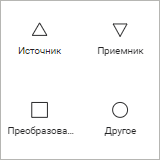

# Управление объектами задачи ETL: Веб-приложение

Управление объектами задачи ETL: Веб-приложение
-

# Управление объектами задачи ETL

Объекты задачи ETL служат для
 отображения схем загрузки и трансформации данных, механизмов, схем и структур
 зависимости объектов в рабочей области.

Объекты делятся на основные и дополнительные объекты.

Основные объекты:

	- [Источники](../03_ETLObjects/02_Inputs/UiEtl_Inputs.htm);

	- [Преобразователи](../03_ETLObjects/04_Transformers/UiEtl_Trfs.htm);

	- [Приёмники](../03_ETLObjects/03_Outputs/UiEtl_Outputs.htm);

	- [Объекты
	 группы «Другое»](../03_ETLObjects/Other/Other_objects_group.htm).

Объекты оформления задачи ETL:

[Линии](javascript:TextPopup(this))

	Предназначены для графического оформления связей различных объектов
	 между собой. При создании соединительной линии между коннекторами
	 или преобразователями [связи](../03_ETLObjects/05_Links/uietl_links_create.htm)
	 между их входами и выходами не создаётся. Для использования доступны
	 следующие соединительные линии:

		- .
		 Прямая линия;

		- . Пунктирная линия;

		- .
		 Стрелка;

		- . Угловая линия;

		- . Изогнутая линия.

[Фигуры](javascript:TextPopup(this))

	Предназначены для дополнительного оформления рабочей области задачи
	 ETL. Для использования доступны следующие графические примитивы:

		- . Скруглённый прямоугольник;

		- .
		 Прямоугольник;

		- .
		 Эллипс;

		- .
		 Треугольник;

		- . Четырёхугольник;

		- .
		 Пятиугольник;

		- .
		 Шестиугольник;

		- .
		 Восьмиугольник.

[Изображения](javascript:TextPopup(this))

	Предназначены для создания визуальных объектов. Поддерживаемые форматы
	 изображения: BMP, JPEG, JPG, JFIF, JPE, GIF, PNG.

Для добавления и настройки объектов оформления задачи ETL обратитесь
 к разделу «[Настройка оформления
 задачи ETL](ETL_Decor.htm#insert_object)».

## Операции с объектами задачи ETL

[Создание объекта
 задачи ETL](javascript:TextPopup(this))

	При создании новой задачи ETL в рабочей области будет отображён
	 список групп возможных объектов, которые доступны в задаче:

	

	При щелчке на выбранную группу будет отображено контекстное меню,
	 в котором можно выбрать необходимый коннектор, преобразователь или
	 другой объект.

	Для добавления объектов оформления задачи ETL обратитесь к разделу
	 «[Настройка оформления задачи
	 ETL](ETL_Decor.htm#insert_object)».

	После того, как на рабочей области создан хотя бы один объект, список
	 доступных групп будет скрыт. Все дальнейшие действия по созданию объектов
	 выполняются с помощью команд контекстного меню, вызываемого на свободном
	 месте рабочей области.

[Выделение
 элементов](javascript:TextPopup(this))

	Для выделения одного элемента на [рабочей
	 области:](../01_General_Info/UiETL_StartingToWork.htm)

		- щелкните по элементу мышью;

		- используйте клавишу TAB для выделения элемента в порядке
		 слева направо, сверху вниз;

		- используйте сочетание клавиш SHIFT+TAB для выделения элемента
		 в порядке снизу вверх, справа налево.

	Примечание.
	 Выделение будет осуществляться в пределах видимой рабочей области.

	Для выделения всех элементов на рабочей области используйте сочетание
	 клавиш CTRL+А.

	Для выделения нескольких элементов на рабочей области:

		- зажмите клавишу CTRL и последовательно
		 щёлкните по каждому выделяемому элементу;

		- выберите режим  «Курсор» на [панели
		 инструментов](../01_General_Info/UiETL_StartingToWork.htm) и используйте рамку для выделения элементов:

			- Определите группу элементов, которые требуется выделить.

			- Щёлкните и зажмите кнопку мыши за пределами группы выделяемых
			 элементов.

			- Начните перемещать указатель мыши. Будет отображена
			 прямоугольная рамка:

	

			- Перемещайте указатель до тех пор, пока все требуемые
			 элементы не будут помещены в рамку.

			- Отпустите указатель мыши. Все элементы, полностью или
			 частично помещенные в рамку, будут выделены.

[Работа с буфером
 обмена](javascript:TextPopup(this))

	Используя буфер обмена можно перемещать и копировать объекты рабочей
	 области.

	Примечание.
	 Работа с буфером обмена ведется с учётом прав доступа. Доступны только
	 те операции, на выполнение которых пользователь имеет права.

	Для копирования объекта в буфер обмена:

		- выполните команду «Копировать» в
		 контекстном меню объекта;

		- выделите объект и нажмите сочетание клавиш CTRL+C.

	Примечание.
	 Операция недоступна для объекта «[Связь](../03_ETLObjects/05_Links/uietl_links_create.htm)».

	Для перемещения выбранных объектов в буфер обмена:

		- выполните команду «Вырезать»
		 в контекстном меню объекта;

		- нажмите сочетание клавиш CTRL+X.

	Примечание.
	 Операция недоступна для объекта «[Связь](../03_ETLObjects/05_Links/uietl_links_create.htm)». При перемещении связи между
	 объектами удаляются.

	Для вставки скопированного/вырезанного объекта из буфера обмена
	 нажмите сочетание клавиш CTRL+V.

	Примечание.
	 Вставка доступна, если в буфере обмена содержатся объекты.

[Удаление объектов](javascript:TextPopup(this))

	Для удаления выделенных объектов:

		- выполните команду «Удалить» в
		 контекстном меню объекта;

		- выделите объект и нажмите клавишу DELETE.

	Примечание.
	 При удалении связи между объектами разрываются.

[Изменение размера
 элемента](javascript:TextPopup(this))

	Для изменения размера элемента на [рабочей
	 области](../01_General_Info/UiETL_StartingToWork.htm):

		- с помощью мыши:

			- Наведите курсор мыши
			 на точку, расположенную на границе элемента. Указатель мыши
			 примет вид двунаправленной стрелки.

			- Зажмите кнопку мыши
			 и растяните/сожмите элемент до необходимого размера.

		- с помощью клавиатуры:

			- Зажмите сочетание клавиш
			 CTRL+SHIFT.

			- Измените размер элемента
			 с помощью клавиш UP, DOWN, LEFT, RIGHT на 1 пиксель.

	После выполнения действий будет изменён размер элемента.

[Поворот объекта](javascript:TextPopup(this))

	[Дополнительные объекты](#additional_objects) рабочей
	 области могут повёрнуты на угол, кратный 90 градусов. Для поворота
	 объекта выполните для него команду контекстного меню  «Повернуть
	 на 90º по часовой стрелке» или  «Повернуть
	 на 90º против часовой стрелки».

[Порядок размещения
 объектов](javascript:TextPopup(this))

	Для настройки порядка размещения выбранных объектов выполните команду
	  «На передний
	 план»/  «На
	 задний план» в контекстном меню объектов.

[Выравнивание
 объектов](javascript:TextPopup(this))

	Для выравнивания объектов относительно
	 друг друга:

		- [Выделите](Objects_settings.htm#select)
		 несколько объектов.

		- Выполните одно из действий:

			- выполните команду «Выровнять»
			 в контекстном меню объекта;

			- нажмите кнопку  «Выровнять»
			 на [панели
			 инструментов](../01_General_Info/UiETL_StartingToWork.htm#elements_etl);

		- Выберите один из вариантов выравнивания объектов в раскрывающемся
		 меню команды/кнопки:

			- Выровнять
			 по левому краю. Выделенные объекты будут выровнены
			 по левому краю относительно крайнего левого объекта:

	

			- Выровнять
			 по центру. Выделенные объекты будут выровнены по центру.
			 Центр рассчитывается исходя из положения крайнего левого объекта
			 и крайнего правого среди выделенных и размеров самих объектов:

	

			- Выровнять
			 по правому краю. Выделенные объекты будут выровнены
			 по правому краю относительно крайнего правого объекта:

	

			- Выровнять
			 по верхнему краю. Выделенные объекты будут выровнены
			 по верхнему краю относительно крайнего верхнего объекта:

	

			- Выровнять
			 по середине. Выделенные объекты будут выровнены по
			 середине. Середина рассчитывается исходя из положения крайнего
			 верхнего объекта и крайнего нижнего среди выделенных и размеров
			 самих объектов:

	

			- Выровнять
			 по нижнему краю. Выделенные объекты будут выровнены
			 по нижнему краю относительно крайнего нижнего объекта:

	

[Перемещение
 объектов на рабочей области](javascript:TextPopup(this))

	Для перемещения одного или нескольких выделенных объектов на рабочей
	 области:

		- используйте клавиши UP, LEFT, DOWN, RIGHT для перемещения
		 объектов на 1 пиксель;

		- используйте сочетание клавиш SHIFT+UP, SHIFT+LEFT, SHIFT+DOWN,
		 SHIFT+RIGHT для перемещения объектов на 10 пикселей;

		- используйте сочетание клавиш CTRL+UP, CTRL+LEFT, CTRL+DOWN,
		 CTRL+RIGHT для перемещения объектов на 100 пикселей.

См. также:

[Построение
 задачи ETL](../03_ETLObjects/Construction_ETL.htm)

		Справочная
		 система на версию 10.9
		 от 18/08/2025,
		 © ООО «ФОРСАЙТ»,
