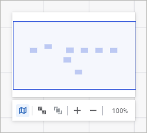

# Настройка рабочей области: Задача ETL, веб-приложение

Настройка рабочей области: Задача ETL, веб-приложение
-

# Настройка рабочей области

Рабочая область - контейнер,
 в котором расположены объекты задачи ETL. Рабочая область является удобным
 механизмом для:

	- визуального размещения объектов задачи на едином рабочем поле;

	- организации доступа к свойствам объектов задачи;

	- отображения связей и зависимостей между объектами.

[Основные объекты](Objects_settings.htm#main_objects) в рабочей
 области могут отображаться в кратком/подробном виде. В кратком виде отображаются
 только пиктограммы объектов. В подробном виде отображается пиктограмма,
 наименование и тип объекта. Для изменения вида используйте кнопку  «Краткий/Подробный вид» на панели
 инструментов.

Для скрытия/отображения панели [параметров](../06_CreateETL/Relational_ETL_master_Param.htm)
 используйте кнопку  «Параметры»
 на панели инструментов.

## Перемещение по рабочей области

Для перемещения по рабочей области выполните одно из действий:

	- выберите режим  «Рука»
	 на [панели
	 инструментов](../../../CalculationAlgorithm/Web/Work/Beginning_of_work.htm) и зажмите кнопку мыши. Если выбран режим  «Курсор»
	 для [выделения объектов](Objects_settings.htm#select),
	 то используйте раскрывающийся список для смены режима;

	- зажмите клавишу ПРОБЕЛ и кнопку мыши;

	- используйте стрелки на клавиатуре;

	- прокрутите колесо мыши для перемещения рабочей области по вертикали.
	 Для перемещения рабочей области по горизонтали дополнительно зажмите
	 клавишу SHIFT;

	- используйте миникарту. Для отображения миникарты нажмите кнопку
	 
	 «Включить миникарту» на панели
	 настроек отображения рабочей области:

## Масштабирование рабочей области

Для масштабирования рабочей области:

	- прокрутите колесо мыши с зажатой клавишей CTRL;

	- используйте панель настроек отображения рабочей области:

На панели доступны следующие операции:

		-  «Подогнать
		 по всем объектам». Изменение масштаба рабочей области по
		 всем объектам;

		-  «Подогнать
		 по объекту». Изменение масштаба рабочей области по выделенному
		 объекту;

Примечание.
 Если ни один объект на рабочей области не выделен, то кнопка  «Подогнать
 по объекту» будет недоступна.

		-  «Увеличить
		 масштаб». Увеличение масштаба рабочей области на 25%;

		-  «Уменьшить
		 масштаб». Уменьшение масштаба рабочей области на 25%.

В рабочей области может быть установлен масштаб
 отображения в диапазоне [1%, 400%]. Для установки стопроцентного масштаба
 нажмите кнопку с отображением текущего масштаба;

См. также:

[Построение
 задачи ETL](../03_ETLObjects/Construction_ETL.htm)

		Справочная
		 система на версию 10.9
		 от 18/08/2025,
		 © ООО «ФОРСАЙТ»,
