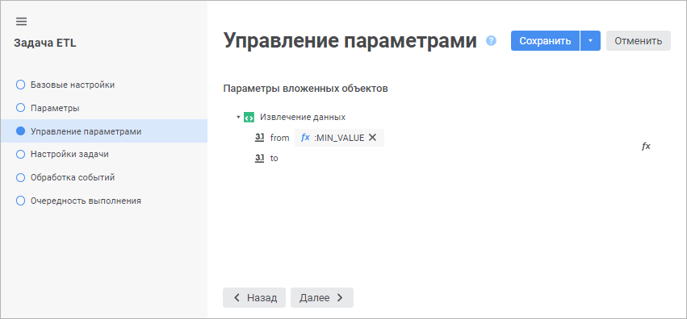
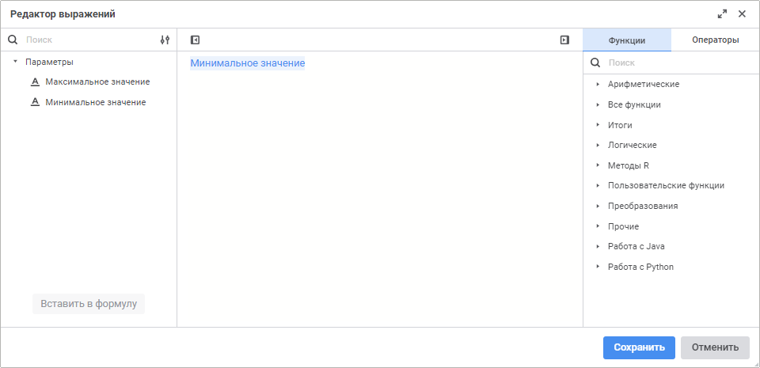

# Управление параметрами вложенных объектов: Задача ETL, веб-приложение

Управление параметрами вложенных объектов: Задача ETL, веб-приложение
-

# Управление параметрами вложенных объектов

На странице «Управление параметрами»
 в [мастере редактирования
 задачи ETL](../06_CreateETL/Relational_ETL_master.htm) формируются выражения, в соответствии с которыми будут
 вычисляться значения для открытия параметрических объектов, используемых
 в задаче ETL.

На странице отображаются только те объекты, которые имеют параметры.
 Значение параметра или выражение, по которому оно будет вычисляться, задаётся
 в окне «Редактор выражения». Для
 открытия редактора выражения дважды щелкните в области нужного параметра
 или нажмите кнопку  «Установка
 формулы для параметра».

## Редактор выражения

Окно редактора выражения для настройки параметров вложенных объектов
 выглядит следующим образом:

Сформируйте формулу, по которой будет рассчитываться значение, или введите
 константное значение в соответствие с тем типом данных, который имеет
 параметр.

В формуле допускается использование [параметров
 задачи ETL](../06_CreateETL/Relational_ETL_master_Param.htm), различных операторов и функций. При этом имеются некоторые
 особенности:

	- вставка всех типов элементов, кроме цифр, может осуществляться
	 как с помощью клавиатуры, так и с помощью специальных панелей справа;

	- вставка цифр осуществляется только с помощью клавиатуры;

	- для облегчения ввода в области редактора доступно использование
	 технологии IntelliSense.

См. также:

[Настройки
 задачи ETL](../06_CreateETL/Relational_ETL_master.htm)

		Справочная
		 система на версию 10.9
		 от 18/08/2025,
		 © ООО «ФОРСАЙТ»,
