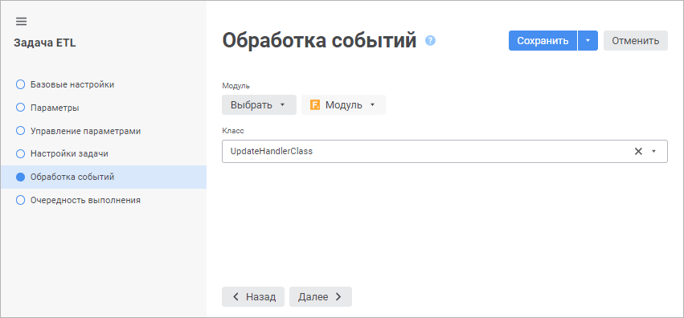

# Обработка событий: Задача ETL, веб-приложение

Обработка событий: Задача ETL, веб-приложение
-

# Обработка событий

На странице «Обработка событий»
 в [мастере редактирования задачи ETL](Relational_ETL_master.htm)
 указывается объект среды разработки и класс, содержащий реализацию обработчиков
 событий для задачи ETL.

Задайте следующие параметры:

	- Модуль. Выполните команду
	 «Выбрать > Выбрать из репозитория»
	 и выберите существующий модуль, который содержит в себе реализацию
	 класса для обработки событий задачи ETL. При необходимости для автоматического
	 создания обработчика событий выполните команду «Выбрать >
	 Создать». После чего будет создан модуль с автоматически сгенерированным
	 кодом;

	- Класс. Выберите в раскрывающемся
	 списке класс, содержащий реализацию обработчиков событий задачи ETL.
	 Список классов-обработчиков содержит все классы, унаследованные от
	 класса [EtlTaskExecutionEvents](KeEtl.chm::/Class/EtlTaskExecutionEvents/EtlTaskExecutionEvents.htm).
	 Класс для обработки событий может иметь конструктор, который будет
	 вызываться при каждой инициализации класса. Конструктор должен быть
	 без параметров. Если в классе несколько конструкторов без параметров,
	 то будет вызываться самый первый (расположенный в коде выше других).

Примечание.
 Инициализация класса-обработчика происходит каждый раз, когда происходит
 [выполнение задачи
 ETL](../05_PropertyETL/UIEtl_WorkVisualisation.htm).

## Пример обработчика событий

	Class EventsClass: EtlTaskExecutionEvents

	    Public Sub OnStartTask(Task: IEtlTask);

	    Begin

	    End Sub OnStartTask;

	    Public Sub OnEndTask(Task: IEtlTask; Duration, TotalRec, ErrorRec: Integer);

	    Begin

	    End Sub OnEndTask;

	    Public Sub OnStartBlock(Task: IEtlTask; Object: IEtlObject);

	    Begin

	    End Sub OnStartBlock;

	    Public Sub OnEndBlock(Task: IEtlTask; Object: IEtlObject; Duration: Integer; TotalRecIn, TotalRecOut, ErrorRec: IDictionary);

	    Begin

	    End Sub OnEndBlock;

	    Public Sub OnProgress(Task: IEtlTask; Progress: Integer);

	    Begin

	    End Sub OnProgress;

	    Public Sub OnError(Task: IEtlTask; Object: IEtlObject; Excep: IException);

	    Begin

	    End Sub OnError;

	End Class EventsClass;

См. также:

[Настройки
 задачи ETL](Relational_ETL_master.htm)

		Справочная
		 система на версию 10.9
		 от 18/08/2025,
		 © ООО «ФОРСАЙТ»,
