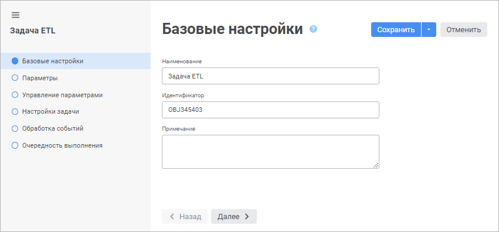

# Настройки задачи: Задача ETL, веб-приложение

Настройки задачи: Задача ETL, веб-приложение
-

# Настройки задачи ETL

Настройка задачи ETL выполняется с помощью мастера. Для открытия мастера
 и редактирования настроек задачи ETL нажмите кнопку  «Настройки», расположенную рядом
 с наименованием задачи ETL на [рабочей
 области](../01_General_Info/UiETL_StartingToWork.htm).

После выполнения действий будет открыт мастер редактирования задачи
 ETL:

Задайте следующие настройки на страницах:

	- [Базовые
	 настройки](Basic_Settings_ETL.htm). Задаются наименование задачи ETL, её идентификатор
	 и примечание;

	- [Параметры](Relational_ETL_master_Param.htm).
	 Задаётся список параметров, которые будут доступны для использования
	 в различных выражениях;

	- [Управление
	 параметрами](../05_PropertyETL/paramscontrol.htm). Формируются выражения, по которым будут рассчитываться
	 и передаваться значения для открытия параметрических объектов, используемых
	 в задаче ETL;

	- [Настройки
	 задачи](../04_Work/04_Jurnal/UiEtl_Jurnal.htm). Указывается журнал, в котором будут храниться системные
	 сообщения о ходе процессов импорта/экспорта данных в задаче ETL, а
	 также ряд дополнительных параметров;

	- [Обработка
	 событий](Event_Handling.htm). Указывается модуль, в котором реализована прикладная
	 логика обработки событий, возникающих при импорте/экспорте в задаче
	 ETL;

	- [Очерёдность
	 выполнения](../05_PropertyETL/UiETL_Property_queue.htm). Задаются цепочки импорта/экспорта, которые будут выполнены/исключены
	 при выполнении задачи ETL.

Для сохранения настроек:

	- нажмите кнопку «Сохранить»;

	- выполните команду «Сохранить
	 и закрыть» в раскрывающемся меню кнопки «Сохранить».
	 После этого будут сохранены заданные настройки и закрыт мастер редактирования
	 задачи ETL.

См. также:

[Построение
 задачи ETL](../03_ETLObjects/Construction_ETL.htm)

		Справочная
		 система на версию 10.9
		 от 18/08/2025,
		 © ООО «ФОРСАЙТ»,
