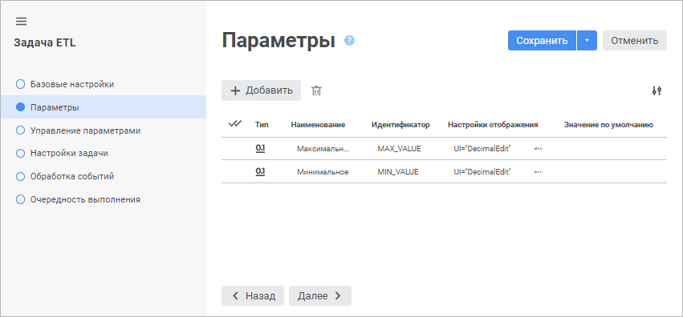

# Параметры: Задача ETL, веб-приложение

Параметры: Задача ETL, веб-приложение
-

# Параметры

На странице «Параметры» в [мастере редактирования задачи ETL](Relational_ETL_master.htm)
 формируется список параметров, которые в дальнейшем могут использоваться
 в различных выражениях для динамической подстановки значений. Таким образом
 можно управлять процессом [выполнения
 задачи ETL](../05_PropertyETL/UIEtl_WorkVisualisation.htm).

[Добавление параметров](javascript:TextPopup(this))

	Для создания нового параметра нажмите кнопку  «Добавить». Параметр будет добавлен
	 в конец списка и выделен.

[Редактирование
 параметров](javascript:TextPopup(this))

	Для изменения каких-либо настроек параметра щелкните по соответствующему
	 столбцу. Тип данных выбирается из раскрывающегося списка. Для наименования,
	 идентификатора и значения по умолчанию будет активирован редактор,
	 в котором необходимо указать значение. Для настройки отображения нажмите
	 кнопку  «Настройка отображения». При этом
	 будет открыт диалог настройки отображения.

[Удаление параметров](javascript:TextPopup(this))

	Для удаления параметра выделите его в списке и нажмите кнопку  «Удалить». Для удаления нескольких
	 параметров отметьте их флажками в первом столбце и нажмите кнопку
	  «Удалить». После подтверждения параметры
	 будут удалены.

См. также:

[Настройки
 задачи ETL](Relational_ETL_master.htm)

		Справочная
		 система на версию 10.9
		 от 18/08/2025,
		 © ООО «ФОРСАЙТ»,
