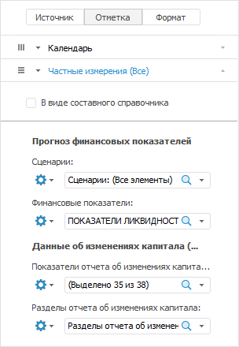

# Создание отчёта по нескольким источникам

Создание отчёта по нескольким источникам
-

# Создание отчёта по нескольким источникам

Для создания отчёта на основе нескольких источников выполните одно из
 следующих действий:

	- на вкладке «[Источники данных](../purpose/UiExpress_Tree_Multivariate_Object.htm)»
	 боковой панели установите флажок «Несколько
	 источников». После этого в дереве объектов будет доступен выбор
	 нескольких источников данных. Для выбора источников данных поочередно
	 щелкните по наименованиям необходимых источников.
	 Также множественную отметку можно осуществить с зажатыми клавишами
	 CTRL или SHIFT;

	- в навигаторе объектов выберите несколько источников (кубов или
	 БД временных рядов) и выполните команду «Открыть
	 с помощью > Аналитические запросы (OLAP)» в контекстном
	 меню выбранных источников.

Будет создан отчёт на основе выбранных источников. Чтобы в таблице отобразились
 данные, установите необходимую [отметку
 в измерениях](UiSelection.chm::/Selection/Selection_of_the_dimension_elements.htm).

Важно. При
 создании экспресс-отчёта на основе двух кубов может возникнуть ошибка:
 «Не указан индекс в измерении».
 Для корректного отображения отчёта необходимо наличие первичного индекса
 для всех измерений куба.

Экспресс-отчёт, построенный на нескольких источников данных, может содержать
 [частные](UiSelection.chm::/Selection/Working_with_private_dimensions.htm)
 и общие измерения. На боковой панели каждое общее измерение источников
 данных отображается на отдельной вкладке. Частные измерения отображаются
 на вкладке «Частные измерения»:

Изначально при настройке отображения данных из нескольких источников
 отметка в общих измерениях и отметка в частных измерениях из первого источника
 соответствует отметке, настроенной в используемых источниках. Отметка
 в частных измерениях второго и последующих источников соответствует отметке
 из сохранённых представлений используемых источников.

При перемещении измерения из общего в частные отметка во всех частных
 измерениях будет соответствовать отметке в общих измерениях, при перемещении
 измерения из частного в фиксированные будет отмечен только первый элемент.

Более подробно о частных измерениях см. раздел: «[Использование
 частных измерений](UiSelection.chm::/Selection/Working_with_private_dimensions.htm)».

Примечание.
 Если в выбранных источниках настроено управление параметрическими измерениями
 с помощью других измерений, то для работы такой связи в экспресс-отчёте
 необходимо, чтобы управляющие измерения
 присутствовали в структуре каждого выбранного источника.

См. также:

[Настройка измерений
 и отметка элементов](UiSelection.chm::/Selection/Dimension.htm) | [Использование
 частных измерений](UiSelection.chm::/Selection/Working_with_private_dimensions.htm)

		Справочная
		 система на версию 10.9
		 от 18/08/2025,
		 © ООО «ФОРСАЙТ»,
