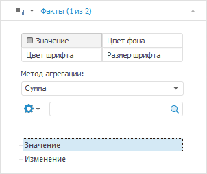
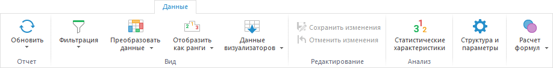

# Работа с данными в таблице

Работа с данными в таблице
-

# Работа с данными в таблице

Данные отчёта отображаются в [таблице](UiAnalyticalArea.chm::/Table.htm),
 которая формируется по [отметке
 элементов измерения источника](UiSelection.chm::/Selection/Selection_of_the_dimension_elements.htm). На основе таблицы формируются
 различные [визуализаторы](../Setup_express_report/UiExpress_control.htm)
 данных (диаграмма, карта, пузырьковая диаграмма и другие).

Операции с данными экспресс-отчёта осуществляются при помощи:

	- вкладки «Отметка» [боковой
	 панели](GetStarted.chm::/Interface/Interface_Description.htm#side_panel). При выборе фиксированного измерения с выбранной
	 ролью «Метрика» доступна агрегация
	 данных:

	- вкладки ленты «Данные»:

При работе со всеми [визуализаторам
 данных](../Setup_express_report/UiExpress_control.htm) отчёта доступны операции:

	- [Множественная
	 отметка и агрегация в фиксированных измерениях](UiSelection.chm::/Selection/Selection_of_the_dimension_elements.htm#multi_select);

	- [Фильтрация](UiAnalyticalArea.chm::/Working_with_table_data/Filtering.htm);

	- [Преобразование
	 данные](UiAnalyticalArea.chm::/Analysis/Convert_data.htm);

	- [Ранжирование](UiAnalyticalArea.chm::/Analysis/Ranking_data.htm);

	- [Пересчет
	 единиц измерения](uinavobj.chm::/Units/Units.htm);

	- [Редактирование
	 и сохранение данных](UiAnalyticalArea.chm::/Working_with_table_data/Edit_and_save_data.htm);

	- [Статистические
	 характеристики](UiAnalyticalArea.chm::/Analysis/Statistics.htm);

	- [Настройка структуры источника
	 данных](../purpose/DS_structure.htm);

	- [Управление параметрами
	 листа](Data_sources_parameters.htm);

	- [Расчет
	 формул](UiAnalyticalArea.chm::/Working_with_table_data/FormulaCalculation.htm).

См. также:

[Работа
 с готовым экспресс-отчётом](../Setup_express_report/Working_with_express_report.htm)

		Справочная
		 система на версию 10.9
		 от 18/08/2025,
		 © ООО «ФОРСАЙТ»,
