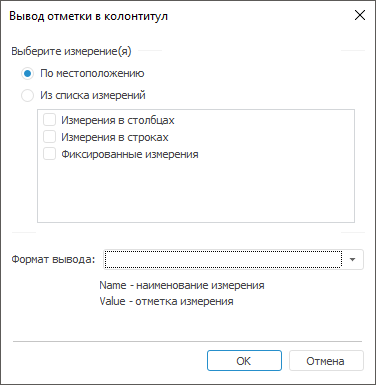
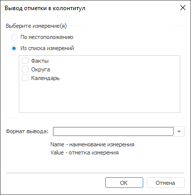

# Вывод отметки по измерениям в колонтитул

Вывод отметки по измерениям в колонтитул
-

# Вывод отметки по измерениям в колонтитул

В колонтитулы отчёта можно вывести отметку по имеющимся измерениям.
 Для добавления отметки в колонтитул нажмите кнопку 
 в [окне редактирования колонтитула](UiExpress_HeaderFooter.htm).

В открывшемся окне определяются следующие параметры:

	- Выберите измерение(я).
	 В данной группе определяются измерения, отметка которых будет выведена
	 в колонтитул:

	-

		- По местоположению.
		 Данный вариант предусматривает выбор измерений в зависимости от
		 их расположения в таблице:

		-

			- Измерения в столбцах;

			- Измерения в строках;

			- Фиксированные измерения.

		- Из списка измерений.
		 Данный вариант предусматривает выбор измерений из списка независимо
		 от их положения. При установке данного переключателя в области
		 ниже будет представлен список всех имеющихся справочников отчёта.
		 Отметьте флажками необходимые справочники:

	- Формат вывода. В комбинированном
	 списке можно ввести свой вариант формата или выбрать из имеющихся
	 вариантов. Подстановки Name и Value используются для вывода имени
	 измерения и его отметки соответственно.

Работа со списком в группе «Выберите
 измерение(я)»:

	- Списки выбора измерений предусматривают множественное выделение
	 элементов. Все элементы списка можно выбрать сочетанием клавиш CTRL+A;

	- При установке/снятии флажка у одного из выделенных элементов
	 у других выделенных элементов флажок также устанавливается/снимается;

	- Для работы со списком предусмотрено контекстное меню:

	-

		- Включить/Выключить.
		 Устанавливает/снимает флажок для выделенных элементов;

		- Включить все/Выключить
		 все. Устанавливает/снимает флажок для всех элементов списка.

После нажатия кнопки «ОК» в
 соответствующую часть колонтитула будет добавлено по одному тегу:

	- на каждое выбранное местоположение:

&[Selection Part
 = "<выбранная часть Rows|Columns|Fixed| >" Format = "<Выбранный/созданный
 формат>"]

Если атрибут Part
 не указан, то будет выведена отметка по фиксированным измерениям.

	- каждое выбранное измерение (из списка измерений):

&[<Идентификатор
 справочника>.Selection Format = "<Выбранный/созданный формат>"]

Примечание.
 Атрибуты Format и Part
 являются необязательными. Если атрибут Format
 не указан, то будет выведено только значение отметки (Value).

После создания тега отредактировать и удалить его можно только вручную,
 повторный вызов данного диалога не предусматривает его редактирования.

Если до нажатия кнопки «ОК»
 не был выбран формат вывода, то будет предложено установить формат вывода
 отметки по умолчанию.

См. также:

[Колонтитулы](UiExpress_Express_ParamPage3.htm)

		Справочная
		 система на версию 10.9
		 от 18/08/2025,
		 © ООО «ФОРСАЙТ»,
