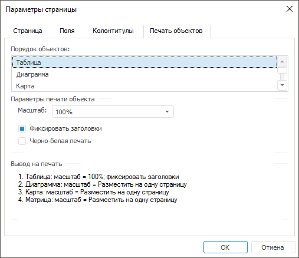

# Печать объектов: Параметры страницы

Печать объектов: Параметры страницы
-

# Печать объектов

Настроить параметры объектов экспресс-отчёта и отобразить порядок их
 печати можно в диалоге «[Параметры
 страницы](UiExpress_Express_ParamPage.htm)» на вкладке «Печать объектов».
 Для открытия диалога выполните команду главного меню «Экспресс-отчёт
 > Печать > Параметры страницы».

Вкладка «Печать объектов» выглядит
 следующим образом:

	- Порядок объектов. Отображается
	 последовательность вывода на печать объектов отчёта. Порядок зависит
	 от [расположения](DataAnalysis.chm::/Visualizators.htm#view_alignment)
	 визуализаторов в экспресс-отчёте и определяется положением окон сверху
	 вниз и слева направо;

	- Параметры печати объекта.
	 В данной области индивидуально для каждого объекта экспресс-отчёта
	 можно определить параметры печати/экспорта. Чтобы определить, для
	 какого объекта будут задаваться настройки, выберите данный объект
	 в поле «Порядок объектов»:

	-

		- Масштаб. Масштаб
		 объекта при печати/экспорте. Значение масштаба изменяется от 10
		 до 500%. Также можно установить автоматической подбор масштаба
		 по ширине/высоте страницы либо подбор масштаба для размещения
		 объекта на одном листе;

		- Фиксировать заголовки.
		 Данный флажок доступен только для таблицы экспресс-отчёта. Если
		 флажок установлен, то при печати/экспорте таблицы с данными на
		 каждой странице будут присутствовать сквозные столбцы и строки
		 заголовков отчёта;

		- Черно-белая печать.
		 Признак черно-белой печати объекта. Если флажок установлен, то
		 при печати и экспорте все цвета будут преобразованы в оттенки
		 серого. Установите данный флажок для лучшей печати диаграмм, карт
		 и других визуальных объектов на черно-белом принтере.

	- Вывод на печать. Отображаются
	 установленные параметры печати для каждого объекта.

См. также:

[Параметры страницы](UiExpress_Express_ParamPage.htm)

		Справочная
		 система на версию 10.9
		 от 18/08/2025,
		 © ООО «ФОРСАЙТ»,
