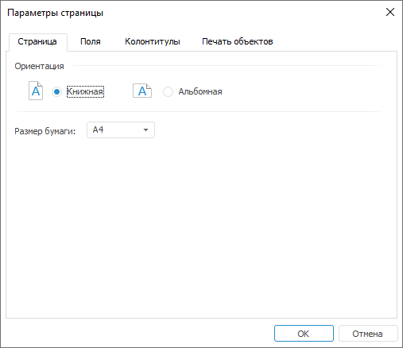

# Страница: Параметры страницы

Страница: Параметры страницы
-

# Страница

Настроить параметры страницы, которые будут использованы при печати,
 можно в диалоге «[Параметры
 страницы](UiExpress_Express_ParamPage.htm)» на вкладке «Страница».
 Для открытия диалога выполните команду главного меню «Экспресс-отчет
 > Печать > Параметры страницы».

Вкладка «Страница» выглядит
 следующим образом:

	- Ориентация. Определите
	 ориентацию страницы при печати, для этого установите переключатели
	 «Книжная» (высота больше,
	 чем ширина) или «Альбомная»
	 (ширина больше, чем высота);

	- Размер. Выберите размер
	 листа из раскрывающегося списка.

См. также:

[Параметры страницы](UiExpress_Express_ParamPage.htm)

		Справочная
		 система на версию 10.9
		 от 18/08/2025,
		 © ООО «ФОРСАЙТ»,
