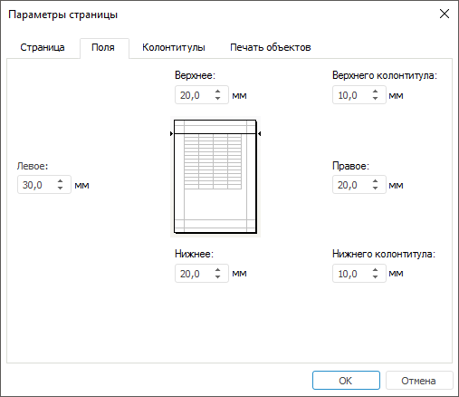

# Поля: Параметры страницы

Поля: Параметры страницы
-

# Поля

Настроить поля страницы, которые будут отображаться при печати, можно
 в диалоге «[Параметры
 страницы](UiExpress_Express_ParamPage.htm)» на вкладке «Поля».
 Для открытия диалога выполните команду главного меню «Экспресс-отчет
 > Печать > Параметры страницы».

На вкладке расположены редакторы ввода для значений полей страницы:

В редакторах ввода «Верхнее»,
 «Нижнее», «Левое»
 и «Правое» установите интервал
 между данными полями и краем печатной страницы.

В редакторах ввода «Верхнего колонтитула»
 и «Нижнего колонтитула» установите
 расстояние между верхним колонтитулом и верхом страницы и между нижним
 колонтитулом и низом страницы. Это расстояние должно быть меньше размера
 нижнего и верхнего полей.

См. также:

[Параметры страницы](UiExpress_Express_ParamPage.htm)

		Справочная
		 система на версию 10.9
		 от 18/08/2025,
		 © ООО «ФОРСАЙТ»,
