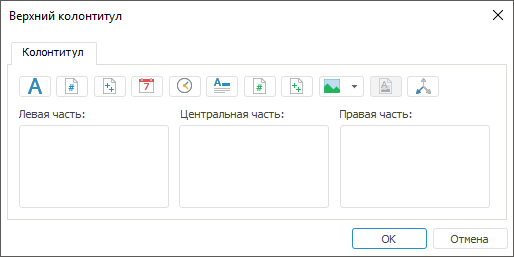
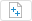
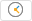
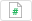
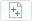
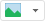
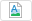

# Работа с колонтитулами

Работа с колонтитулами
-

# Работа с колонтитулами

Для создания нового или редактирования уже созданного колонтитула используйте
 окно «Верхний/нижний колонтитул».

[Для открытия
 окна](javascript:TextPopup(this))

	Для открытия диалога настройки колонтитула:

		- Перейдите на вкладку «[Колонтитулы](UiExpress_Express_ParamPage3.htm)»
		 окна «[Параметры
		 страницы](UiExpress_Express_ParamPage.htm)».

		- В списке «Верхний колонтитул»/«Нижний колонтитул» выберите
		 вариант «нет» и нажмите
		 кнопку «Настроить верхний колонтитул»/«Настроить нижний колонтитул».

Диалоги создания верхнего и нижнего колонтитула подобны:

В зависимости от флажков, установленных на вкладке «Колонтитулы»
 окна «[Параметры
 страницы](UiExpress_Express_ParamPage3.htm)», окно редактирования колонтитулов будет содержать
 различные вкладки:

	- если не были установлены флажки «Разные
	 колонтитулы для четных и нечетных страниц» и «Особый
	 колонтитул для первой страницы», окно редактирования колонтитулов
	 будет содержать вкладку «Колонтитул»;

	- если был установлен флажок «Разные
	 колонтитулы для четных и нечетных страниц», окно редактирования
	 колонтитулов будет содержать вкладки «Колонтитул
	 чётной страницы» и «Колонтитул
	 нечётной страницы», аналогичные вкладке «Колонтитул»;

	- если был установлен флажок «Особый
	 колонтитул для первой страницы», окно редактирования колонтитулов
	 будет содержать вкладки «Колонтитул»
	 и «Колонтитул первой страницы»,
	 аналогичную вкладке «Колонтитул»;

	- если были установлены оба флажка, окно редактирования колонтитулов
	 будет содержать вкладки «Колонтитул
	 чётной страницы», «Колонтитул
	 нечётной страницы» и «Колонтитул
	 первой страницы», аналогичные вкладке «Колонтитул».

Область колонтитула условно разделена на три части, отличающиеся способом
 выравнивания содержимого: по левому краю, по центру или по правому краю.
 Каждая часть имеет свои собственные параметры.

Расположение колонтитулов на листе отчёта задается на этапе формирования
 каждого колонтитула с использованием специальных подстановок или ввода
 статичного текста в выбранную часть колонтитула.

[Варианты подстановок](javascript:TextPopup(this))

			 Кнопка
			 Подстановка/тег
			 Описание

			 
			 Формат шрифта
			 При нажатии на кнопку будет открыто окно для настройки
			 [параметров шрифта](UiNav.chm::/GUI/Format/UiReport_Table_Attribute_Type.htm)
			 в колонтитуле.

			 
			 &[Page]
			 В текущую позицию будет выведен номер текущей страницы.

			 
			 &[Pages]
			 В текущую позицию будет выведено количество страниц текущего
			 отчёта.

			 
			 &[Date]
			 В текущую позицию будет выведена текущая дата.

			 
			 &[Time]
			 В текущую позицию будет выведено текущее время.

			 
			 &[Name]
			 В текущую позицию будет выведено наименование отчёта.

			 
			 &[Sheet.Page]
			 В текущую позицию будет выведен номер страницы на текущем
			 листе.

			 
			 &[Sheet.Pages]
			 В текущую позицию будет выведено количество страниц текущего
			 листа отчёта.

			 
			 Вставка изображения
			 В текущую позицию будет вставлено [изображение](uireport.chm::/desktop/tuning/parampage/uireport_tuning_parampage_3_insert_picture.htm)
			 из репозитория или файла.

			 
			 Формат изображения
			 При нажатии на кнопку будет открыто окно для настройки
			 формата изображения.
			Примечание.
			 Кнопка доступна, если в колонтитуле используется изображение.

			 
			 Отметка по измерениям
			 В текущую позицию будет выведена [отметка
			 по измерениям](UiExpress_Express_ParamPage3_Slice.htm).

			 &[Selection]
			 В текущую позицию будут выведены наименования отображаемых
			 фиксированных измерений.

			 &[<Идентификатор измерения>.Selection]
			 В текущую позицию будет выведена отметка по заданному измерению.

			 &[Globals.<Идентификатор переменной>]
			 В текущую позицию будет выведено значение [глобальной
			 переменной](UiNav.chm::/02_Navigator/UiNav_GlobalVariables.htm).

Созданный колонтитул будет добавлен в список к стандартным вариантам
 и будет автоматически установлен в комбинированном списке «[Верхний/нижний колонтитул](UiExpress_Express_ParamPage3.htm)».

См. также:

[Параметры страницы](UiExpress_Express_ParamPage.htm)
 | [Колонтитулы](UiExpress_Express_ParamPage3.htm)

		Справочная
		 система на версию 10.9
		 от 18/08/2025,
		 © ООО «ФОРСАЙТ»,
