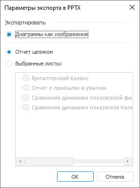
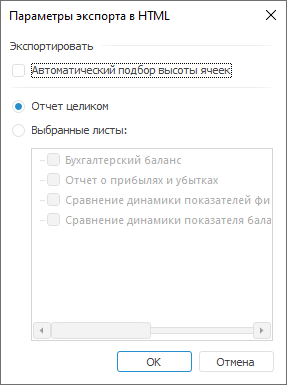
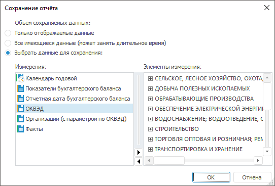

# Экспорт экспресс-отчёта

Экспорт экспресс-отчёта
-

# Экспорт экспресс-отчёта

Для экспорта отчёта во внешние форматы в подменю команды главного меню
 «Экспресс-отчет > Сохранить как»
 выберите формат:

	- книга Excel (*.xlsx);

	- книга Excel 97-2003 (*.xls);

	- документ PDF (*.pdf);

	- документ в формате RTF (*.rtf);

	- презентация PowerPoint (*.pptx);

	- веб-страница (*.html);

	- веб-страница, архив в одном файле (*.mht);

	- изображение (*.emf);

	- изображение (*.png);

Примечание.
 Экспорт в формат *.png доступен только в веб-приложении.

	- куб (*.ppcube);

	- экспресс-отчёт (*.ppexpress).

Примечание.
 Форматы PPEXPRESS и PPCUBE являются внутренними форматами продукта «Форсайт. Аналитическая платформа»
 и служат для выгрузки отчётов в локальный файл для последующей работы
 без связи с репозиторием.

После выполнения команды будет открыто окно «Экспорт
 в файл». Определите в нем месторасположение и имя файла.

Примечание.
 Экспортируются только видимые объекты экспресс-отчёта. При несовместимости
 некоторых объектов в процессе экспорта будет выдано предупреждение.

Для экспорта нескольких вариантов отчёта, сформированных по отметке
 фиксированных измерений, используйте [пакетный
 экспорт](UiReport_PackExp.htm).

## Особенности экспорта

При экспорте отчётов в файлы различных форматов учитывайте следующие
 особенности:

		 XLS, XLSX
		 PDF
		 RTF
		 HTML
		 MHT

		 Колонтитулы
		 

		 

		 

		 

		 

		 Легенда таблицы
		 

		 

		 

		 

		 

		 Перенос текста
		 

		 

		 

		 

		 

		 Верхний и нижний отступы в ячейке
		 

		 

		 

		 

		 

		 Сноски, подключенные с помощью языка Fore
		 

		 

		 

		 

		 

		 Спарклайны
		 

		 

		 

		 

		 

		 EMF
		 PNG
		 PPEXPRESS
		 PPCUBE
		 PPTX

		 Колонтитулы
		 

		 

		 

		 

		 

		 Легенда таблицы
		 

		 

		 

		 

		 

		 Перенос текста
		 

		 

		 

		 

		 

		 Верхний и нижний отступы в ячейке
		 

		 

		 

		 

		 

		 Сноски, подключенные с помощью языка Fore
		 

		 

		 

		 

		 

		 Спарклайны
		 

		 

		 

		 

		 

Условные обозначения:

 - экспорт экспресс-отчёта
 доступен;

 - экспорт экспресс-отчёта
 недоступен;

 - экспорт экспресс-отчёта
 доступен с особенностями использования.

В зависимости от настроек экспресс-отчёта можно выделить следующие особенности
 экспорта:

	- отчёт в формате PDF после экспорта будет выглядеть также, как
	 экспресс-отчёт при просмотре перед печатью;

	- колонтитулы:

	-

		- в результирующем файле формата XLS с колонтитулами можно
		 работать средствами Microsoft Excel: диалог «Параметры
		 страницы», вкладка «Колонтитулы»;

		- отображение колонтитулов в формате RTF. Если секции колонтитулов
		 в отчёте содержали изображения, то:

		-

			- при наличии пустых секций соседние секции будут растягиваться
			 на место пустых;

			- при пустой центральной секции и непустых боковых секциях
			 будет растягиваться изображение, расположенное в правой секции;

	- карты и диаграммы экспортируются в формат RTF в виде метафайлов;

	- пузырьковое и плоское деревья экспортируются во все файлы в
	 виде изображений. Формат PDF не поддерживает экспорт пузырьковых и
	 плоских деревьев;

	- при экспорте в презентацию PPTX каждая печатная таблица будет
	 экспортирована в отдельный слайд. Диаграмма и карта также экспортируются
	 в отдельные слайды в виде изображений;

	- [сноски](UiAnalyticalArea.chm::/TableView/Table_footnotes.htm):

		- при экспорте в формат RTF нумерация сносок в документе будет
		 упорядочена по листам: от первого к последнему;

		- при экспорте в XLS или XLSX по умолчанию сноски не экспортируются.
		 Номера сносок экспортируются, если с помощью Fore
		 заданы соответствующие настройки. Текст сносок не экспортируется.

		Формат ячеек, содержащих сноски, будет изменен на текстовый. В
		 связи с этим:

			- вид диаграммы может отличаться от вида в исходном отчёте;

			- формулы, для которых были заданы сноски, будут отображаться
			 в виде текста;

			- не будут рассчитаны формулы, которые ссылаются на ячейки
			 со сносками;

	- при экспорте в формат PPCUBE экспортируются только данные по
	 указанной отметке, сама отметка не экспортируется и не восстанавливается.
	 Сохраненное представление отчёта также не экспортируется.

Примечание.
 При экспорте отчёта в результирующем файле может быть отображен [штамп](Admin.chm::/04_SecurityPolicy/Editor_of_Politicy/Admin_MandatAccess_Marking.htm)
 № 1 в соответствии с Инструкцией № 0126-87, если в качестве
 политики безопасности используется [мандатный
 доступ](admin.chm::/04_securitypolicy/admin_mandataccess.htm) и для уровня безопасности данного экспресс-отчёта
 включена маркировка при экспорте и печати.

[Экспорт
 в файл формата XLS или XLSX](javascript:TextPopup(this))

	При экспорте в формат XLS и XLSX перед диалогом «Экспорт
	 в файл» будет открыт диалог «Параметры
	 экспорта в <формат>»:

	

	В данном окне задайте параметры:

		- Экспандеры. По умолчанию
		 флажок снят. При установленном флажке экспортируются отображаемые
		 экспандеры в текущем виде таблицы экспресс-отчёта. Если экспандеры
		 свернуты, то экспортируются все вложенные элементы таблицы и содержащиеся
		 в нем свернутые\развернутые экспандеры. Экспандеры доступны для
		 работы средствами Microsoft Excel;

	Примечание.
	 Параметр доступен только при экспорте в формат XLSX.

		- Диаграмма как изображение. По умолчанию флажок установлен.
		 При установленном флажке диаграмма будет экспортироваться как
		 изображение в формате EMF, и с ней можно будет работать только
		 как с изображением средствами Microsoft Excel. Если флажок снят,
		 то диаграмма экспортируется как объект, работа с которым осуществляется
		 как с диаграммой средствами Microsoft Excel.

	Примечание.
	 Типы диаграмм, которые не поддерживают форматы XLS и XLSX, экспортируются
	 в виде изображений. При экспорте [каскадной
	 диаграммы](uidiagrams.chm::/Type_diagrams/WaterFall_chart.htm) вид диаграммы будет отличаться от исходного
	 из-за несоответствия настроек. В формат XLSX экспорт выполняется в
	 виде диаграммы, в XLS - изображения.

	Для экспорта выборочных листов отметьте пункт «Выбранные
	 листы».

	В результирующем файле каждый объект экспресс-отчёта располагается
	 на отдельном листе. Если таблица данных скрыта, а диаграмма отображена,
	 то в файле экспорта лист с таблицей данных будет скрыт, о чем будет
	 дополнительно сообщено.

	Особенности экспорта экспандеров:

		- если в шапке или боковике таблицы содержится более одного
		 иерархического измерения, то экспандеры будут экспорироваться
		 только для первого измерения, расположенного в первом столбце
		 или строке таблицы. Если для первого измерения экспандеры [скрыты](UiAnalyticalArea.chm::/TableView/Layout/Layout_Dim.htm#expander),
		 то экспортируются отображаемые экспандеры у следующего измерения;

		- если в шапке или боковике таблицы содержится несколько [объединенных
		 измерений](UiAnalyticalArea.chm::/TableView/Layout/Merging_Dimensions.htm), то экспортируются экспандеры только
		 для первого столбца или строки с учётом объединения. Если первое
		 измерение содержит несколько [уровней](UiNavObj.chm::/reference_book/Master_Table_reference_book/UiMd_reference_book_Master_Table_page4.htm),
		 которые размещены по нескольким столбцам или строкам, то экспортируются
		 экспандеры только нулевого уровня.

	Условное форматирование ячеек экспортируется со следующими ограничениями:

		- поддерживается только в Microsoft Excel 2007 и выше;

		- некоторые обозначения в результирующем файле могут
		 не совпадать с обозначениями в экспресс-отчёте.

	При наличии в экспресс-отчёте столбца, содержащего легенду, экспорт
	 легенды в рядном режиме в форматы XLS и XLSX производится в виде фигуры.

	При активном [режиме
	 мандатного разграничения доступа](Admin.chm::/04_SecurityPolicy/Admin_PermSep_M.htm) и включенной [маркировке
	 печати](Admin.chm::/03_Admin/Admin_MandatAccessParam.htm) в первой строке отчёта размещается метка
	 безопасности.

[Экспорт
 в файл формата PDF](javascript:TextPopup(this))

	В результирующем файле формата PDF отчёт будет выглядеть так же,
	 как экспресс-отчёт, открытый на предварительный просмотр перед печатью.

	Если карты и диаграммы, расположенные на листе отчёта, не содержат
	 неподдерживаемых для экспорта в файл формата PDF настроек (штриховых
	 линий, альфа – канала), то они экспортируются в PDF в виде векторного
	 изображения, в противном случае - в виде битового изображения.

	При экспорте в данный формат необходимо помнить, что:

		- текстура ячеек в результирующем файле и в экспресс-отчёте
		 могут не совпадать;

		- отображение в легенде обозначений рядов данных диаграммы
		 в результирующем файле и в экспресс-отчёте могут не совпадать;

		- отображение в легенде названий рядов данных может быть неполным;

		- отображение символов китайского или арабского языка может
		 быть неполным или некорректным;

		- в зависимости от выбранного шрифта отображение текста, написанного
		 с использованием русского алфавита и курсивного начертания, может
		 быть некорректным.

[Экспорт
 в файл формата PPTX](javascript:TextPopup(this))

	При экспорте в формат PPTX перед диалогом «Экспорт
	 в файл» будет открыт диалог «Параметры
	 экспорта в PPTX»:

	

	При установленном флажке «Диаграмма
	 как изображение» диаграмма будет экспортироваться как изображение
	 в формате EMF, и с ней можно будет работать только как с изображением
	 средствами Microsoft Excel. Если флажок снят, то диаграмма экспортируется
	 как объект, работа с которым осуществляется как с диаграммой средствами
	 Microsoft Excel. По умолчанию флажок установлен согласно настройкам
	 прошлого экспорта.

	Для экспорта выборочных листов отметьте пункт «Выбранные
	 листы».

	При экспорте экспресс-отчёта, содержащего оформление ячеек, будет
	 выгружен только один тип оформления со следующим приоритетом:

		- Изображение.

		- Условное форматирование.

		- Заливка ячейки.

[Экспорт
 в файл формата HTML и MHT](javascript:TextPopup(this))

	При экспорте в формат HTM или MHT перед диалогом «Экспорт
	 в файл» будет открыт диалог «Параметры
	 экспорта в HTML» или «Параметры
	 экспорта в MHT»:

	

	Для экспорта выборочных листов отметьте пункт «Выбранные
	 листы».

	Установка флажка «Автоматический
	 подбор высоты ячеек» позволяет при экспорте произвести автоподбор
	 высоты ячеек в соответствии с содержащейся в них информацией.

	При экспорте в формат HTML учитывается установленный масштаб отображения
	 на листах отчёта, то есть отчёт в формате HTML будет выглядеть так
	 же как объекты, расположенные в области данных.

[Экспорт
 в файл формата PNG](javascript:TextPopup(this))

	Экспорт в формат *.png доступен только в веб-приложении. Для этого
	 в файле [PP.xml](Setup.chm::/UiWebSetup/03_setup_web/PP_config_Java.htm)
	 установите значение true для
	 атрибута [ClientExportPng](Setup.chm::/UiWebSetup/03_Setup_Web/PP_config_Java.htm#export)
	 в разделе <export>.

	При экспорте экспресс-отчёта в файл формата *.png в результирующем
	 файле содержимое отчёта будет отображаться так же, как в веб-приложении
	 в момент экспорта.

[Экспорт
 в файл формата PPEXPRESS или PPCUBE](javascript:TextPopup(this))

	При экспорте экспресс-отчёта в один из указанных форматов будет
	 открыто окно:

	

	В области «Объем сохраняемых данных»
	 выберите вариант сохранения:

		- сохранить только отображаемые данные;

		- сохранить все имеющиеся данные;

		- выбрать данные для сохранения. При этом выполните отметку
		 по элементам измерений, которые необходимо сохранить.

	По умолчанию отметка совпадает с отметкой в экспресс-отчёте. Сохранение
	 данных происходит только по отмеченным элементам измерений, также
	 будут сохранены диаграмма и карта, содержащиеся в отчёте.

	Примечание.
	 Экспорт в файл формата PPEXPRESS или PPCUBE недоступен, если измерение
	 источника данных содержит [вычисляемый
	 элемент](UiSelection.chm::/Selection/Dimension_edit.htm#add_elem).

См. также:

[Сохранение
 экспресс-отчёта](UiExpress_Express_Save.htm) | [Пакетный экспорт
 экспресс-отчёта](UiReport_PackExp.htm)

		Справочная
		 система на версию 10.9
		 от 18/08/2025,
		 © ООО «ФОРСАЙТ»,
