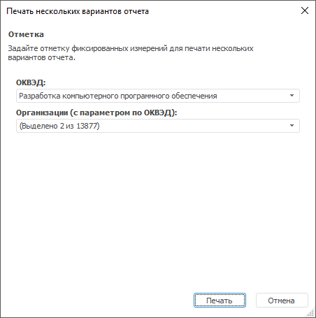

# Пакетная печать экспресс-отчёта

Пакетная печать экспресс-отчёта
-

# Пакетная печать экспресс-отчёта

Пакетная печать - это [печать](UiExpress_Express_Print.htm)
 нескольких вариантов отчёта. Варианты отчёта формируются по отметке фиксированных
 измерений.

Пакетная печать доступна только для настольного приложения.

Для пакетной печати отчёта выполните команду главного меню «Отчет
 > Печать > Пакетная печать». Откроется диалог, с помощью
 которого можно произвести печать нескольких вариантов отчёта:

В диалоге задайте отметку фиксированных измерений, по которым будет
 производиться печать и нажмите кнопку «Печать»,
 откроется [диалог](UiExpress_Express_Print.htm), выберите в
 нем параметры печати и используемый принтер.

См. также:

[Печать
 экспресс-отчёта](UiExpress_Express_Print.htm)

		Справочная
		 система на версию 10.9
		 от 18/08/2025,
		 © ООО «ФОРСАЙТ»,
