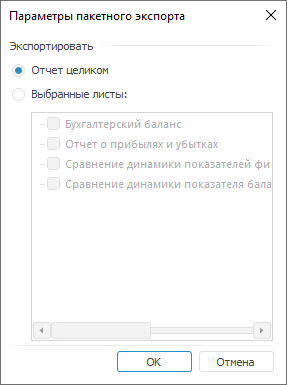
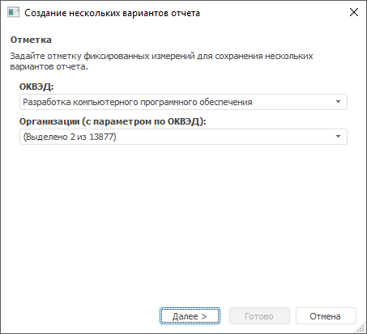
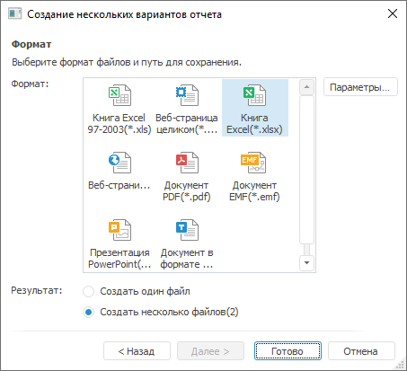

# Пакетный экспорт экспресс-отчёта

Пакетный экспорт экспресс-отчёта
-

# Пакетный экспорт экспресс-отчёта

Пакетный экспорт - это экспорт
 нескольких вариантов отчёта. Варианты отчёта формируются по отметке фиксированных
 измерений [источника
 данных](../purpose/UiExpress_Tree_Multivariate_Object.htm).

Примечание.
 Пакетный экспорт доступен только в настольном приложении.

Чтобы выполнить пакетный экспорт:

	- Выполните команду главного меню «Отчет
	 > Экспорт > Пакетный экспорт». Будет открыт диалог «Параметры пакетного экспорта»:

Для экспорта выборочных листов отметьте пункт
 «Выбранные листы».

	- После выбора листов отчёта будет открыта
	 первая страница мастера пакетного экспорта:

В раскрывающихся списках выберите элементы
 фиксированных измерений, по которым нужно создать варианты отчёта. Количество
 отчётов, которые будут экспортированы, равно декартовому произведению
 отмеченных элементов в фиксированных измерениях. Например, на рисунке
 выше видим, что в первом измерении отмечено 2 элемента, а во втором -
 1 элемент. Количество возможных пар, которые можно составить из этих элементов
 (т.е. декартово произведение) - 2, соответственно, будет создано 2 варианта
 отчёта.

	- Нажмите кнопку «Далее»,
	 будет открыта вторая страница мастера пакетного экспорта:

	- Выберите формат файла и результат экспорта. Если выбран формат
	 Книга Excel (*.xls), доступно сохранение вариантов отчёта в несколько
	 файлов. При выборе других форматов, варианты отчёта можно сохранить
	 как в одном файле, так и в нескольких.

При сохранении вариантов отчёта в нескольких
 файлах, названия файлов будут формироваться по следующему шаблону: <наименование файла>+(<комбинация фиксированных элементов>)+.+<формат>, например: Социально-экономические
 показатели (Данные регионов; Туризм).xls.

	- После того, как выбраны формат и результат экспорта, нажмите
	 кнопку «Готово». Будет открыт
	 стандартный диалог для размещения созданного файла. Если отчёт сохранялся
	 в несколько файлов, после сохранения будет предложено перейти в папку,
	 содержащую созданные файлы.

## Особенности пакетного экспорта

При выполнении пакетного экспорта отчёта учитывайте следующие особенности:

	- при выполнении пакетного экспорта отчёта в несколько файлов
	 название создаваемого файла формируется следующим образом <наименование файла>+(<комбинация фиксированных элементов>)
	 при этом:

		- если название файла не превышает 218 символов, название
		 файла не сокращается;

		- если название файла превышает 218 символов, то часть названия
		 файла, включающая фиксированную отметку сокращается следующим
		 образом <наименование файла>+(<комбинация фиксированных элементов>(сокр.));

	- если в наименованиях измерений присутствуют недопустимые символы,
	 то при пакетном экспорте в несколько файлов недопустимые символы заменяются
	 символом «_»;

	- если в измерении присутствуют одинаковые наименования, то при
	 экспорте к имени экспортируемого файла добавляется «(N)».
	 Где «(N)» - порядковый номер.

	Например:

		- Социально-экономические
		 показатели (Данные регионов; Туризм).xls;

		- Социально-экономические
		 показатели (Данные регионов; Туризм(1)).xls.

См. также:

[Экспорт
 экспресс-отчёта](UiExpress_Express_Export.htm) | [Пакетная
 печать экспресс-отчёта](UiExpress_Express_Select.htm)

		Справочная
		 система на версию 10.9
		 от 18/08/2025,
		 © ООО «ФОРСАЙТ»,
