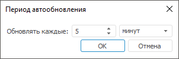

# Обновление данных экспресс-отчёта

Обновление данных экспресс-отчёта
-

# Обновление данных экспресс-отчёта

Обновление данных необходимо после изменения отметки блока и после изменения
 данных в источнике.

В экспресс-отчёте доступно:

	- обновление данных экспресс-отчёта.
	 Нажмите кнопку  «Обновить» на вкладке «Главная»
	 ленты инструментов;

	- переоткрытие источника данных
	 экспресс-отчёта. Выполните команду «Переоткрыть
	 источники данных» в раскрывающемся меню кнопки  «Обновить» на вкладке «Данные»
	 ленты инструментов. Будут обновлены источники данных и данные таблицы;

Примечание.
 Возможность доступна только в настольном приложении.

	- автоматическое обновление всего
	 экспресс-отчёта. Используйте кнопку  «Автоматическое обновление» на вкладке
	 «Главная» ленты инструментов.

Все настройки обновления данных сохраняются вместе с экспресс-отчётом.

Обновление происходит следующим образом:

	- при использовании кнопки  «Обновить» или автоматического обновления
	 таблица данных будет обновлена, все изменения, внесенные в таблицу
	 и не сохраненные в источник данных, будут утеряны;

	- при выполнении команды «Переоткрыть
	 источники данных» в раскрывающемся меню кнопки  «Обновить»:

		- если были созданы новые элементы измерения, то они будут
		 добавлены в раскрывающийся иерархический список элементов без
		 отметки;

		- если элементы были удалены, то с них будет снята отметка,
		 они будут удалены из списка элементов измерения. Если был удален
		 отмеченный элемент фиксированного измерения, то отметка будет
		 установлена для следующего за ним элемента в списке;

		- если было создано новое измерение, то он будет добавлен
		 в список фиксированных измерений, отметка будет установлена для
		 первого элемента;

		- удаленное измерение будет удалено из списка измерений.

## Автоматическое обновление

Автоматическое обновление позволяет обновлять данные при смене отметки
 и/или с заданным периодом.

[Для
 автоматического обновления данных при смене отметки](javascript:TextPopup(this))

		- Перейдите на вкладку «Главная»
		 ленты инструментов.

		- Установите флажок «При
		 смене отметки» в раскрывающемся меню кнопки  «Автоматическое обновление».

	Обновление таблицы будет выполняться каждый раз при изменении отметки
	 измерений его источника.

	Для отключения режима автоматического обновления при смене отметки
	 снимите флажок «При смене отметки»
	 в раскрывающемся меню кнопки  «Автоматическое обновление».

[Для
 периодического обновления данных](javascript:TextPopup(this))

		- Перейдите на вкладку «Главная»
		 ленты инструментов.

		- Установите переключатель «Задать
		 период» в раскрывающемся меню кнопки  «Автоматическое обновление».
		 Будет открыт диалог «Период автообновления»:

	

	В диалоге задайте период обновления данных
	 в экспресс-отчёте. Обновление может выполняться каждые N
	 секунд, минут или часов.

	Примечание.
	 Если для экспресс-отчёта уже настраивался период обновления, то его
	 можно выбрать в раскрывающемся меню кнопки  «Автоматическое обновление».

	Обновление экспресс-отчёта будет выполняться раз в заданный период
	 времени.

	Для отключения периодического обновления данных установите переключатель
	 «Не использовать» в раскрывающемся
	 меню кнопки  «Автоматическое обновление».

[Для
 отключения автоматического обновления](javascript:TextPopup(this))

		- В раскрывающемся меню кнопки  «Автоматическое обновление» снимите
		 флажок «При смене отметки»
		 и установите переключатель «Не
		 использовать».

		- Переведите кнопку  «Автоматическое обновление» в
		 ненажатое состояние.

	Автоматическое обновление экспресс-отчёта будет отключено.

	Для установки прежних параметров автоматического обновления нажмите
	 кнопку  «Автоматическое
	 обновление».

	После изменения отметки таблица данных будет пустой и будет содержать
	 только ссылку «Отобразить данные».
	 Для заполнения таблицы данными:

		- перейдите по ссылке «Отобразить
		 данные» в таблице;

		- нажмите кнопку 
		 «Обновить» на вкладке
		 «Главная» ленты инструментов.

	Данные будут отображены в таблице.

См. также:

[Работа с данными в таблице](Data.htm)

		Справочная
		 система на версию 10.9
		 от 18/08/2025,
		 © ООО «ФОРСАЙТ»,
