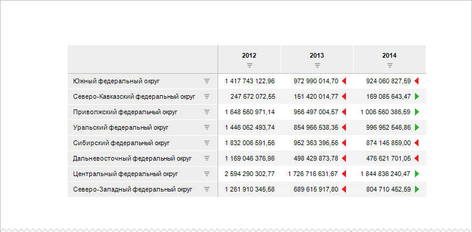
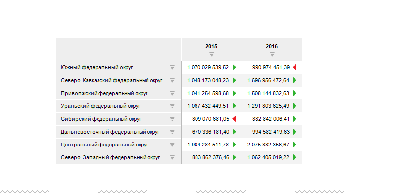
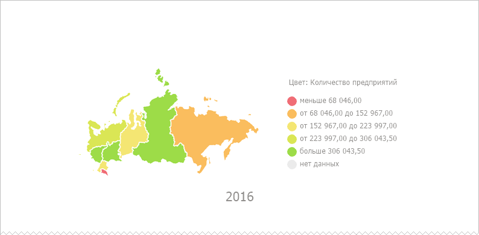
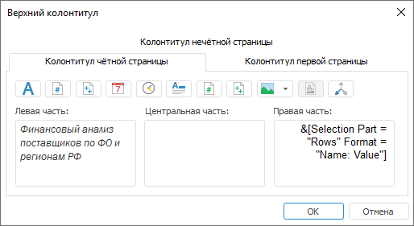
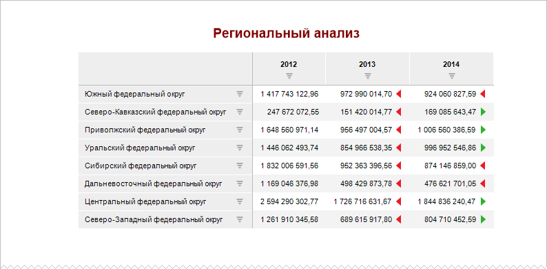
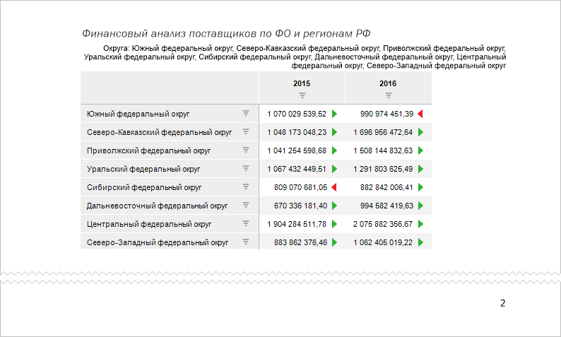
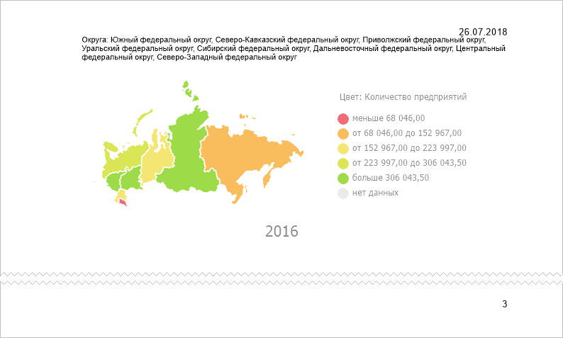

# Как при печати нескольких страниц на каждой вывести повторяющуюся информацию?

Как при печати нескольких страниц на каждой вывести повторяющуюся информацию?
-

# Как при печати нескольких страниц на каждой вывести повторяющуюся информацию?

Часто при многостраничной печати требуется выводить повторяющуюся информацию
 на каждой странице.

Например, при печати отчёта требуется:

	- на первой странице вывести название отчёта;

	- на каждой четной странице - заголовок области данных, отметку
	 по измерению и номер текущей страницы;

	- на каждой нечётной странице - отметку по измерению, текущую
	 дату и номер текущей страницы;

	- при печати области данных нужно вывести её заголовок, шапку
	 и боковик.

## Исходные данные

В качестве исходных данных берётся таблица данных, по которой строится
 визуализатор.

На печать отчёт будет выведен на нескольких страницах:

При печати отчёта должна быть отображена следующая информация:

	- на первой странице - название отчёта;

	- на каждой четной странице - заголовок области данных, отметка
	 по измерению и номер текущей страницы;

	- на каждой нечётной странице - отметка по измерению, текущая
	 дата и номер текущей страницы;

	- при печати области данных нужно вывести её заголовок, шапку
	 и боковик.

## Решение

Для отображения при печати на каждом листе отчёта дополнительной информации
 настройте [колонтитулы](../Express/ParamPage/UiExpress_Express_ParamPage3.htm).

	- Для настройки отображения при печати колонтитулов выполните
	 команду главного меню «Отчет >
	 Печать > Параметры страницы».

	- В открывшемся окне «Параметры
	 страницы» перейдите на вкладку «[Колонтитулы](../Express/ParamPage/UiExpress_Express_ParamPage3.htm)»:

	- Установите флажки «Разные колонтитулы
	 для четных и нечетных страниц» и «Особый
	 колонтитул для первой страницы».

	- Нажмите кнопку «Настроить верхний
	 колонтитул». В открывшемся одноименном окне задайте следующие
	 параметры колонтитулов:

		- на вкладке «Колонтитул
		 первой страницы» установите курсор в области «Центральная
		 часть» и нажмите кнопку . Таким образом,
		 по центру верхнего колонтитула будет отображаться наименование
		 отчёта. Если необходимо, настройте формат выводимого текста, для
		 этого нажмите кнопку ;

		- на вкладке «Колонтитул
		 нечётной страницы»:

			- установите курсор в область «Левая
			 часть» и нажмите кнопку . В открывшемся
			 окне «[Вывод
			 отметки](../Express/ParamPage/UiExpress_Express_ParamPage3_Slice.htm)» установите флажок «Измерения
			 в строках». Если необходимо, настройте формат
			 выводимого текста, для этого нажмите кнопку ;

			- установите курсор в область «Правая
			 часть» и нажмите кнопку .

После выполнения данных действий для нечётных
 страниц в левой части колонтитула будет отображаться отметка по измерению,
 а в правой части - текущая дата;

		- на вкладке «Колонтитул
		 чётной страницы»:

			- установите курсор в область «Левая
			 часть» и с помощью клавиатуры введите заголовок таблицы
			 данных;

			- установите курсор в область «Правая
			 часть» и нажмите кнопку .
			 В открывшемся окне «[Вывод
			 отметки](../Express/ParamPage/UiExpress_Express_ParamPage3_Slice.htm)» установите флажок «Измерения
			 в строках». Если необходимо, настройте формат
			 выводимого текста, для этого нажмите кнопку .

После выполнения данных действий для чётных
 страниц в левой части колонтитула будет отображаться заголовок области
 данных, а в правой части - отметка по измерению.

Пример заполненной вкладки «Колонтитул
 чётной страницы» окна «Верхний
 колонтитул»:

Сохраните параметры оформления верхнего колонтитула.

	- Нажмите кнопку «Настроить нижний
	 колонтитул» и аналогичным образом на вкладках «Колонтитул
	 нечётной страницы» и «Колонтитул
	 чётной страницы» установите курсор в область «Правая
	 часть» и нажмите кнопку .

В качестве колонтитулов для всех страниц,
 кроме первой, будет использоваться номер текущей страницы.

Сохраните параметры оформления нижнего колонтитула.

После произведенных настроек отчёт при печати будет выглядеть следующим
 образом:

Страница 1:

Страница 2:

Страница 3:

Таким образом, была произведена настройка параметров страницы так, чтобы
 при печати на каждой странице присутствовали колонтитулы.

См. также:

[Вопросы и ответы](FAQ.htm) │
 [Параметры
 страницы](../Express/ParamPage/UiExpress_Express_ParamPage.htm) │ [Колонтитулы](../Express/ParamPage/UiExpress_Express_ParamPage3.htm)

		Справочная
		 система на версию 10.9
		 от 18/08/2025,
		 © ООО «ФОРСАЙТ»,
