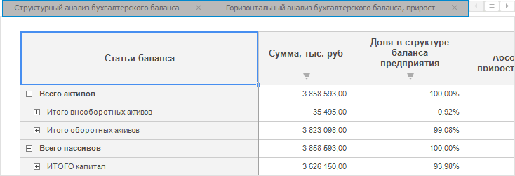

# Вставка листов экспресс-отчёта

Вставка листов экспресс-отчёта
-

# Вставка листов экспресс-отчёта

Экспресс-отчёт может содержать несколько листов, на каждом из которых
 можно отобразить разные данные из источника, используя разные визуализаторы
 данных. Управление листами отчёта осуществляется при помощи вкладок:

## Вставка

Для добавления нового листа отчёта:

	- выполните команду контекстного меню для вкладки листа «Добавить лист»;

	- нажмите на знак «+», расположенный справа от вкладок листов.

## Дублирование

Для создания копии листа выполните команду контекстного меню листа «Дублировать».

В результате выполнения команды будет создана точная копия листа.

## Переименование

Для переименования листа отчёта:

	- выполните команду контекстного меню «Переименовать»;

	- переведите заголовок листа в режим редактирования двойным щелчком мыши.

## Удаление

Для удаления листа отчёта:

	- выполните команду контекстного меню «Удалить».
	 Будет выдано предупреждение об удалении;

	- нажмите на знак «Х», расположенный справа от вкладок листов.

См. также:

[Построение
 экспресс-отчёта](../purpose/UiExpress_Purpose_Starting.htm) | [Управление
 параметрами листа](../Express/Data_sources_parameters.htm)

		Справочная
		 система на версию 10.9
		 от 18/08/2025,
		 © ООО «ФОРСАЙТ»,
