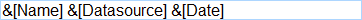
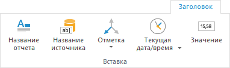
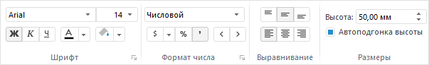
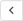
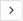
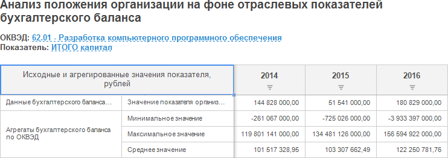
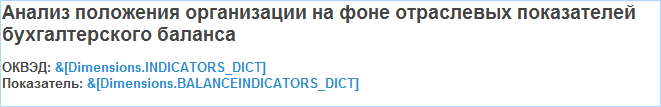

# Настройка заголовка как интерактивного элемента управления

Настройка заголовка как интерактивного элемента управления
-

# Настройка заголовка как интерактивного элемента управления

	Для отображения/скрытия заголовка отчёта нажмите/переведите в ненажатое
	 состояние кнопку  «Заголовок», расположенную на вкладке
	 «Главная» или «Вид»
	 ленты инструментов.

	Для выбора режима отображения заголовка установите переключатель
	 в раскрывающемся меню кнопки 
	 «Заголовок»:

		- Простой. Заголовок
		 отображается как текст;

		- Элемент управления.
		 Заголовок отображается как гиперссылка, при нажатии на которую
		 открывается иерархический список для выбора элемента измерения.
		 Режим выбран по умолчанию.

	Заголовок экспресс-отчёта может поддерживать несколько языков пользовательского
	 интерфейса, например, русский и английский. Подобные заголовки называются
	 мультиязычными.

	Для перевода заголовка на другие языки обратитесь к разделу «[Перевод заголовков
	 экспресс-отчётов](UiNav.chm::/Multilanguage/Title_Express.htm)».

	Для получения подробной информации о настройке мультиязычности содержимого
	 репозитория и общей системы обратитесь к разделу «[Настройка
	 мультиязычности](uinav.chm::/Multilanguage/Multilanguage_setting.htm)».

## Содержимое заголовка

	Для изменения содержимого заголовка:

		- Переведите заголовок в режим редактирования. Для этого дважды
		 щёлкните по нему. Составляющие части заголовка будут представлены
		 в виде тегов:

	

		- В режиме редактирования заголовка можно добавлять текст
		 вручную с помощью шаблонов или использовать подстановки, расположенные
		 в группе «Вставка» на
		 вкладке «Заголовок» ленты
		 инструментов:

	

	Примечание.
	 Вкладка «Заголовок» доступна,
	 если отображен заголовок.

	Доступные подстановки:

			- Название отчёта;

			- Название источника;

			- Отметка. Позволяет
			 создать в заголовке элемент управления, основанный на измерении
			 или [метрике](UiSelection.chm::/Selection/Dimension_type.htm#metric).

			Для вставки текущей отметки по всем фиксированным измерениям
			 нажмите кнопку  «Отметка».

			Для вставки отметки определенного измерения или метрики нажмите
			 нижнюю часть кнопки 
			 «Отметка». Будет отображено
			 меню, содержащее следующие группы:

				- Измерения.
				 Содержит список измерений, доступных для использования
				 в заголовке в качестве элементов управления.

				В настольном приложении для настройки дополнительных параметров
				 измерения, например, способа отметки, выполните команду
				 «Параметры редактора»
				 в контекстном меню тега измерения. Будет открыто окно
				 «[Параметры редактора значений](UiNav.chm::/GUI/ValueEditorParameters.htm#dimension)»;

				- Метрики.
				 Группа содержит список возможных метрик, доступных для
				 использования в заголовке в качестве элементов управления.
				 Группа доступна только для [визуализаторов
				 данных](UiExpress_control.htm), в которых заданы метрики;

					- Текущая дата
					 и время. Для вставки текущей даты нажмите кнопку
					 «Текущая дата/время».

					Для вставки текущего времени нажмите нижнюю часть кнопки
					 «Текущая дата/время»
					 и выполните команду «Текущее
					 время»;

					- Значение выделенной
					 ячейки. Значение, полученное при фиксации всех
					 измерений в источнике данных, используемым [визуализатором](UiExpress_control.htm).

		- Для выхода из режима редактирования:

			- нажмите левой кнопкой мыши вне заголовка;

			- нажмите сочетание клавиш CTRL+ENTER.

	Примечание.
	 Наименование элементов измерения в элементе управления в заголовке
	 соответствует наименованию элементов этого измерения в боковой панели.

	[Вставка
	 подстановок с помощью шаблонов](javascript:TextPopup(this))

		Шаблоны вводятся с помощью клавиатуры.

		Доступные шаблоны:

			- &[Name].
			 Наименование отчёта;

			- &[Datasource].
			 Наименование источника данных;

			- &[Selection].
			 Текущая отметка по всем фиксированным измерениям;

		Примечание.
		 В веб-приложении инструментов «Аналитические
		 запросы (OLAP)» и «Аналитические
		 панели» настроено автоматическое форматирование измерений
		 с фиксированной отметкой, а также доступна возможность изменения
		 отметки в заголовке.

			- &[Date].
			 Текущая дата;

			- &[Time].
			 Текущее время;

			- &[Value].
			 Значение, полученное при фиксации всех измерений в источнике
			 данных визуализатора;

			- &[EXPRESSION:<e>].
			 Значение, вычисленное по заданному выражению, где e - это выражение.
			 В качестве выражения могут выступать:

				- Формула.
				 Допускается использование арифметических и логических
				 функций, аналогичных используемым в [редакторе
				 выражения](uinav.chm::/GUI/Expression_editor_func.htm). Например: &[EXPRESSION:Average(1,2,3)];

				- Функция,
				 рассчитываемая модулем Fore. Функция указывается
				 в следующем формате: <Идентификатор
				 модуля>.<Идентификатор
				 функции>. Например, функция «Func»,
				 содержащаяся в модуле «TESTEXPR»: &[EXPRESSION:TESTEXPR.Func];

			- &[Dimensions.<id>].
			 Текущая отметка заданного измерения, где id -
			 это идентификатор требуемого измерения. Например: &[Dimensions.CALENDAR];

			- &[<v>.Metric.<m>].
			 Текущая отметка заданной метрики, где v -
			 это визуализатор, а m -
			 метрика визуализатора. Например: &[Grid.Metric.FontSize].
			 Шаблон доступен только для визуализатора, в котором заданы
			 метрики.

	[Работа
	 с отметкой](javascript:TextPopup(this))

		В раскрывающемся меню кнопки 
		 «Отметка» имеется список
		 подстановок для добавления в заголовок.

		Подстановка «Измерения»
		 позволяет вставить в заголовок подстановку с отметкой по измерению.

		Примечание.
		 Если в качестве измерения в подстановке выбрано календарное измерение,
		 то при работе с подстановкой будет доступен выбор режима отметки:
		 «Только по элементам»,
		 «Только по уровням» или
		 «По элементам и уровням».
		 Доступный режим задается на вкладке «[Структура
		 источника данных](../purpose/DS_structure.htm)» окна «Структура
		 и параметры». Работа с отметкой в такой подстановке аналогична
		 работе с [отметкой
		 элементов календарного измерения](UiSelection.chm::/Selection/Selection_of_the_CalendarDimension_elements.htm).

		Если для измерений были настроены [метрики](UiSelection.chm::/Selection/Dimension_type.htm#metric),
		 то в группе «Метрики»
		 будут доступны подстановки с ними:

			- если настроена синхронизация [метрик](UiSelection.chm::/Selection/Dimension_type.htm#metric),
			 будет доступны подстановки: «Значение/Цвет»,
			 «Размер»;

			- для каждого включенного визуализатора будут доступны подстановки
			 по [метрикам](UiSelection.chm::/Selection/Dimension_type.htm#metric).

## Внешний вид заголовка

	Для настройки внешнего вида заголовка используйте группы команд
	 «Шрифт», «Формат
	 числа», «Выравнивание»,
	 «Размеры», расположенные на
	 вкладке «Заголовок» ленты
	 инструментов:

	

	Группа команд «Выравнивание»
	 доступна только в настольном приложении.

	Доступны следующие настройки:

	[Шрифт
	 заголовка](javascript:TextPopup(this))

		Для настройки шрифта используйте элементы, расположенные в группе
		 «Шрифт»:

			- Шрифт. Выберите
			 один из шрифтов, установленных в операционной системе;

			- Размер шрифта.
			 Установите требуемый размер шрифта. Размер задаётся в пунктах,
			 и его можно выбрать из раскрывающегося списка или ввести вручную.
			 Диапазон допустимых значений: [1, 72];

			- Начертание шрифта.
			 Установите стиль начертания шрифта с помощью соответствующих
			 кнопок. Доступно использование нескольких стилей одновременно;

			- Цвет шрифта.
			 Выберите цвет шрифта в раскрывающейся палитре цветов;

			- Цвет фона. Выберите
			 цвет фона в раскрывающейся палитре цветов. Возможность доступна
			 только в настольном приложении.

		Совет. В
		 настольном приложении для дополнительной настройки шрифта заголовка
		 используйте вкладку «[Шрифт](UiNav.chm::/GUI/Format/UiReport_Table_Attribute_Type.htm)» в
		 диалоге «Формат». Для
		 отображения диалога нажмите кнопку , расположенную
		 в правом нижнем углу группы «Шрифт»
		 на вкладке ленты инструментов, или выполните команду «Формат»
		 в контекстном меню заголовка, находящегося в режиме редактирования.

		Оформление может быть применено ко всему заголовку или к его
		 частям.

	[Формат
	 числа](javascript:TextPopup(this))

		Примечание.
		 Возможность доступна только для подстановки «Значение».

		Для настройки формата числа выделите подстановку «Значение»
		 и используйте группу «Формат
		 числа».

		В раскрывающемся списке выберите один из поддерживаемых
		 форматов данных.

		Для быстрой настройки формата данных используйте
		 кнопки:

			-  - преобразование в денежный формат.
			 Для выбора валюты используйте раскрывающееся меню кнопки;

			-  - преобразование в процентный формат;

			-  - преобразование в числовой формат
			 и отображение разделителя групп разрядов с двумя десятичными
			 знаками после запятой;

			-  - уменьшение разрядности числа.
			 Применяется для отображения менее точных значений;

			-  - увеличение разрядности числа.
			 Применяется для отображения более точных значений.

		Совет. В
		 настольном приложении для дополнительной настройки формата числа
		 заголовка используйте вкладку «[Формат
		 числа](uinav.chm::/GUI/Format/UiReport_Table_Attribute_Format.htm)» в диалоге «Форматирование».
		 Для отображения диалога нажмите кнопку , расположенную
		 в правом нижнем углу группы «Формат
		 числа» на вкладке ленты инструментов.

	[Выравнивание
	 текста заголовка](javascript:TextPopup(this))

		Для настройки выравнивания:

			- в настольном приложении.
			 Используйте кнопки в группе команд «Выравнивание»
			 для горизонтального и вертикального выравнивания;

			- в веб-приложении.
			 Используйте кнопки на группе команд «Шрифт»
			 для горизонтального выравнивания.

	[Высота и
	 автоподгонка высоты заголовка](javascript:TextPopup(this))

		Для задания точной высоты заголовка:

			- Снимите флажок «Автоподгонка
			 высоты».

			- Задайте значение высоты в поле «Высота».

		Для настройки автоматического подбора высоты:

			- Установите флажок «Автоподгонка
			 высоты».

			- Задайте максимальное значение для высоты заголовка в
			 поле «Высота».

## Пример настроенного заголовка

	На рисунке ниже приведен пример экспресс-отчёта с настроенным заголовком:

	

	Название измерения отображается в виде гиперссылки. При нажатии
	 на нее можно выбрать элемент измерения. При смене элемента измерения
	 автоматически изменяются данные в таблице.

	Заголовок в режиме редактирования выглядит следующим образом:

	

См. также:

[Построение
 экспресс-отчёта](../purpose/UiExpress_Purpose_Starting.htm)

		Справочная
		 система на версию 10.9
		 от 18/08/2025,
		 © ООО «ФОРСАЙТ»,
