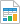
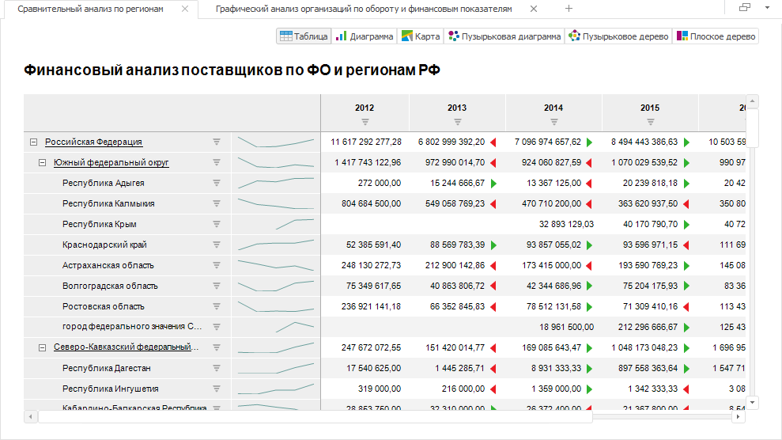
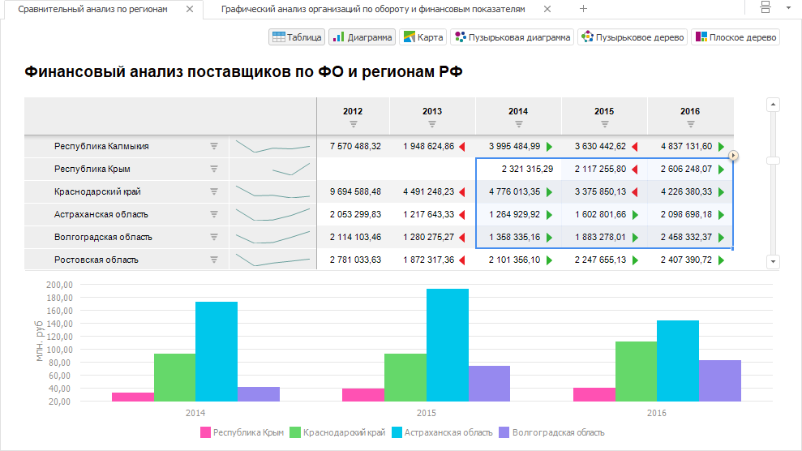
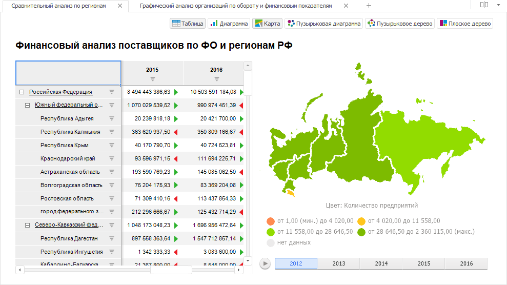
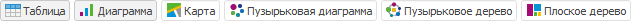
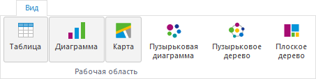

# Выбор визуализатора для отображения данных

Выбор визуализатора для отображения данных
-

# Выбор визуализатора для отображения
 данных

Аналитические запросы (OLAP) предоставляют возможность быстро формировать
 отчёты, позволяющие анализировать произвольные измерения данных с помощью
 [визуализаторов](DataAnalysis.chm::/Visualizators.htm).

Доступны следующие визуализаторы:

	- [Таблица](UiAnalyticalArea.chm::/Table.htm).
	 Представляет собой электронную таблицу, построенную на основе источника
	 данных из репозитория платформы. Куб данных в общем случае может содержать
	 неограниченное число измерений. Для представления куба в виде таблицы
	 часть измерений фиксируется – в каждом из них определяется элемент,
	 по которому будет построен срез данных. Срез данных представляет собой
	 двумерную таблицу данных, у которой в шапке и боковике отображаются
	 элементы измерений куба, расположенные по столбцам и по строкам;

	- [Диаграмма](UiDiagrams.chm::/Diagrams.htm).
	 Основывается на какой-либо области таблицы и сохраняет связь с данными.
	 Любые изменения данных в таблице приводят к перерисовке диаграммы
	 с учетом этих изменений;

	- [Карта](UiMaps.chm::/Map.htm).
	 Cтроится на базе двумерной таблицы и обычно представляет собой одну
	 строку/столбец из этой таблицы в виде закраски территорий. Закраска
	 территорий определяется начальным и конечным цветами, которые соответствуют
	 минимальному и максимальному значению на карте соответственно. Цвета
	 промежуточных значений вычисляются автоматически;

	- [Пузырьковая
	 диаграмма](UiVisualizators.chm::/BubbleChart/BubbleChart.htm). Точечная диаграмма, в которой
	 точки данных заменены пузырьками, причем их цвет и размер служат дополнительными
	 измерениями данных. На пузырьковой диаграмме нет оси категорий. Горизонтальная
	 и вертикальная оси являются осями значений. Дополнительно пузырьковая
	 диаграмма содержит анимированную временную шкалу, отображающую динамику
	 значений;

	- [Пузырьковое
	 дерево](UiVisualizators.chm::/BubbleTree/BubbleTree.htm). Способ отображения иерархических
	 данных в виде набора взаимосвязанных пузырьков. Каждой ветке иерархии
	 соответствует пузырек, который связан с пузырьками, являющимися элементам
	 иерархии того же уровня. Все элементы одной ветки и одного уровня
	 иерархии образуют круг, в центре которого - родительский элемент иерархии.
	 Диаметр каждого пузырька пропорционален значению соответствующего
	 элемента иерархии. Цвет пузырька также определяется значением элемента
	 иерархии;

	- [Плоское
	 дерево](UiVisualizators.chm::/TreeMap/TreeMap.htm). Способ отображения иерархических
	 данных в виде набора вложенных прямоугольников. Каждой ветке иерархии
	 соответствует прямоугольник, который состоит из меньших прямоугольников,
	 являющихся подветками. Площадь каждого прямоугольника пропорциональна
	 значению соответствующего элемента иерархии. Цвет прямоугольника также
	 определяется значением элемента иерархии.

## Агрегация фиксированных измерений

Агрегация позволяет производить множественную отметку элементов фиксированных
 измерений с применением выбранного метода агрегации.

Примечание.
 Агрегация фиксированных измерений недоступна при работе с [глобальным кешем](UiNav.chm::/02_Navigator/Cache_In_Blob.htm).

Для [агрегации
 фиксированных измерений](UiNavObj.chm::/Cube/Agregation.htm):

	- [Выберите](UiExpress_control.htm#choosing) визуализатор
	 данных.

Примечание.
 Агрегация применяется для всех визуализаторов, построенных на одном источнике.

	- Перейдите на вкладку «Данные»
	 из группы «Источник» боковой
	 панели.

	- Выберите необходимый вариант агрегации из раскрывающегося списка
	 «Агрегировать фиксированные измерения»:

		- Нет. Агрегация данных
		 не производится;

		- Сумма. По выбранным
		 элементам в фиксированных измерениях будет произведено суммирование;

		- Максимум. Из выбранных
		 элементов в фиксированных измерениях будет отображено максимальное
		 значение;

		- Минимум. Из
		 выбранных элементов в фиксированных измерениях будет отображено
		 минимальное значение;

		- Из измерений источника.
		 К данным фиксированного измерения применяется метод агрегации,
		 заданный в [настройках](UiNavObj.chm::/Cube/CreateCube/Master_Standart/UiMd_Cube_CreateCube_Master_Standart_7.htm)
		 источника данных.

При работе с кубами ADOMD используется агрегация,
 настроенная в соответствующих источниках ADOMD;

		- Из фактов источника.
		 В фиксированных измерениях с полной отметкой используется [агрегация на сервере](UiNavObj.chm::/Cube/Agregation.htm#fact)
		 в соответствии с методами, заданными для [фактов
		 источника](UiNavObj.chm::/Cube/CreateCube/Master_Standart/UiMd_Cube_CreateCube_Master_Standart_2.htm#agregation). Агрегацию из фактов источника необходимо
		 настраивать в том случае, когда в источнике для одного набора
		 измерений есть несколько записей, требующих агрегации.

Если в настройках агрегации измерения куба
 установлен флажок «[Агрегировать
 отмеченные элементы в измерении](uinavobj.chm::/cube/work_cube/tuning_agr/uimd_cube_work_cube_tuning_agr_basic.htm)»,
 и для фактов на странице «[Привязка фактов](UiNavobj.chm::/Cube/CreateCube/Master_Standart/UiMd_Cube_CreateCube_Master_Standart_2.htm)»
 выбран метод агрегации, то агрегация рассчитывается на сервере по отмеченным
 элементам в соответствии с методами, заданными для фактов куба. При единичной
 отметке родительского элемента агрегация выполняется только для его дочерних
 элементов. Если в отметке только родительский элемент без дочерних, то
 данные в него не будут агрегированы. Если флажок снят, то при множественной
 отметке агрегация выполняется по всему измерению, независимо от отметки.
 При единичной отметке родительского элемента агрегация выполняется по
 дочерним элементам.

Если в качестве таблицы фактов выбран «[Источник данных
 ODBC](UiNavObj.chm::/ODBC/UiDb_relational_ODBC.htm)», то в мастере стандартного куба для данного
 источника доступна настройка расчёта [агрегации
 на клиенте](uinavobj.chm::/Cube/CreateCube/Master_Standart/UiMd_Cube_CreateCube_Master_Standart_2.htm);

		- Среднее. По выбранным
		 элементам в фиксированных измерениях будет отображено среднее
		 значение.

Примечание.
 При выборе любого пункта списка, кроме «Нет»,
 становится активной кнопка «Отметить
 все фиксированные», при нажатии на которую будут отмечены все элементы
 в фиксированных измерениях.

### Особенности агрегации

Доступно в веб-приложении.

Если для таблицы:

	- отмеченные элементы содержат идентификаторы различных единиц
	 измерения;

	- структура измерения, который включает эти элементы, соответствует
	 структуре [справочника
	 показателей](UiNavObj.chm::/Units/Units_Cube.htm#indicators);

	- куб не содержит [справочник единиц
	 измерения](UiNavObj.chm::/Units/Units_Cube.htm#units) и установлен флажок «[Не агрегировать разные единицы измерения](uinavobj.chm::/Cube/CreateCube/Master_Standart/UiMd_Cube_CreateCube_Master_Standart_7.htm#no_agr)»;

то при агрегации фиксированных измерений:

	- В группе вкладок  «Отметка»
	 напротив измерения, который включает эти элементы, будет отображаться
	 пиктограмма  и всплывающая подсказка.

	- В расчётной ячейке вместо значения будет выведен символ «-».
	 Для изменения символа или текста используйте свойство [IPivot.UnmatchedUnitsText](kepivot.chm::/Interface/IPivot/IPivot.UnmatchedUnitsText.htm).
	 Для отображения символа или текста при агрегации фиксированных измерений
	 измерение должно находиться в фиксированных.

При включении [отображения
 пиктограмм для вычисляемых ячеек](UiAnalyticalArea.chm::/TableView/Formatting/Cells_icons.htm#pic) в расчётной ячейке
 одновременно будет выведено оба символа. По умолчанию «=-».

## Расположение визуализаторов данных

Выберите режим расположения данных из раскрывающегося списка:

	- при нажатии кнопки  «Раскладка» в правом верхнем углу
	 рабочей области. Вид кнопки зависит от установленного режима;

	- при нажатии кнопки  «Раскладка» на вкладке «Вид»
	 ленты инструментов.

Доступные режимы размещения визуализаторов данных:

[На закладках](javascript:TextPopup(this))

	При размещении на закладках визуализатор занимает всю рабочую область.
	 На переднем плане отображается только активный объект экспресс-отчёта.
	 Изменение размеров панели с данными недоступно. Данный вариант размещения
	 данных используется по умолчанию.

	Пример рабочей области при размещении визуализаторов на закладках:

	

[Вертикально](javascript:TextPopup(this))

	При вертикальном размещении:

		- ширина визуализаторов соответствует ширине рабочей области
		 и недоступна для изменения;

		- высота визуализаторов по умолчанию соответствует:

			- высоте рабочей области при отображении одного визуализатора;

			- половине высоты рабочей области при отображении двух
			 и более визуализаторов. Только в настольном приложении.

	Высоту панелей визуализаторов можно изменять
	 с помощью перетаскивания их границ.

	Пример рабочей области при вертикальном размещении визуализаторов:

	

[Горизонтально](javascript:TextPopup(this))

	При горизонтальном размещении:

		- высота визуализаторов соответствует высоте рабочей области
		 и недоступна для изменения;

		- ширина визуализаторов по умолчанию соответствует:

			- ширине рабочей области при отображении одного визуализатора;

			- половине ширины рабочей области при отображении двух
			 и более визуализаторов. Только в настольном приложении.

	Ширину панелей визуализаторов можно изменять
	 с помощью перетаскивания их границ.

	Пример рабочей области при горизонтальном размещении визуализаторов:

	

## Выбор визуализатора

Выбор визуализатора осуществляется при помощи группы кнопок в правой
 верхней части рабочей области.

В зависимости от выбранного варианта расположения данных группа кнопок
 для выбора визуализатора может отображаться по-разному:

	- На закладках. Видимостью
	 представлений управляют переключатели. Доступен выбор только одного
	 визуализатора:

	- Горизонтально/вертикально.
	 Видимостью представлений управляют кнопки. Доступен множественный
	 выбор визуализаторов:

## Отображение/скрытие визуализатора

Чтобы отобразить/скрыть визуализатор переведите в активное/неактивное
 состояние кнопку, соответствующую требуемому визуализатору данных в группе
 «Рабочая область» на вкладке «Вид» ленты инструментов:

Примечание.
 Скрыть все визуализаторы невозможно, отображается как минимум один визуализатор.

См. также:

[Визуализаторы данных](DataAnalysis.chm::/Visualizators.htm) |
 [Выбор данных для
 построения визуализации](../purpose/UiDiagrams_Express_selection.htm)

		Справочная
		 система на версию 10.9
		 от 18/08/2025,
		 © ООО «ФОРСАЙТ»,
