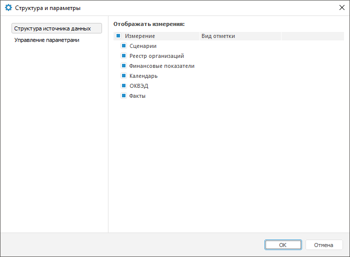
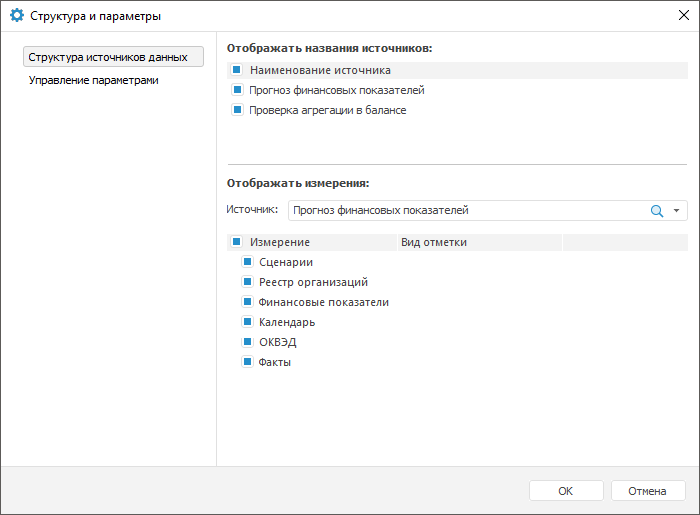

# Настройка структуры источника данных

Настройка структуры источника данных
-

# Настройка структуры источника данных

Настройка структуры источника данных экспресс-отчёта позволяет задать
 измерения, доступные для работы пользователю.

Для настройки структуры источника данных используйте вкладку «Структура источника данных» в диалоге
 «Структура и параметры». В
 зависимости от количества источников данных экспресс-отчёта вид окна будет
 различным.

[Для отображения
 вкладки «Структура источника данных»](javascript:TextPopup(this))

		- Нажмите кнопку  «Структура
		 и параметры» на вкладке «Данные»
		 на ленте инструментов. Будет открыт диалог «Структура
		 и параметры».

	Примечание.
	 Кнопка доступна, если для экспресс-отчёта задан [источник
	 данных](UiExpress_Tree_Multivariate_Object.htm).

		- Перейдите на вкладку «Структура
		 источника данных».

	 Один источник Несколько источников

		

		

Для настройки структуры источника данных:

	- В столбце «Измерение»
	 установите флажки напротив тех измерений, которые должны быть доступны
	 пользователю в группе вкладок «[Отметка](UiSelection.chm::/Selection/Dimension.htm)»
	 на боковой панели. Скрытые измерения будут отображаться в таблице
	 с той же отметкой, которая была у этих измерений до скрытия. Подробное
	 описание приведено в разделе [Отображение/скрытие
	 измерений в группе вкладок «Отметка»](UiSelection.chm::/Selection/Dimension.htm#show_dims).

Измерения, для которых настроены альтернативные
 иерархии, отображаются в виде дерева (по умолчанию дерево свернуто). В
 развернутом дереве перечисляются справочники/атрибуты справочников, использующиеся
 в качестве альтернативных иерархий. Данная возможность доступна, если
 источником данных является:

		- стандартный куб, атрибуты справочников которого используются
		 в качестве [альтернативной
		 иерархии](UiNavObj.chm::/reference_book/look-and-feel_Reference_book/Attributes_as_alt_hier.htm). Для использования альтернативной
		 иерархии на основе атрибутов справочников должны быть выполнены
		 [предварительные
		 настройки](UiNavObj.chm::/reference_book/look-and-feel_Reference_book/Attributes_as_alt_hier.htm);

		- куб ADOMD, для справочников которого настроена [альтернативная
		 иерархия](UiNavObj.chm::/reference_book/look-and-feel_Reference_book/Use_AlterHier_ForRefBook.htm). Если установлены флажки напротив
		 наименований альтернативных иерархий, то в группе вкладок «Отметка» боковой панели на отдельных
		 вкладках будут отображаться выбранные альтернативные иерархии.

	- В столбце «Вид
	 отметки» задайте режим [отметки](UiSelection.chm::/Selection/Selection_of_the_CalendarDimension_elements.htm)
	 для календарных измерений. Для этого выделите наименование календарного
	 измерения и в раскрывающемся списке выберите вид отметки:

		- Только по элементам.
		 На вкладке «Отметка» на
		 боковой панели будут отображаться только элементы календаря;

		- Только по уровням.
		 На вкладке «Отметка» на
		 боковой панели будут отображаться только уровни календаря;

		- По элементам и уровням.
		 На вкладке «Отметка» на
		 боковой панели будут отображаться элементы и уровни календаря.

Примечание.
 Изменение режима отметки для календарных измерений доступно только для
 отчётов, содержащих один источник данных.

Если диалог «Структура и параметры»
 был открыт для отчёта, имеющего несколько источников данных, то вкладка «Структура источника данных» будет
 содержать дополнительные параметры:

	- Отображать названия источников.
	 Установка/снятие флажков позволяет отобразить/скрыть наименования
	 источников данных в таблице. Область содержит флажок «Наименование
	 источника» и ниже список источников, используемых в экспресс-отчёте.
	 Для отображения названий всех источников установите флажок «Наименование источника», при этом
	 установятся флажки у наименований всех источников. Для отображения
	 названий отдельных источников установите флажки напротив наименований
	 требуемых источников. По умолчанию флажки установлены и названия всех
	 источников данных отображаются в таблице;

	- Отображать измерения.
	 Установка/снятие флажков позволяет отобразить/скрыть наименования
	 измерений для каждого источника экспресс-отчёта, которые отображаются
	 на вкладке «Отметка» боковой
	 панели. Выберите источник данных в списке «Источник»
	 и установите флажки напротив измерений этого источника, которые должны
	 быть отображены. Для отметки всех измерений установите флажок «Измерение». По умолчанию флажки
	 установлены и названия всех измерений отображаются. Скрытые измерения
	 будут отображаться в таблице с той же отметкой, которая была у этих
	 измерений до скрытия.

См. также:

[Выбор источника данных](UiExpress_Tree_Multivariate_Object.htm)

		Справочная
		 система на версию 10.9
		 от 18/08/2025,
		 © ООО «ФОРСАЙТ»,
