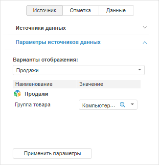
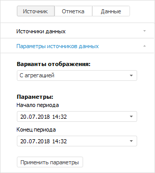
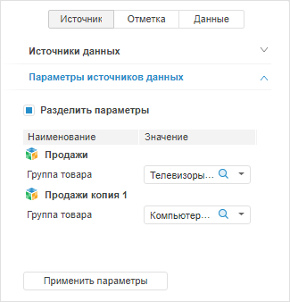

# Управление параметрами источника данных

Управление параметрами источника данных
-

# Управление параметрами источника данных

Параметры позволяют динамически управлять содержимым экспресс-отчёта.

Для управления параметрами источников данных экспресс-отчёта используйте
 вкладку «Параметры источников данных»
 на боковой панели.

[Для отображения
 вкладки](javascript:TextPopup(this))

		- Убедитесь, что [боковая
		 панель](GetStarted.chm::/Interface/Interface_Description.htm#side_panel) отображается.

		- Выберите источник данных с параметрами на вкладке «[Источники данных](UiExpress_Tree_Multivariate_Object.htm)».

		- Перейдите на вкладку «Параметры
		 источников данных».

	Веб-приложение Настольное приложение

		

		

В зависимости от источника данных на вкладке доступны следующие настройки:

[Варианты
 отображения](javascript:TextPopup(this))

	В раскрывающемся списке «Варианты
	 отображения» выберите набор данных, который будет отображаться
	 в экспресс-отчёте.

	Примечание.
	 Варианты отображения источника данных в экспресс-отчёте доступны только
	 при использовании одного источника.

	Доступные варианты зависят от типа источника данных:

		- Стандартный куб.
		 Доступны [варианты
		 отображения](UiNavObj.chm::/Cube/CreateCube/Master_Standart/Display_Version_Options.htm), настроенные при создании куба;

		- Вычисляемый
		 куб. Доступны следующие варианты, в которых N
		 - наименование вычисляемого куба:

			- N.
			 Данные куба;

			- Формулы N. Данные
			 куба, вычисленные по формулам, заданным в [редакторе
			 формул для вычисляемого куба](UiNavObj.chm::/equation_editor/UiMd_Equation_editor_CalculationCube.htm);

		- База
		 данных временных рядов. Доступны следующие варианты, в
		 которых N - наименование
		 базы данных временных рядов:

			- Атрибуты N. Данные
			 временных рядов по состоянию на последнюю ревизию по сценарию
			 «Факт» с дополнительным
			 измерением «Атрибуты».
			 В качестве элементов измерение содержит все [атрибуты](UiNavObj.chm::/TimeSeriesDatabase/TS_Attributes.htm)
			 уровня рядов и уровня наблюдений, кроме системных атрибутов
			 и атрибутов, имеющих [множественные
			 значения](UiNavObj.chm::/TimeSeriesDatabase/TS_Attributes.htm#attr).

			Если атрибут является ссылкой на справочник, то для него в
			 качестве дочерних элементов будут отображаться все атрибуты
			 используемого справочника.

			Редактирование значений доступно только для атрибутов наблюдений;

			- Полные данные N. Данные
			 временных рядов с дополнительными измерениями «Ревизии»
			 и «Сценарии». Измерение
			 «Ревизии» дает доступ
			 к данным временных рядов по состоянию на различные ревизии.
			 Измерение «Сценарии»
			 дает доступ к данным временных рядов по различным сценариям.

			Редактирование значений недоступно;

			- Сценарные данные N. Данные
			 временных рядов по состоянию на последнюю ревизию с дополнительным
			 измерением «Сценарии».
			 Измерение «Сценарии»
			 дает доступ к данным временных рядов по различным сценариям;

	Примечание.
	 Вариант «Сценарные данные N» доступен,
	 если база данных временных рядов поддерживает сценарии. Для получения
	 подробной информации обратитесь к описанию [IRubricator.HasScenarioDimension](kecubes.chm::/Interface/IRubricator/IRubricator.HasScenarioDimension.htm).

			- Актуальные данные N. Данные
			 временных рядов по состоянию на последнюю ревизию по сценарию
			 «Факт»;

			- N.
			 Данные временных рядов по сценарию «Факт»
			 с дополнительным измерением «Ревизии».
			 Измерение «Ревизии»
			 дает доступ к данным временных рядов по состоянию на различные
			 ревизии.

			Редактирование значений недоступно.

	Примечание.
	 Дополнительные измерения отображаются в группе вкладок «[Отметка](UiSelection.chm::/Selection/Dimension.htm)»
	 на боковой панели.

[Параметры](javascript:TextPopup(this))

	В области «Параметры» задайте
	 значения параметров источника данных или экспресс-отчёта.

	Примечание.
	 Параметры доступны, если источником данных является параметрический
	 куб или активный лист экспресс-отчёта содержит [собственные
	 параметры](../Express/Data_sources_parameters.htm).

Операции с источником данных, доступные только в веб-приложении:

[Копирование](javascript:TextPopup(this))

	Для копирования источника данных выполните команду «Копировать»
	 в контекстном меню источника. После чего в список источников данных
	 будет добавлена его копия и активировано [разделение
	 параметров](#separation), если отчёт не был создан на основе [нескольких
	 источников](../ChangeNote/UiExpress_Tabl_ChangeNote_PrivDim.htm).

	Наименование копии источника формируется в формате «<наименование
	 источника данных> копия N», где N - порядковый номер копии.

[Переименование](javascript:TextPopup(this))

	Для переименования источника данных выполните команду «Переименовать»
	 в контекстном меню источника. После чего куб будет переименован в
	 отчёте и [навигаторе
	 объектов](GetStarted.chm::/Interface/Interface_Navigator.htm).

[Удаление](javascript:TextPopup(this))

	Для удаления источника данных из списка выполните команду «Удалить» в контекстном меню источника.
	 После чего данные источника будут исключены из отчёта.

Для обновления данных экспресс-отчёта в соответствии с заданными значениями
 параметров нажмите кнопку «Применить
 параметры».

## Разделение параметров источников данных

Примечание.
 Доступно только в веб-приложении.

Для разделения параметров [нескольких
 источников данных](../ChangeNote/UiExpress_Tabl_ChangeNote_PrivDim.htm) или использования одного источника данных с разными
 наборами параметров используйте флажок «Разделить
 параметры». По умолчанию флажок доступен и установлен:

	- если на вкладке «[Источники
	 данных](UiExpress_Tree_Multivariate_Object.htm)» выбрано больше двух источников данных;

	- если на вкладке «Параметры
	 источников данных» содержится исходный источник данных
	 и его [копия](#copy).

Вид вкладки «Параметры источников данных»
 при разделении параметров источников данных:

Для изменения данных в экспресс-отчёте задайте значения параметрам соответствующих
 источников данных.

При снятии флажка «Разделить параметры»
 параметры разных источников данных объединяются в один список без разделения.

См. также:

[Выбор
 источника данных](UiExpress_Tree_Multivariate_Object.htm)

		Справочная
		 система на версию 10.9
		 от 18/08/2025,
		 © ООО «ФОРСАЙТ»,
