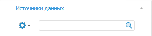
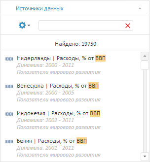

# Поиск источников данных

Поиск источников данных
-

# Поиск источников данных

В инструменте «Аналитические запросы
 (OLAP)» доступны следующие режимы поиска:

	- стандартный поиск источников данных по их наименованию. Доступен
	 всегда;

	- BI-поиск источников данных по их содержимому. Доступен, если
	 выполнены соответствующие настройки. Подробнее в статье «[Установка сервиса BI-поиска](setup.chm::/BISearch/BISearch_Setup.htm)».

Каждый из данных режимов выполняет поиск на любом языке, поддерживаемом
 «Форсайт. Аналитическая платформа».

Для поиска источников данных используйте строку поиска, расположенную
 в верхней части вкладки «[Источники
 данных](UiExpress_Tree_Multivariate_Object.htm)». Вид строки поиска отличается в зависимости от режима
 поиска:

	- стандартный поиск:

	- BI-поиск:

Для выполнения поиска:

	- источника данных по его наименованию:

		- в стандартном режиме поиска.
		 Введите в строку поиска наименование или часть наименования искомого
		 источника данных;

		- в режиме BI-поиска:

				- Нажмите кнопку . Будет отображено
				 меню, в котором установите переключатель «По
				 наименованию».

				- Введите в строку поиска наименование или часть наименования
				 искомого источника данных.

	- источника данных по его содержимому
	 (доступно только для BI-поиска):

		- Нажмите кнопку . Будет отображено меню,
		 в котором установите переключатель «По
		 данным».

		- Введите в строку поиска наименование или часть наименования
		 искомого источника данных.

Поиск будет выполняться автоматически по мере ввода искомого текста.
 В строке поиска отобразится кнопка ,
 применяемая для сброса результатов поиска.

Если источники данных, удовлетворяющие условиям поиска не найдены, то
 будет отображено соответствующее сообщение.

Если источники данных найдены, то представление результатов поиска зависит
 от режима поиска:

	- BI-поиск. Будет отображен
	 список с результатами поиска. Например:

Доступна множественная отметка результатов
 поиска с зажатой клавишей CTRL.

	- стандартный поиск. В
	 дереве источников данных будет установлено выделение на первом
	 источнике, соответствующем условиям поиска. Для перехода к следующему
	 источнику, соответствующему условиям поиска, нажмите клавишу ENTER.

Источник, выбранный в результатах поиска, будет установлен в качестве
 источника данных экспресс-отчёта.

См. также:

[Выбор
 источника данных](UiExpress_Tree_Multivariate_Object.htm)

		Справочная
		 система на версию 10.9
		 от 18/08/2025,
		 © ООО «ФОРСАЙТ»,
