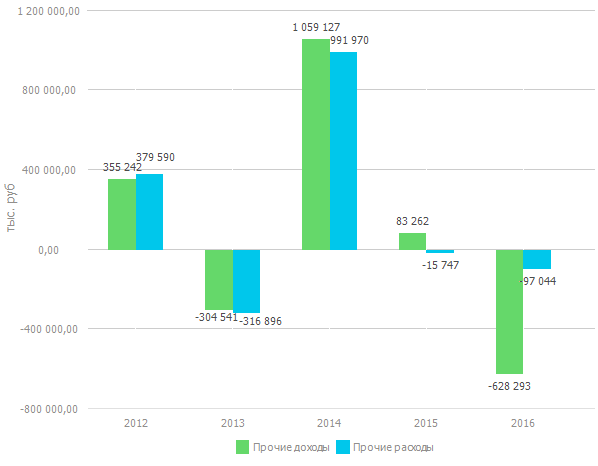

# Выбор данных для построения визуализации

Выбор данных для построения визуализации
-

# Выбор данных для построения визуализации

В инструменте «Аналитические запросы
 (OLAP)» при выделении диапазона ячеек в таблице данных доступно
 перестроение [визуализаторов](../Setup_express_report/UiExpress_control.htm),
 построенных на том же источнике данных, что и таблица.

Для выбора области таблицы, по которой будут строиться визуализаторы:

	- Перейдите на вкладку «Главная»
	 или «Данные» на ленте инструментов.

	- Нажмите кнопку  «Данные визуализаторов» и выберите
	 вариант построения:

		- Вся
		 таблица. Визуализаторы строятся по всей таблице данных;

		- Выделенная
		 область. Визуализаторы строятся по данным, выделенным в
		 таблице.

		Особенности построения визуализаторов по выделенной области таблицы:

			- если в таблице выделена одна ячейка или уголок, то визуализаторы
			 будут построены по всей таблице данных;

			- если в таблице с помощью клавиши CTRL выделено несколько
			 диапазонов ячеек, то в визуализаторы будет передаваться объединенная
			 отметка по всем выделенным диапазонам;

			- изменение исходных измерений и/или отметки может повлечь
			 за собой сдвиг выделения областей в таблице данных и, соответственно,
			 перестроению визуализаторов.

После настройки визуализаторы будут перестраиваться согласно заданным
 параметрам.

## Пример

В качестве примера рассмотрим построение диаграммы на основании выделенной
 области. Таблица с выделенным диапазоном выглядит следующим образом:

Диаграмма, построенная по выделенному диапазону, выглядит следующим
 образом:

См. также:

[Выбор
 визуализатора для отображения данных](../Setup_express_report/UiExpress_control.htm)

		Справочная
		 система на версию 10.9
		 от 18/08/2025,
		 © ООО «ФОРСАЙТ»,
