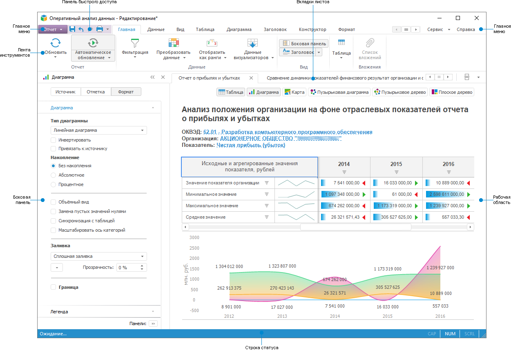
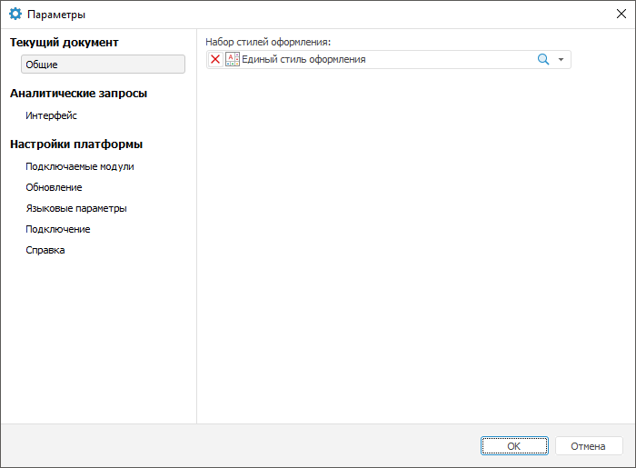

# Начало работы с инструментом «Аналитические запросы (OLAP)»

Начало работы с инструментом «Аналитические запросы (OLAP)»
-

# Начало работы с инструментом «Аналитические
 запросы (OLAP)»

Для начала работы с инструментом создайте новый или откройте готовый
 экспресс-отчёт.

[Создание
 нового экспресс-отчёта](javascript:TextPopup(this))

	Для создания нового экспресс-отчёта:

		- в [навигаторе
		 объектов](GetStarted.chm::/Interface/Interface_Navigator.htm):

			- нажмите кнопку «Новый
			 объект > Экспресс-отчет» в группе «Создать»
			 на вкладке «Главная»
			 ленты инструментов;

			- выполните команду «Создать > Экспресс-отчет»
			 в контекстном меню навигатора объектов. Команда доступна
			 только в настольном приложении;

			- выберите куб или базу данных
			 временных рядов и:

				- нажмите кнопку «Открыть > В аналитических
				 запросах (OLAP)» в группе «Открыть»
				 на вкладке «Главная»
				 ленты инструментов;

				- выполните команду «Открыть с помощью >
				 Аналитические запросы (OLAP)» в контекстном меню
				 выбранного объекта. Команда доступна только в настольном
				 приложении;

				- выполните команду «Открыть в аналитических запросах
				 (OLAP)» в контекстном меню базы данных временных
				 рядов. Команда доступна только в веб-приложении.

	При таком способе создания в экспресс-отчёт
	 будет добавлена [таблица](UiAnalyticalArea.chm::/Table.htm),
	 построенная на срезе выбранного объекта.

		- в инструменте «Аналитические
		 запросы (OLAP)» выполните команду «Новый
		 отчет» в главном меню «Отчет».

[Открытие
 готового экспресс-отчёта](javascript:TextPopup(this))

	Для открытия на редактирование или просмотр готового экспресс-отчёта:

		- в [навигаторе
		 объектов](GetStarted.chm::/Interface/Interface_Navigator.htm) выделите экспресс-отчёт и выполните
		 одно из действий:

			- в веб-приложении:

				- выполните команду «Открыть»
				 в контекстном меню экспресс-отчёта;

				- выполните команду «Открыть
				 в новой вкладке» в контекстном меню экспресс-отчёта;

				- выполните команду «Открыть
				 в новом окне» в контекстном меню экспресс-отчёта;

				- дважды щёлкните по экспресс-отчёту;

			- в настольном приложении:

				- нажмите кнопку  «Открыть»
				 в группе «Открыть»
				 на вкладке «Главная»
				 ленты инструментов;

				- нажмите кнопку  «Открыть
				 > В инструменте по умолчанию» в группе «Открыть» на вкладке
				 «Главная» ленты
				 инструментов;

				- выполните команду «Открыть»
				 в контекстном меню экспресс-отчёта;

				- дважды щёлкните по экспресс-отчёту;

		- в инструменте «Аналитические
		 запросы (OLAP)» откройте главное меню «Отчет»
		 и выберите вариант открытия экспресс-отчёта:

			- Открыть.
			 В открывшемся диалоге выберите экспресс-отчёт из навигатора
			 объектов;

			- Открыть
			 > Открыть из файла. При выполнении команды будет
			 открыт стандартный диалог выбора файла. Укажите файл с расширением
			 *.ppexpress, *.p5e, *.ppcube, *.p5c или
			 *.p5p.

	По умолчанию используется редактирование экспресс-отчёта. Если возможен
	 только просмотр, то у пользователя отсутствуют [права](Admin.chm::/03_Admin/Admin_AdminObjects_Discretionary.htm)
	 на изменение [экспресс-отчёта](../Setup_express_report/Working_with_express_report.htm).
	 Доступны все возможности режима редактирования и [сохранение
	 копии](../Express/UiExpress_Express_Save.htm#save_copy) экспресс-отчёта.

Для построения экспресс-отчёта смотрите
 статью «[Построение
 экспресс-отчёта](UiExpress_Purpose_Starting.htm)».

Для работы с готовым экспресс-отчётом
 смотрите статью «[Работа
 с готовым экспресс-отчётом](../Setup_express_report/Working_with_express_report.htm)».

Если остались вопросы, смотрите
 статью «[Вопросы
 и ответы](../FAQ/FAQ.htm)».

Основное окно инструмента «Аналитические
 запросы (OLAP)»:

[Элементы
 окна экспресс-отчёта](javascript:TextPopup(this))

		- [Главное
		 меню](GetStarted.chm::/Interface/Interface_Description.htm#main_menu). Содержит список команд, предназначенных
		 для выполнения различных операций над экспресс-отчётом.

		- [Лента
		 инструментов](GetStarted.chm::/Interface/Interface_Description.htm#customize_ribbon). Содержит кнопки для построения
		 и настройки экспресс-отчёта.

		- [Боковая
		 панель](GetStarted.chm::/Interface/Interface_Description.htm#side_panel). Содержит настройки параметров
		 экспресс-отчёта и управления измерениями источников данных.

		- [Панель
		 быстрого доступа](GetStarted.chm::/Interface/Interface_Description.htm#quick_access_toolbar).
		 Содержит набор часто используемых команд.

		- [Строка
		 статуса](GetStarted.chm::/Interface/Interface_Description.htm#status_line).
		 Содержит результаты расчета базовых агрегатов выделенного диапазона
		 ячеек таблицы.

		- [Вкладки
		 листов](../Setup_express_report/Sheets.htm). Предназначены для [управления
		 листами экспресс-отчёта](../Setup_express_report/Sheets.htm).

		- Рабочая область.
		 Предназначена для [построения
		 экспресс-отчёта](UiExpress_Purpose_Starting.htm).

## Настройка параметров инструмента «Аналитические
 запросы (OLAP)»

Для настройки параметров инструмента «Аналитические
 запросы (OLAP)» в целом и общих параметров «Форсайт. Аналитическая платформа»
 используйте диалог «Параметры».

Примечание.
 Диалог «Параметры» доступен только
 в настольном приложении.

Для открытия диалога «Параметры»
 выполните команду «Сервис > Параметры»
 в главном меню экспресс-отчёта.

Доступны следующие группы настроек:

[Настройки
 экспресс-отчёта](javascript:TextPopup(this))

	Используйте группу вкладок «Текущий
	 документ».

	В раскрывающемся списке «Набор
	 стилей оформления» выберите [таблицу стилей](UiNav.chm::/StylesTable/StylesTablePurpose.htm),
	 стили которой будут использоваться для оформления визуализаторов в
	 текущем экспресс-отчёте.

[Настройки
 интерфейса инструмента «Аналитические
 запросы (OLAP)»](javascript:TextPopup(this))

	Используйте группу вкладок «Аналитические
	 запросы».

	Задайте [сочетания
	 клавиш](GetStarted.chm::/Interface/Interface_Description.htm#shortcut_keys) для быстрого доступа к командам главного
	 меню и ленты инструментов с помощью вкладки «Интерфейс».

[Настройки
 платформы](javascript:TextPopup(this))

	Задайте настройки платформы, используя следующие вкладки:

		- [Подключаемые модули](UiNav.Chm::/02_Navigator/CommonSettings/Integration.htm).
		 Задайте программные модули, расширяющие возможности «Форсайт. Аналитическая платформа»;

		- [Обновление](Setup.chm::/Update/Update.htm).
		 Задайте параметры обновления версии программных файлов продукта
		 «Форсайт. Аналитическая платформа»;

		- [Языковые
		 параметры](GetStarted.chm::/Interface/Intro_Language.htm). Выберите язык интерфейса
		 и язык справочной системы продукта «Форсайт. Аналитическая платформа»;

		- [Подключение](UiNav.chm::/02_Navigator/CommonSettings/ProxyServer.htm).
		 Задайте настройки прокси-сервера для доступа «Форсайт. Аналитическая платформа»
		 к сети Internet;

		- [Справка](UiNav.chm::/02_Navigator/UiNav_RepoConfig_Help.htm).
		 Задайте тип справки, используемой продуктом «Форсайт. Аналитическая платформа».

См. также:

[Построение
 экспресс-отчёта](UiExpress_Purpose_Starting.htm)

		Справочная
		 система на версию 10.9
		 от 18/08/2025,
		 © ООО «ФОРСАЙТ»,
