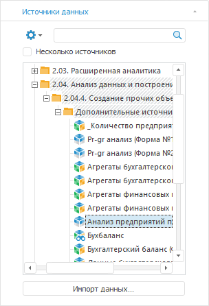

# Выбор источника данных

Выбор источника данных
-

# Выбор источника данных

Инструмент «Аналитические запросы
 (OLAP)» оперирует данными одного или нескольких источников.

Источник данных представлен
 в виде многомерного массива данных. Каждый массив данных характеризуется
 набором [измерений](UiSelection.chm::/Selection/Dimension.htm),
 на пересечении которых находятся ячейки с данными. Если для экспресс-отчёта
 используется [несколько
 источников](../ChangeNote/UiExpress_Tabl_ChangeNote_PrivDim.htm) и существуют уникальные измерения, которыми обладает только
 один из источников, в измерениях выделяется отдельная группа измерений
 - [частные](UiSelection.chm::/Selection/Working_with_private_dimensions.htm).
 В этом случае строится так называемый виртуальный куб, содержащий общие
 и частные измерения всех входящих в него кубов.

Источниками данных для экспресс-отчётов могут быть:

	- [все
	 виды кубов](uinavobj.chm::/cube/uimd_cube_type.htm),
	 включая дочерние кубы контейнера моделирования;

	- [переменные
	 моделирования](uimodelling.chm::/2_container_of_modeling/2_3_work_object/2_3_1_value/uimodelling_work_object_value.htm);

	- [базы
	 данных временных рядов](uidw.chm::/UiDw_Title.htm).

Для выбора и поиска источников данных используйте вкладку «Источники
 данных» из группы «Источник»
 боковой панели:

Данная вкладка становится активной при [создании](UiExpress_Organizational_Starting.htm#create_report)
 экспресс-отчёта. В дереве объектов репозитория отображаются объекты, которые
 могут быть выбраны в качестве источников данных для экспресс-отчёта. При
 поиске источника в поле с деревом объектов репозитория отображается список
 результатов [поиска](Search.htm).

Выберите требуемые источники данных в дереве объектов или в списке результатов
 поиска. После чего в рабочей области будет размещена [таблица данных](UiAnalyticalArea.chm::/Table.htm).

Далее [выберите
 вариант расположения измерения](UiSelection.chm::/Selection/Dimension.htm) и [отметьте
 элементы измерения](UiSelection.chm::/Selection/Selection_of_the_dimension_elements.htm).

С источниками данных доступны следующие операции:

[Выбор и смена
 источника данных](javascript:TextPopup(this))

	Для выбора и смены источника данных отметьте источник в дереве объектов
	 репозитория.

	Для создания отчёта на основе [нескольких
	 источников](../ChangeNote/UiExpress_Tabl_ChangeNote_PrivDim.htm) установите флажок «Несколько
	 источников». После этого в дереве объектов будет доступна множественная
	 отметка источников данных. При использовании нескольких источников
	 необходимо наличие первичного индекса во всех измерениях кубов.

	Примечание.
	 После установки флажка и выбора дополнительного источника на листе
	 появится надпись «Нет данных».
	 Чтобы данные появились, измените отметку в [частных
	 измерениях](UiSelection.chm::/Selection/Working_with_private_dimensions.htm).

[Импорт источника
 данных](javascript:TextPopup(this))

	Для создания нового источника данных нажмите кнопку «Импорт
	 данных». Будет запущена процедура [импорта
	 данных](UiNavObj.chm::/Data_import_wizard/Data_import_wizard.htm).

	При нажатии на кнопку «Импорт данных»
	 в веб-приложении открывается окно [выбора
	 источника](UiNavObj.chm::/Data_import_wizard/Select_and_configure_the_data_source.htm).

[Настройка структуры
 источника данных](javascript:TextPopup(this))

	Для управления структурой источника данных используйте вкладку «[Структура источника
	 данных](DS_structure.htm)» в диалоге «Структура
	 и параметры».

[Выбор
 набора данных источника для использования в отчёте](javascript:TextPopup(this))

	Источники могут содержать два типа данных: непосредственно данные
	 источника и данные сохраненного представления. Сохраненное представление
	 содержит пользовательские настройки отображения, например: отображаемые
	 элементы измерений, настройки диаграммы, параметры подписей и т.д.

	Для выбора типа загружаемых данных используйте переключатели в контекстном
	 меню источника на боковой панели:

		- Использовать только данные
		 источника. В экспресс-отчёт загружаются только данные источника;

		- Использовать данные источника
		 и сохраненную отметку. В экспресс-отчёт загружаются данные
		 источника и параметры отметки измерений источника, настроенные
		 пользователем. Если параметры отметки отсутствуют, то загружаются
		 только данные источника;

		- Использовать данные и сохранённое
		 представление источника. В экспресс-отчёт загружается сохранённое
		 представление. Если сохранённое представление отсутствует, то
		 загружаются только данные источника.

[Редактирование
 источника данных](javascript:TextPopup(this))

	Для редактирования источника данных выберите источник на панели
	 «Источники данных» и выполните
	 команду контекстного меню «Редактировать».
	 Источник данных будет открыт на редактирование.

	Примечание.
	 Редактирование источника данных [может
	 быть отключено](UiLib.chm::/Interface/IUiCommandActionCustomize/IUiCommandActionCustomize.htm) используя встроенный язык программирование
	 Fore.

[Управление параметрами
 источника данных](javascript:TextPopup(this))

	Параметры позволяют динамически управлять содержимым экспресс-отчёта.
	 Для управления параметрами источников данных экспресс-отчёта используйте
	 вкладку «Параметры источников данных»
	 на боковой панели. Подробнее см. раздел «[Управление
	 параметрами источника данных](DataSourceParam.htm)».

[Поиск
 источников данных](javascript:TextPopup(this))

	В инструменте «Аналитические запросы»
	 доступны следующие режимы поиска:

		- стандартный поиск источников данных по их наименованию;

		- BI-поиск источников данных по их содержимому.

	Подробнее см. раздел «[Поиск
	 источников данных](Search.htm)».

[Повторная
 загрузка данных в источник](javascript:TextPopup(this))

	Если в качестве источника данных указан куб, который был создан
	 в процессе импорта, то для источника доступна повторная загрузка данных.
	 Для загрузки данных выполните команду «Выполнить
	 задачу ETL» в контекстном меню выбранного источника.

	В результате данные в источник будут повторно загружены с помощью
	 задачи ETL.

	Для редактирования задачи ETL выполните команду «Редактировать
	 задачу ETL» в контекстном меню выбранного источника.

	В результате откроется окно редактирования [задачи
	 ETL](UiETL.chm::/desktop/01_General_Info/UiETL_General.htm).

	Если в качестве источника данных указан куб, в который был произведен
	 импорт, то для него будут доступны несколько задач ETL:

		- задача, созданная в результате построения куба;

		- задачи, созданные в результате импорта данных в куб.

	Примечание.
	 В веб-приложении доступно только выполнение задачи ETL.

См. также:

[Начало
 работы с инструментом «Аналитические запросы (OLAP)»](UiExpress_Organizational_Starting.htm) | [Настройка измерений
 и отметка элементов](UiSelection.chm::/Selection/Dimension.htm) | [Настройка измерений для работы
 с картой](UiMaps.chm::/Common/Metrics.htm)

		Справочная
		 система на версию 10.9
		 от 18/08/2025,
		 © ООО «ФОРСАЙТ»,
