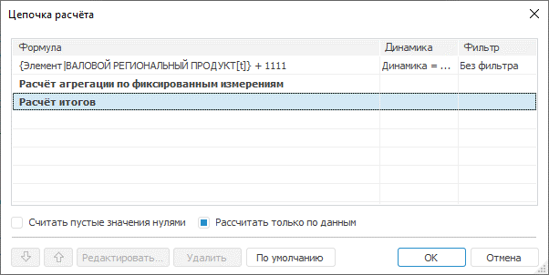

# ShowCalcChaingDialog

ShowCalcChaingDialog
-

# Команда ShowCalcChaingDialog

## Назначение

Вывод стандартного окна [цепочки
 расчета](UiAnalyticalArea.chm::/Work_with_dimensions/Edited_elements.htm) для организации порядка расчета моделей.

## Параметры использования

		 Параметр

		 Описание

		 [IEaxAnalyzer](KeExpress.chm::/Interface/IEaxAnalyzer/IEaxAnalyzer.htm)
		 Экспресс-отчет, для которого необходимо организовать порядок
		 расчета моделей.

		 [IEaxDataAreaSlice](KeExpress.chm::/Interface/IEaxDataAreaSlice/IEaxDataAreaSlice.htm)
		 Срез аналитической области данных.

Все параметры являются обязательными.

## Особенности применения

Команда может применяться только для экспресс-отчетов.

## Пример

Для выполнения примера разместите на форме компоненты Button,
 TabSheetBox и UiErAnalyzer
 с наименованиями BUTTON1, TABSHEETBOX1 И UIERANALYZER1
 соответственно. Для компонента TabSheetBox установите свойству
 Source значение UiErAnalyzer1. Предполагается наличие экспресс-отчета
 с вычисляемым элементом, который указан в качестве свойства Object
 для компонента UiErAnalyzer.

Добавьте ссылки на системные сборки: Express, Tab, Ui.

					Sub Button1OnClick(Sender: Object; Args: IMouseEventArgs);

		Var

		    Express: IEaxAnalyzer;

		    Data: Array;

		    Grid: IEaxGrid;

		    Slice: IEaxDataAreaSlice;

		    Context: IUiCommandExecutionContext;

		    Target: IUiCommandTarget;

		Begin

		    //Получаем экспресс-отчет

		    Express := UiErAnalyzer1.ErAnalyzer;

		    //Получаем таблицу экспресс-отчета

		    Grid := Express.Grid;

		    //Получаем срез данных

		    Slice := Grid.Slice;

		    //Указываем необходимые элементы массива

		    Data := New Variant[2];

		    Data[0] := Express;

		    Data[1] := Slice;

		    //Открытие полученного экспресс-отчёта на просмотр

		    Target := WinApplication.Instance.GetPluginTarget("Express");

		    Context := Target.CreateExecutionContext;

		    Context.Data := Data;

		    Target.Execute("ShowCalcChainDialog", Context);

		End Sub Button1OnClick;

В результате при нажатии на кнопку «Button1» будет выведен диалог цепочки
 расчета:

См. также:

[IUiCommandTarget.Execute](../IUiCommandTarget.Execute.htm)

		Справочная
		 система на версию 10.9
		 от 18/08/2025,
		 © ООО «ФОРСАЙТ»,
