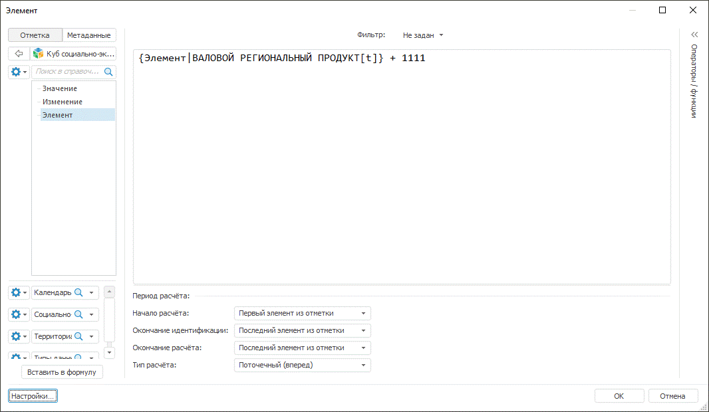
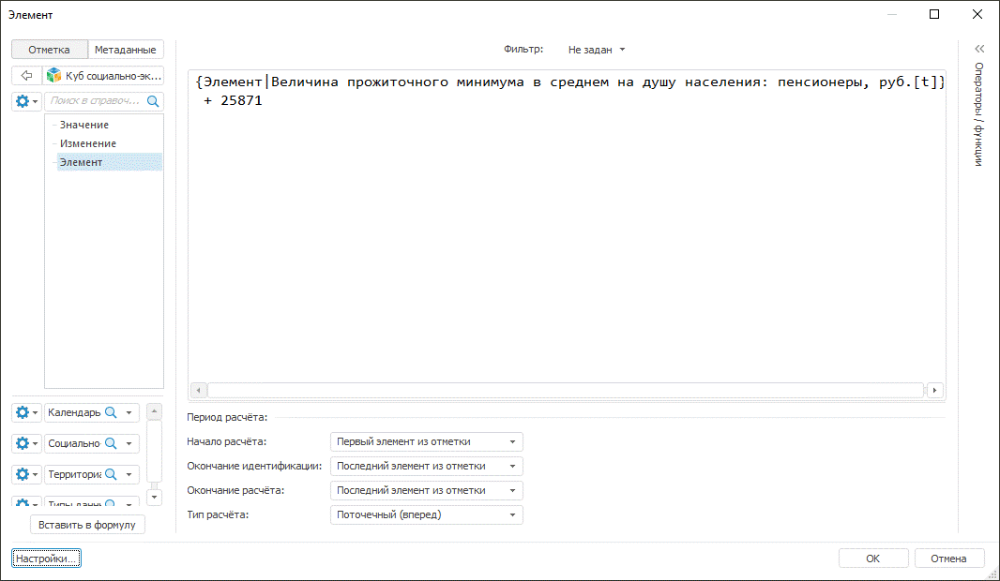

# ShowFormulaEditor

ShowFormulaEditor
-

# Команда ShowFormulaEditor

## Назначение

Вывод стандартного диалога редактора [выражений](UiNav.chm::/GUI/ExpressionEditor.htm)
 для настройки элемента измерения.

## Параметры использования

		 Тип значения
		 Описание

		 [IEaxAnalyzer](KeExpress.chm::/Interface/IEaxAnalyzer/IEaxAnalyzer.htm)
		 Экспресс-отчет, для которого необходимо составить выражение.
		 Параметр является обязательным.

		 [IEaxDataAreaTransformation](KeExpress.chm::/Interface/IEaxDataAreaTransformation/IEaxDataAreaTransformation.htm)

		 Объект для работы с формулой преобразования данных. Параметр
		 является обязательным.

		 [IDimInstance](KeDims.chm::/interface/IDimInstance/IDimInstance.htm)
		 Содержит свойства и методы для доступа к данным справочника.
		 Необходим для поиска элемента трансформации. Не обязательный параметр.

		 [IDimSelectionSet](KeDims.chm::/interface/IDimSelectionSet/IDimSelectionSet.htm)
		 Отметка по которой строится таблица.

		 Boolean
		 Флажок определяет, будет ли доступна панель [настройки фильтра](UiNav.chm::/GUI/ExpressionEditor.htm#filter). Допустимые значения:

			- True. Использовать
			 фильтрацию;

			- False. Не использовать
			 фильтрацию.

		Необязательный параметр.

		 [IEaxDataArea](KeExpress.chm::/Interface/IEaxDataArea/IEaxDataArea.htm)
		 Возвращает параметры аналитической области данных. Не обязательный
		 параметр.

## Пример

Для выполнения примера предполагается наличие формы, расположенные на
 ней кнопки с наименованием BUTTON1 и BUTTON2, компонент UiErAnalyzer
 с наименованием UIERANALYZER1, являющийся источником для компонента TabSheetBox1, компонент UiReport1
 являющийся источником для компонента Tabsheetbox2.
 К UiErAnalyzer1 подключен какой-либо
 экспресс-отчёт с измерением с идентификатором FACTS в котором располагается
 вычисляемый элемент, а к Uireport1
 подключен какой-либо регламентный отчет с измерением с идентификатором
 FACTS в котором располагается вычисляемый элемент.

Подключите ссылки на системные сборки: Express, Pivot, Tab, Ui, Dimension
 и Report.

	Sub Button1OnClick(Sender: Object; Args: IMouseEventArgs);

	Var

	    Express: IEaxAnalyzer;

	    Transform: IEaxDataAreaTransformation;

	    SelectSet: IDimSelectionSet;

	    DimSelect: IDimSelection;

	    Data: Array;

	    Context: IUiCommandExecutionContext;

	    Target: IUiCommandTarget;

	Begin

	    //Получаем экспресс-отчет

	    Express := UiErAnalyzer1.ErAnalyzer;

	    //Получаем отметку по
	 которой строится таблица

	    SelectSet := Express.Pivot.Selection;

	    //Получаем срез данных

	    Transform := Express.DataArea.Slices.Item(0).CalcTransformations.Item(0);

	    //Получаем измерение
	 с вычисляемым элементом

	    DimSelect := SelectSet.FindById("FACTS");

	    //Указываем необходимые
	 элементы массива

	    Data := New Variant[6];

	    Data[0] := Express;

	    Data[1] := Transform;

	    Data[2] := DimSelect.Dimension;

	    Data[3] := SelectSet;

	    Data[4] := True;

	    Data[5] := Express.DataArea;

	    //Открытие полученного экспресс-отчёта на просмотр

	    Target := WinApplication.Instance.GetPluginTarget("Express");

	    Context := Target.CreateExecutionContext;

	    Context.Data := Data;

	    Target.Execute("ShowFormulaEditor", Context);

	End Sub Button1OnClick;

	Sub Button2OnClick(Sender: Object; Args: IMouseEventArgs);

	    Var

	    Report: IPrxReport;

	    Slice: IEaxDataAreaTransformation;

	    DimSelect: IDimSelection;

	    SelectSet: IDimSelectionSet;

	    Data: Array;

	    Context: IUiCommandExecutionContext;

	    Target: IUiCommandTarget;

	    DataArea: IEaxDataArea;

	    PivSlice: IEaxDataAreaPivotSlice;

	    Pivot: IPivot;

	Begin

	    //Получим отчет

	    Report := UiReport1.Report;

	    // Получим аналитическую область данных регламентного отчета

	    DataArea := Report.DataArea;

	    // Получим основу для построения среза аналитической области данных

	    PivSlice := DataArea.Slices.Item(0) As IEaxDataAreaPivotSlice;

	    //Получим отметку по которой строится таблица

	    Pivot := PivSlice.Pivot;

	    SelectSet := Pivot.Selection;

	    //Получим срез данных

	    Slice := Report.DataArea.Slices.Item(0).CalcTransformations.Item(0);

	    //Получим измерение с вычисляемым элементом

	    DimSelect := SelectSet.FindById("FACTS");

	    //Указываем необходимые элементы массива

	    Data := New Variant[6];

	    Data[0] := Pivot;

	    Data[1] := Slice;

	    Data[2] := DimSelect.Dimension;

	    Data[3] := SelectSet;

	    Data[4] := True;

	    Data[5] := Report.DataArea;

	    //Открытие отчета на просмотр

	    Target := WinApplication.Instance.GetPluginTarget("Express");

	    Context := Target.CreateExecutionContext;

	    Context.Data := Data;

	    Target.Execute("ShowFormulaEditor", context);

	End Sub Button2OnClick;

В результате при нажатии на кнопку «Button1» будет выведен диалог редактора
 выражений вычисляемого элемента экспресс-отчета, в котором располагается
 формула элемента с возможностью её редактирования:

В результате при нажатии на кнопку «Button2» будет выведен диалог редактора
 выражений вычисляемого элемента регламентного отчета, в котором располагается
 формула элемента с возможностью её редактирования:

См. также:

[IUiCommandTarget.Execute](../IUiCommandTarget.Execute.htm)

		Справочная
		 система на версию 10.9
		 от 18/08/2025,
		 © ООО «ФОРСАЙТ»,
