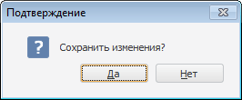

# IWinApplicationClass.ConfirmationBox

IWinApplicationClass.ConfirmationBox
-

# IWinApplicationClass.ConfirmationBox

## Синтаксис

ConfirmationBox(Message: String; [ParentWindow: [IWin32Window](ModForms.chm::/Interface/IWin32Window/IWin32Window.htm) = Null]): Boolean;

## Параметры

Message. Сообщение, которое будет отображаться в окне подтверждения.

ParentWindow. Родительское окно, для которого диалог открывается модально. По умолчанию передается значение Null, при этом диалог откроется модально для текущего окна.

## Описание

Метод ConfirmationBox вызывает стандартный диалог подтверждения и возвращает результат закрытия диалога.

## Комментарии

Используется только в настольном приложении.

Диалог содержит две кнопки «Да» и «Нет». Метод ConfirmationBox возвращает значение True, если была нажата кнопка «Да» и False, если нажата кнопка «Нет».

## Пример

Для выполнения примера предполагается наличие формы и расположенной на ней кнопки.

			Sub Button1OnClick(Sender: Object; Args: IMouseEventArgs);

Var

    b: Boolean;

Begin

    b := WinApplication.ConfirmationBox("Сохранить изменения?");

End Sub Button1OnClick;

При нажатии на кнопку на экран будет выведен диалог подтверждения. Результат выбора в диалоге будет доступен в переменной «b».

См. также:

[IWinApplicationClass](IWinApplicationClass.htm)

		Справочная
		 система на версию 10.9
		 от 18/08/2025,
		 © ООО «ФОРСАЙТ»,
