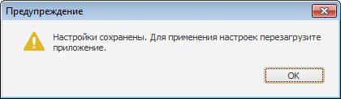

# IWinApplicationClass.ExclamationBox

IWinApplicationClass.ExclamationBox
-

# IWinApplicationClass.ExclamationBox

## Синтаксис

ExclamationBox(Message: String; [ParentWindow: [IWin32Window](ModForms.chm::/Interface/IWin32Window/IWin32Window.htm) = Null]);

## Параметры

Message. Сообщение, которое будет отображаться в окне предупреждения.

ParentWindow. Родительское окно, для которого диалог открывается модально. По умолчанию передается значение Null, при этом диалог откроется модально для текущего окна.

## Описание

Метод ExclamationBox вызывает стандартный диалог с предупреждением.

## Комментарии

Используется только в настольном приложении.

Диалог имеет только одну кнопку «ОК» и выглядит следующим образом:

## Пример

Для выполнения примера предполагается наличие формы и расположенной на ней кнопки.

			Sub Button1OnClick(Sender: Object; Args: IMouseEventArgs);

Begin

    WinApplication.ExclamationBox("Настройки сохранены. Для применения настроек перезагрузите приложение.");

End Sub Button1OnClick;

При нажатии на кнопку на экран будет выведен диалог с предупреждением.

См. также:

[IWinApplicationClass](IWinApplicationClass.htm)

		Справочная
		 система на версию 10.9
		 от 18/08/2025,
		 © ООО «ФОРСАЙТ»,
