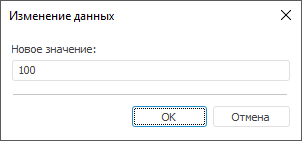

# IWinApplicationClass.InputBox

IWinApplicationClass.InputBox
-

# IWinApplicationClass.InputBox

## Синтаксис

InputBox(

Caption: String;

Prompt: String;

Var Data: String;

[ParentWindow: [IWin32Window](ModForms.chm::/Interface/IWin32Window/IWin32Window.htm)
 = Null]): Boolean;

## Параметры

Caption. Заголовок диалога.

Prompt. Сообщение, отображаемое
 над полем для ввода значения. К указанному сообщению в конце автоматически
 будет добавлен символ «:».

Data. Переменная, в которую
 помещается введеное значение.

ParentWindow. Родительское
 окно, для которого диалог открывается модально. По умолчанию передается
 значение Null, при этом диалог
 откроется модально для текущего окна.

## Описание

Метод InputBox вызывает стандартный
 диалог для ввода данных и возвращает результат закрытия диалога.

## Комментарии

Используется только в настольном приложении.

При нажатии кнопки «ОК» метод вернет значение True
 и введенное значение будет помещено в переменную, указанную в параметре
 Data.

При нажатии кнопки «Отмена» метод вернет значение False.
 В переменной, указанной в качестве параметра Data,
 будет содержаться пустая строка.

## Пример

Для выполнения примера предполагается наличие формы и расположенной
 на ней кнопки.

Добавьте ссылку на системную сборку UI.

			Sub Button1OnClick(Sender: Object; Args: IMouseEventArgs);

Var

    s: String;

    b: Boolean;

Begin

    b := WinApplication.InputBox("Изменение данных", "Новое значение", s);

    If b Then

        Self.Text := s;

    End If;

End Sub Button1OnClick;

При нажатии на кнопку на экран будет выведен диалог ввода данных. Введенное
 значение будет установлено в качестве заголовка формы, если в диалоге
 была нажата кнопка «ОК».

См. также:

[IWinApplicationClass](IWinApplicationClass.htm)

		Справочная
		 система на версию 10.9
		 от 18/08/2025,
		 © ООО «ФОРСАЙТ»,
