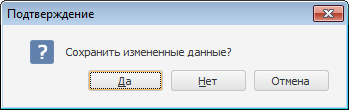

# IWinApplicationClass.YesNoCancelBox

IWinApplicationClass.YesNoCancelBox
-

# IWinApplicationClass.YesNoCancelBox

## Синтаксис

YesNoCancelBox(

Message: String;

Var YesPressed: Boolean;

[ParentWindow: [IWin32Window](ModForms.chm::/Interface/IWin32Window/IWin32Window.htm) = Null]): Boolean;

## Параметры

Message. Сообщение, которое будет отображаться в окне подтверждения.

YesPressed. Переменная, в которой будет содержаться True, если была нажата кнопка "Да" и False, если нажата, какая-либо другая кнопка.

ParentWindow. Родительское окно, для которого диалог открывается модально. По умолчанию передается значение Null, при этом диалог откроется модально для текущего окна.

## Описание

Метод YesNoCancelBox вызывает стандартный диалог подтверждения, содержащий три варианта ответа и возвращает результат закрытия диалога.

## Комментарии

Используется только в настольном приложении.

Метод возвращает значение True, если была нажата кнопка «Да», либо «Нет» и False, если была нажата кнопка «Отмена».

## Пример

Для выполнения примера предполагается наличие формы и расположенной на ней кнопки.

			Sub Button1OnClick(Sender: Object; Args: IMouseEventArgs);

Var

    b, b1: Boolean;

Begin

    b := WinApplication.YesNoCancelBox("Сохранить измененные данные?", b1);

End Sub Button1OnClick;

При нажатии на кнопку на экран будет выведен диалог подтверждения с указанным сообщением.

См. также:

[IWinApplicationClass](IWinApplicationClass.htm)

		Справочная
		 система на версию 10.9
		 от 18/08/2025,
		 © ООО «ФОРСАЙТ»,
