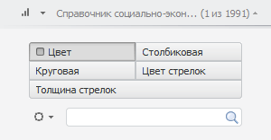

# Настройка измерений для работы с картой

Настройка измерений для работы с картой
-

# Настройка измерений для работы с картой

При переходе к картографическому представлению измерения источника данных
 настраиваются автоматически.

Для изменения настроек измерений выполните следующие действия:

	- На боковой панели установите переключатель «Отметка».
	 Будет отображен набор вкладок для работы с измерениями источника данных.

	- Укажите роль измерений. Нажмите кнопку управления измерением.
	 Будет отображено меню, в котором установите флажок, соответствующий
	 роли измерения. Обязательные измерения:

		- метрики. Измерение,
		 по отмеченным элементам которого будет закрашена карта и настроены
		 её прочие визуальные элементы;

		- объекты наблюдения.
		 [Территориальное измерение](Requirements.htm), содержащее
		 атрибут «TERRID»;

		- шкала времени. Календарное
		 измерение, по отмеченным элементам которого будет формироваться
		 временная шкала карты.

Измерения, предоставляющие [дополнительные
 возможности](../Configure/Advanced_Features.htm) карты:

		- объекты геолокации.
		 Измерение, по отмеченным элементам которого на карте будут отображаться
		 [маркеры](../Configure/coordinate_marker.htm);

		- направление стрелок.
		 [Территориальное измерение](Requirements.htm), используемое
		 для построения [стрелок](../Configure/Arrows.htm).

Остальные измерения будут автоматически зафиксированы.

Примечание.
 В инструменте «Анализ временных рядов»
 изменение настроек измерений недоступно.

## Настройка измерения метрик

По значениям элементов, отмеченных в измерении метрик, определяются
 следующие параметры карты:

	- [цвет заливки территорий](../Configure/Color.htm);

	- [высота территорий](../Configure/Panel_Height.htm)
	 для карты в [режиме 3D](../Configure/MapConfigure.htm#3d);

	- [цвет маркеров](../Configure/coordinate_marker.htm);

	- [цвет и толщина стрелок](../Configure/Arrows.htm);

	- отображение [столбиковых
	 диаграмм](../Configure/Diagrams.htm);

	- отображение [круговых диаграмм](../Configure/Diagrams.htm).

По умолчанию измерение метрик определяет только цвет заливки территорий
 и источники данных для круговых и столбиковых диаграмм на карте. Если
 включен [режим 3D](../Configure/MapConfigure.htm#3d), настроено
 [отображение маркеров](../Configure/coordinate_marker.htm),
 [стрелок](../Configure/Arrows.htm) или прочих параметров, то
 на вкладке измерения отображается набор переключателей. Например:

Название переключателя соответствует управляемому параметру. Если параметр
 задан, то он отмечен маркером.

Для сопоставления элемента измерения и параметра карты:

	- Установите переключатель, соответствующий управляемому параметру
	 карты.

	- Выберите управляющий элемент измерения.

Карта будет перестроена в соответствии с заданными параметрами.

Примечание.
 В аналитических запросах (OLAP) доступна [синхронизация
 метрик](UiSelection.chm::/Selection/Dimension_type.htm#sync) между визуализаторами одного листа.

См. также:

[Настройка карты](../Configure/MapConfigure.htm)

		Справочная
		 система на версию 10.9
		 от 18/08/2025,
		 © ООО «ФОРСАЙТ»,
