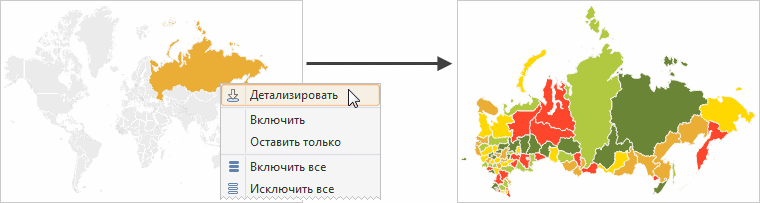
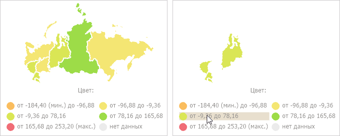

# Дополнительные возможности карты

Дополнительные возможности карты
-

# Дополнительные возможности карты

В «Форсайт. Аналитическая платформа»
 карты предоставляют пользователям широкие возможности визуализации разнообразных
 данных следующими способами:

[Детализация
 и обобщение данных](javascript:TextPopup(this))

	Детализация данных - операция, позволяющая переходить по уровням
	 данных: от общих до детализированных. Доступная глубина детализации
	 определяется иерархией измерений источника данных.

	Совет. Убедитесь,
	 что доступна детализация карты. Подробнее см. в разделе «[Требования для детализации территорий](../Common/DrillDown_requirements.htm)».

	Для детализации данных:

		- выполните команду  «Детализировать»/«Карта
		 >  Детализировать»
		 в контекстном меню территории;

		- дважды щёлкните по территории.

	Обобщение - операция обратная детализации, позволяющая переходить
	 от детализированных данных к общим.

	Для обобщения данных:

		- выполните команду  «Обобщить»/«Карта >  Обобщить»
		 в контекстном меню территории;

		- зажмите клавишу SHIFT и дважды щёлкните по
		 обобщаемой территории.

	Примечание.
	 Детализация/обобщение недоступны в инструменте «Отчеты»
	 в веб-приложении.

	Слева пример карты до детализации, справа - после:

	

[Фильтрация
 отображаемых данных](javascript:TextPopup(this))

	Для фильтрации отображаемых данных используйте легенду. Наведите
	 указатель мыши на элемент легенды. В результате на карте будут отображены
	 только значения, соответствующие выделенному элементу.

	На изображении слева карта до фильтрации, справа - после:

	

[Использование
 внешних картографических сервисов](javascript:TextPopup(this))

	Для расширения возможностей отображения карты доступно подключение
	 внешних картографических сервисов: Яндекс, Bing, ArcGis, OpenStreetMap,
	 Google.

	Примечание.
	 Возможность доступна для инструментов «[Аналитической
	 панели](UIAdhoc.chm::/UiAdhoc_Purpose.htm)», «[Аналитические
	 запросы (OLAP)](UIExpress.chm::/purpose/UiExpress_Purpose.htm)», «[Анализ
	 временных рядов](UiDw.chm::/UiDw_Title.htm)» только в веб-приложении и
	 [конструкторе
	 бизнес-приложений](Constructor.chm::/Intro/Designer_business_applications.htm).

	Для подключения и использования
	 внешних картографических сервисов обратитесь к разделу
	 «[Подключение
	 внешних картографические сервисов к карте](DataAnalysis.chm::/Plugins/Connecting_External_Services.htm)».

[Отображение
 контуров территорий](javascript:TextPopup(this))

	Примечание.
	 Возможность недоступна в инструменте «Анализ
	 временных рядов».

	Контур территории позволяет отображать на карте границы родительской
	 территории при отметке нескольких дочерних элементов территориального
	 измерения.

	Для отображения контуров должны выполнятся все требования, приведенные
	 в разделе «[Требования
	 для отображения контуров территорий](../Common/Loop_requirements.htm)».

	Подробнее о контурах территорий см. раздел «[Отображение
	 контуров территорий](terr_contour.htm)».

[Исключение
 и включение областей карты](javascript:TextPopup(this))

	Примечание.
	 Возможность доступна в инструментах «Аналитические
	 запросы (OLAP)» и «Аналитические
	 панели».

	При работе с картой доступны операции исключения отдельных областей
	 с помощью:

		- изменения отметки в измерении объектов наблюдения;

		- выполнения команд контекстного меню областей карты.

	Рассмотрим более подробно операции исключения областей из карты,
	 выполняемые с помощью команд контекстного меню. Команда контекстного
	 может быть выполнена как для одной, так и для нескольких выделенных
	 областей карты.

	Совет. Для выделения
	 нескольких областей карты, удерживайте клавишу CTRL при выделении.

	Для исключения:

		- выделенной области карты:

			- Выделите область, которую необходимо исключить.

			- Выполните команду «Исключить»/«Карта > Исключить» в
			 контекстном меню выделенной области.

	Выделенная область будет исключена из
	 карты;

		- всех областей карты, кроме
		 выделенной:

			- Выделите область, которая должна быть оставлена на карте.

			- Выполните команду «Оставить
			 только»/«Карта >
			 Оставить только» в контекстном меню выделенной области.

	Из карты будут исключены все области,
	 кроме выделенной;

		- всех областей карты:

			- Вызовите контекстное меню
			 карты.

			- Выполните команду  «Исключить все»/«Карта
			 >  Исключить все».

	Из карты будут исключены все области.

	Для включения:

		- исключенной области карты:

			- Выделите исключенную область
			 карты, которую требуется включить.

			- Выполните команду «Включить»/«Карта
			 > Включить» в контекстном меню выделенной области.

	Область будет включена в карту;

		- всех областей карты:

			- Вызовите контекстное меню
			 карты.

			- Выполните команду  «Включить все»/«Карта
			 >  Включить все».

	В карту будут включены все области.

[Отображение
 маркеров геолокации](javascript:TextPopup(this))

	Примечание.
	 Возможность недоступна в инструменте «Анализ
	 временных рядов».

	Маркер геолокации - это точка, привязанная к территории. Маркеры
	 позволяют отображать на карте места, необходимые пользователю, например:
	 расположение магазинов или станций метро.

	Для отображения маркеров должны выполнятся все требования, приведенные
	 в разделе «[Требования
	 для отображения маркеров геолокации](../Common/Markers_requirements.htm)».

	Подробнее о маркерах и их настройке см. раздел «[Отображение маркеров геолокации](coordinate_marker.htm)».

[Отображение
 версионной карты](javascript:TextPopup(this))

	Версионная карта отображает динамику территориальных делений во
	 времени (разделение/объединение территорий).

	Подробнее о версионных картах см. раздел «[Отображение версионной карты](map_version.htm)».

[Отображение
 стрелок](javascript:TextPopup(this))

	Примечание.
	 Возможность недоступна в инструменте «Анализ
	 временных рядов».

	Стрелка - это объект карты, привязанный к двум территориям: из которой
	 начинается стрелка и в которую направляется стрелка. Стрелки позволяют
	 визуализировать направление движения каких-либо потоков между территориями,
	 например: экспорт или импорт товаров.

	Для отображения стрелок должны выполнятся все требования, приведенные
	 в разделе «[Требования
	 для отображения стрелок](../Common/Arrows_requirements.htm)».

	Подробнее о стрелках и их настройке см. раздел «[Отображение стрелок](Arrows.htm)».

[Отображение
 диаграмм](javascript:TextPopup(this))

	Примечание.
	 Возможность недоступна в инструменте «Анализ
	 временных рядов».

	Диаграммы на карте позволяют отобразить дополнительную информацию
	 о территориях.

	Для отображения диаграмм настройте [измерение
	 метрик](../Common/Metrics.htm#metrics): укажите элементы измерения метрик, по значениям которых
	 будут строиться диаграммы.

	Подробнее диаграммах и их настройке см. раздел «[Отображение диаграмм](Diagrams.htm)».

См. также:

[Приступая
 к работе](../Common/GettingStarted.htm) | [Требования для работы
 с картой](../Common/Requirements.htm)

		Справочная
		 система на версию 10.9
		 от 18/08/2025,
		 © ООО «ФОРСАЙТ»,
